## Semantic Segmentation

모든 픽셀마다 클래스를 분류하는 것

> Application
>
> - 자율주행

강의에서 다루는 논문

- Fully Convolutional Networks for Semantic Segmentation

- Semantic Image Segmentation with Deep Convolutional Nets and Fully Connected CRFs
- Learning Deconvolution Networks for Semantic Segmentations
- DeepLab

### Fully Convolutional Networks for Semantic Segmentation

#### Fully Convolutional Network(FCN)의 이해

- 일반적인 CNN의 뒷단에 있는 Fully Connected Layer가 없다. 즉, 모든 네트워크가 Convolution으로만 이루어짐
- 채널이 one-hot encoding된 class가 된다. 
- input size에 dependant 하지 않다.(input size가 고정될 필요가 없다.)
  - Input size가 커지면 Output size도 비례해서 커짐
- Fully Convolutional Network의 이해
- 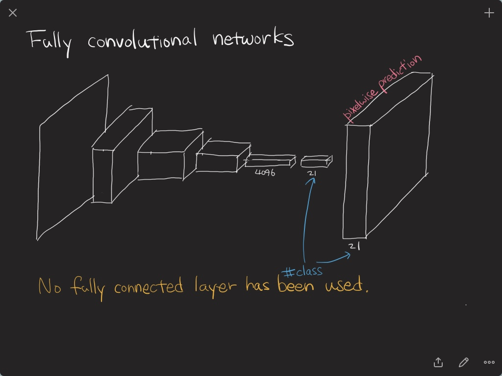
- 세번째 feature map(10x10x100이라고 가정)에서 1x1x4096으로 갈때
  - 기존의 CNN : 10000x4096 matrix
  - FCN : 동일한 dimension의 filter, 즉 10x10x100짜리 filter(한번 convolution했을때 숫자 한개가 나온다!) 4096개를 하면 된다!

- 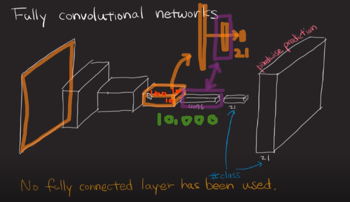
- FC layer가 하는 일과 본질적으로 같다.(90도 회전, 하지만 fc layer는 vector, 1x1 conv는 3차원 tensor)
- 1x1x4096에서 1x1x21도 같은 방법으로!
- 결론적으로는 pixelwise prediction을 하게 된다.
- Convolutionalization한다.
- 더 큰 이미지가 input으로 들어왔을때 더 큰 아웃풋
- 24x24 input로 1x1 output이라면, 500x500의 input이 들어가면? 더 큰 아웃풋
- 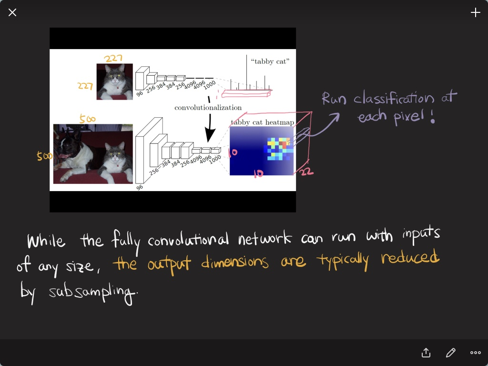
- 왜 하는걸까? heatmap을 만들어 줌.
- 그런데 우리는 500x500이면, 500x500의 픽셀이 각각 뭔지 분류하고 싶은데, 사이즈가 작아지네..?
- 뒤에서 deconvolution, unpooling과 같이 어떻게 늘릴까?라는 테크닉에 집중하게 된다.

#### Deconvolution

- 하나의 픽셀(스칼라)에 convolution filter를 다 곱해준다. 즉 convolution filter에 픽셀의 스칼라 값을 곱해주고, 그것을 그대로 feature map의 일부로 둔다. 그 다음 바로 옆 픽셀에도 똑같이 연산을 해준다. 겹치는 부분이 생기면, 평균을 하거나 Max값을 취해준다.
- 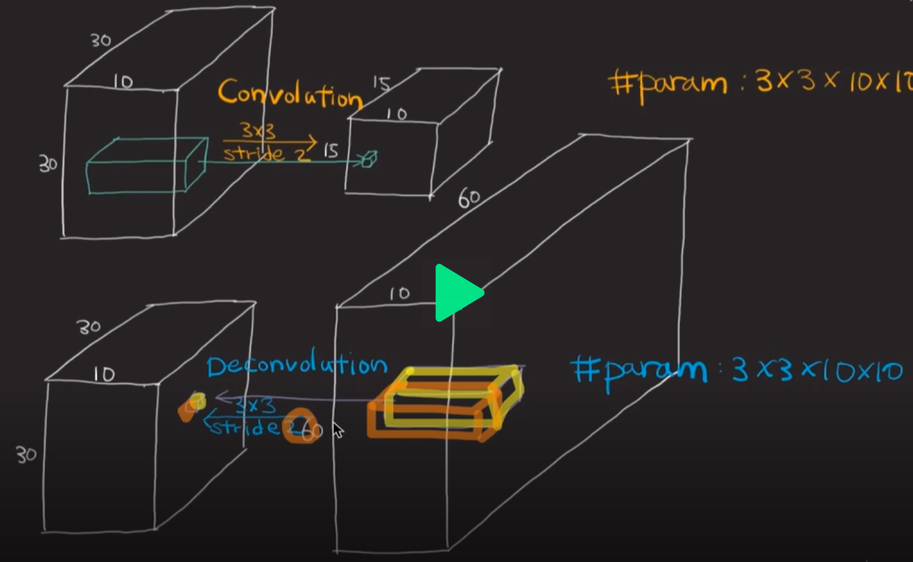
- input의 x2씩! 채널의 갯수는 더 많게 할수도 있다.
- 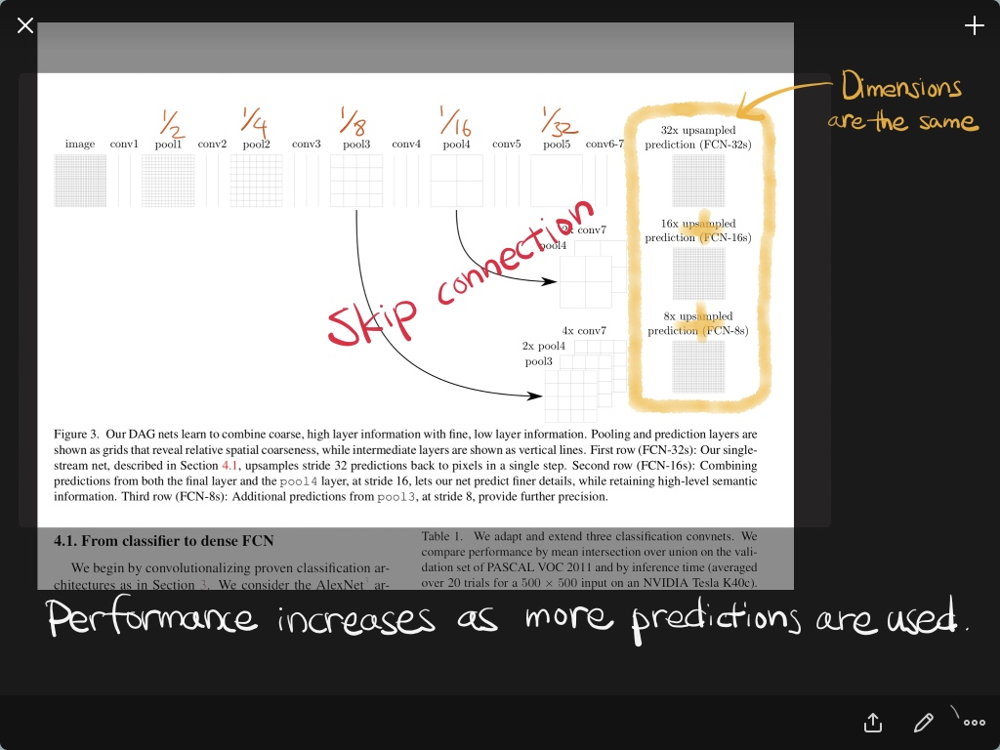
- Convolutionalization을 한다음에 Conv Net을 만들고, Deconvolution을 쓴다.
- 이때, Skip Connection이라는 스킬이 쓰이는데, 마지막까지 줄인 Conv net은 Spatial한 정보가 너무 줄어든 상태이므로, 줄이는 중간중간에 Deconv를 해주는 것! 1/8일때 8배를 해주고, 1/16일때 16배를 해주고, 1/32일때 32배를 해주고 이들을 다 더해준다.
- End to End 문제

### Semantic Image Segmentation with Deep Convolutional Nets and Fully Connected CRFs

>  FCN 8s의 두가지 문제점

-  Signal Downsampling

  - Subsampling 때문에 Spatial한 정보가 많이 줄어들어 정확한 예측이 안된다.
  - 그렇다고 Subsampling을 줄여도 잘 안된다.

      --> Atrous Algorithm

- Spatial Insensitivity

  - 윤곽선을 잘 못땀

  --> Conditional Random Field

#### Atrous Convolution

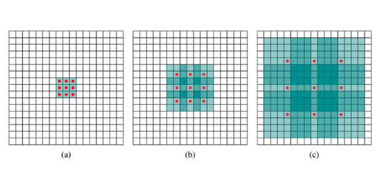

- 원래 빨간색 점에 있는 값들만 가져가는데, 중간에 0을 삽입하여 더 dense한 feature map을 얻음
- 더 적은 parameter로 큰 receptive field를 얻을 수 있다.

#### Conditional Random Field(CRF)

- 위와 같이 Atrous Algorithm을 이용해도, 결국 Max pooling이 있어서 input보다 작은 output을 갖게 됨.
- 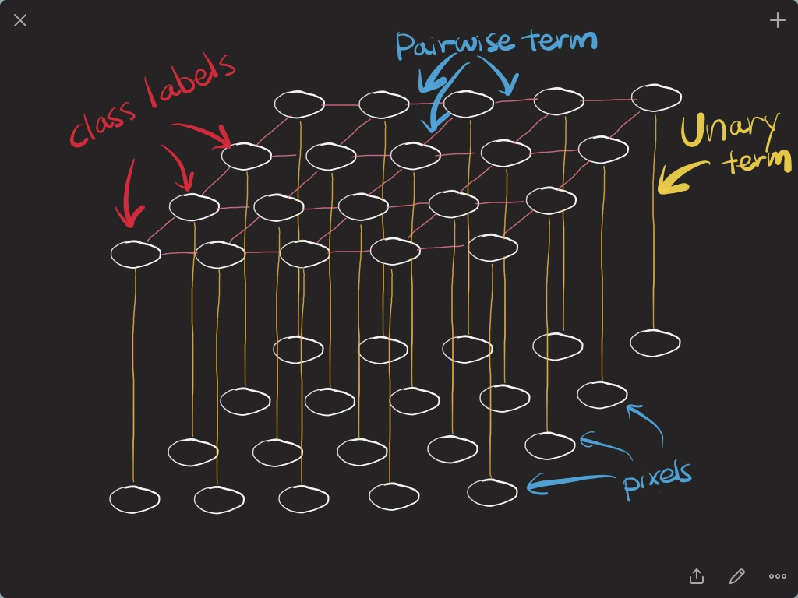
- 인접한 픽셀들은 비슷한 class일 것이다라는 Pairwise term, 각 픽셀이 색깔에 따라 어떤 class일 것인지에 대한 확률정보를 가지고 있는Unary term을 정의해주면 알아서 돌아간다.
- 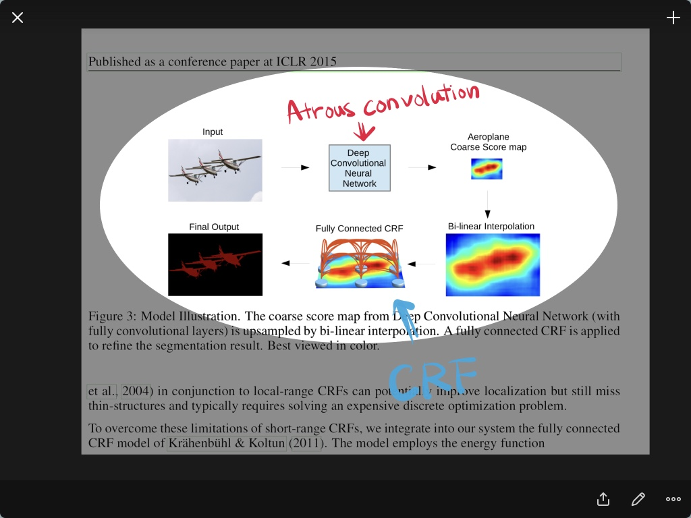
- Atrous Conv를 해주고, Bi-linear Interpolation으로 사이즈를 키워준 뒤, CRF로 저런 output을 만들어준다.

### Learning Deconvolution Networks for Semantic Segmentations

- Deconvnet보다는 Unpooling Net에 가깝

> 문제제기
>
> - Problem 1 : 네트워크가 predefined된 receptive field를 가지므로, 너무 큰 물체나 작은 물체를 놓치게 됨. 
> - Problem 2 : 즉 디테일을 놓치게 됨.

아예 극단적으로 1x1까지 줄여버리자!

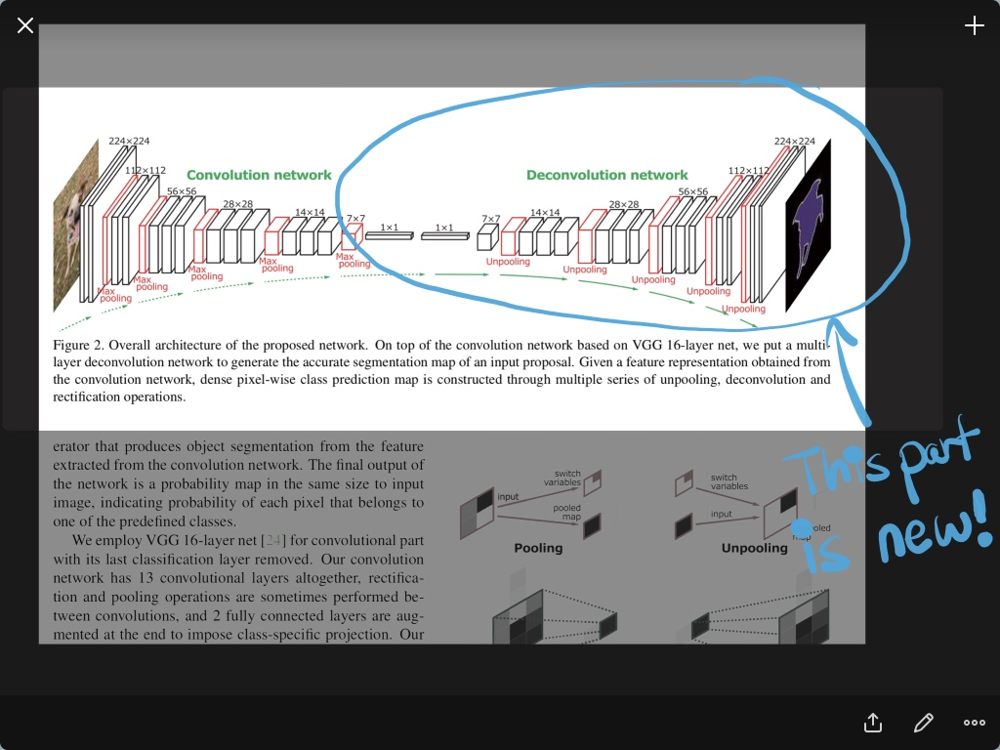

- Unpooling이라는 방법을 이용
  - 쉬운 방법이 아님, 왜냐하면 앞단에서 max pooling했을때, 그거 하나로 2x2의 정보를 채워 넣어야 하기 때문
  - Switch variable, 즉 max pooling할때 어떤 위치의 값을 가져왔는지를 기억해서, Unpooling할때 그 위치에 값을 채워넣고 나머지는 0으로 채움.
  - 따라서 Network의 모양이 Symmetric하다.
- 이게 가능한 이유는 Max pooling을 할때 택해지는 그 위치가, 의미있는 영역일 확률이 높기 때문
- Batch Normalization은 중요하다, 물체가 가운데에 있는 쉬운 친구들을 먼저 학습시키고 복잡한 애들을 학습하는 Two stage training, Ensemble Model을 이용함.

### DeepLab

핵심은 ASPP

> 문제 제기
>
> - 1. Reduced Feature Resolution : Spatial한 정보가 많이 없어진다.
>      1. Atrous Convolution으로 해결
>   2. 애초에 이미지의 물체 사이즈가 다른데, 그 다른 이미지들을 하나의 receptive field를 가지는 문제로 둬도 되냐?
>      1. Atrous Spatial Pyramid Pooling(ASPP)
>   3. Reduced  Localization Accuracy : Detail한 정보를 많이 놓친다.
>      1. Conditional Random Field를 이용

#### Atrous Spatial Pyramid Pooling(ASPP)

- 작은 물체는 3x3이 잡고,큰거는 5x5이 잡고!
- Receptive Field를 키우려면, 결국 parameter가 많아진다.
- 큰 고양이 이미지를 사이즈를 줄인다고 우리가 못알아볼까?
- Receptive Field가 클때, 그 모양만큼의 filter를 찍는게 아니라, 중간에 0을 많이 집어넣은 filter로 찍어서 보자!
- 같은 paramter 갯수로 다양한 receptive field를 만들어보자!
- 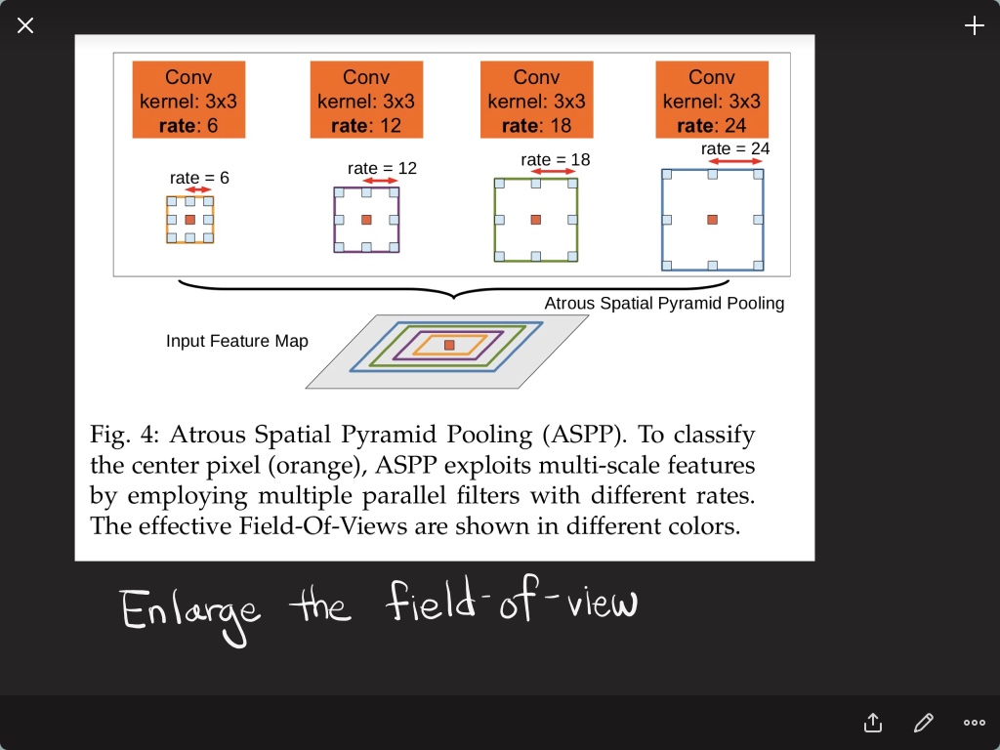

### Full-Resolution Residual Nets

- 줄였다가 키우면, 그 줄인 것 때문에 올바르게 못키운다, CRF를 쓰면 계산량이 많아 real time application 불가
- input 그대로의 Residual Stream과, 기존처럼 Pooling Stream을 병행하여 상호작용 시키는 모델
- 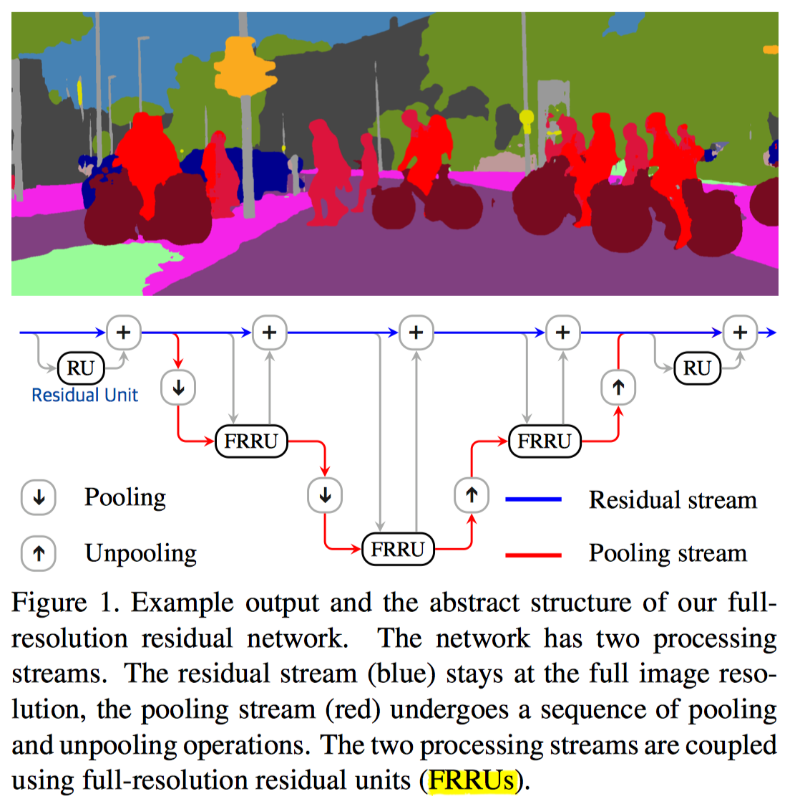
- FRRU에서 ResNet style과 DenseNet Style을 모두 이용

### U-Net

~~Batch Normalization처럼 아묻따 쓰면 좋은거~~

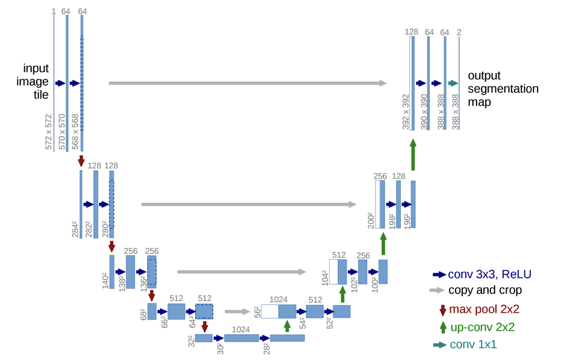

- 앞단의 정보를 그냥 Concat을 시켜버림(회색 화살표)
- Unpooling 사용X, Concat하는 Skip-connection을 사용, FC layer도 없다
- Gan구조에 많이 활용이 된다고 함(선명한 이미지를 얻기 위해)
- 단점 : 채널이 늘어나서 parameter수가 늘어남

#### Deep Contextual Networks

- 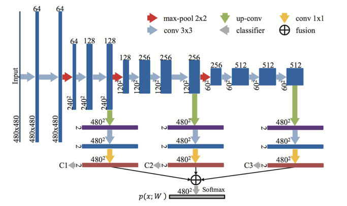

- 중간 중간에 줄어든 것들을 Upconv로 키움, 이를 Concat해서 output을 낸다.

- Lower Memory Consumption

#### FusionNet

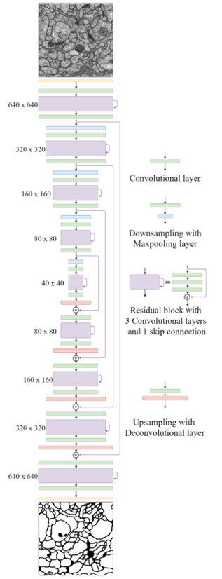

- 앞에것들을 합침
- Skip Connection을 Concat하는게 아니라 더해줌

#### Pyramid Scene Parsing Net(PSPNet)

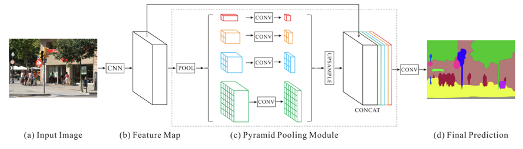

- Pretrained된 ConvNet(ResNet)을 사용 --> 학습시간 단축
- 각기 다른 사이즈의 Pooling이용, 이들을 Concat

---

## Residual Network가 왜 잘되는지 해석해보기

ResNet이 Degradation을 늦춰줌

더 쉽게 학습을 시킬 수 있다.

근데 왜 잘될까?

### ResNet is an Ensemble Model

*Andreas el. al. "Residual Networks are Exponential Ensembles of Relatively Shallow Networks." arXiv (2016).*

- Skip Connection이 Ensemble과 같은 역할을 한다.
- 중간에 Layer를 끊는 실험
- 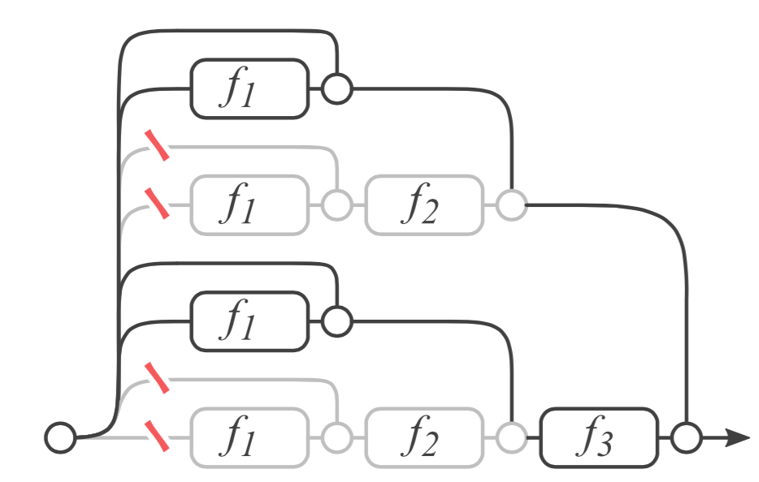
- 뒷단의 Layer를 끊을때 성능 차이가 거의 없다(중간중간 차이나는 애들은 Max Pooling이 일어나는 곳이라고 한다.
- 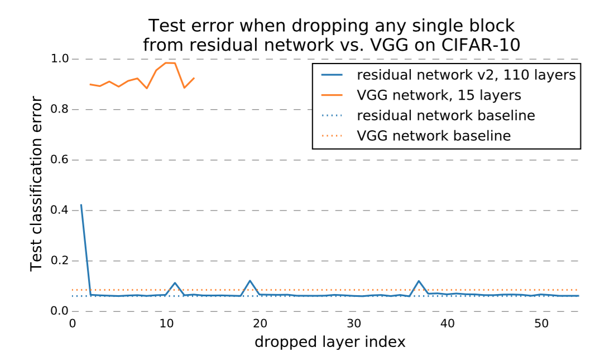
- 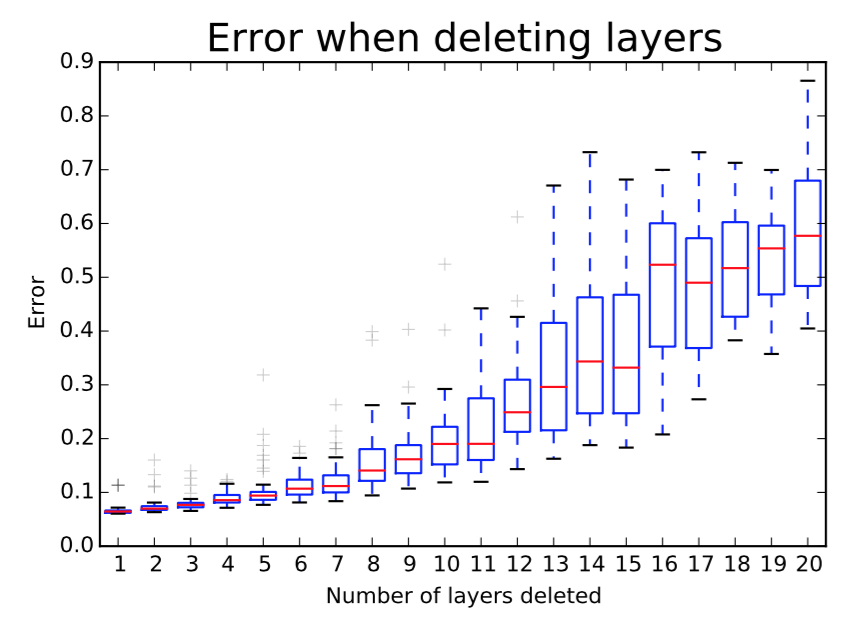
- layer를 여러개 끊는 실험도 해볼 수 있다. 그렇게 Member를 없앴을때 에러가 위처럼 Smoothly하게 올라가므로, ResNet은 Ensemble 모델이라고 할 수 있다.

Shallow Net..?

### Depth is NOT that important

*Zagoruyko, Sergey, and Nikos Komodakis. "Wide Residual Networks." arXiv (2016).*

- Deep 한게 중요한걸까?

- Param을 줄이기 위한 Residual Connection이 안좋을 수도 있지 않을까?

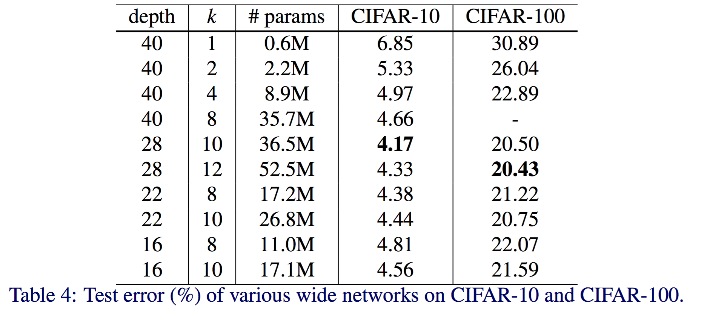

- 파라미터가 많은 애가 성능이 좋네?
- Depth가 늘어난게 성능이 더 안좋네?
- 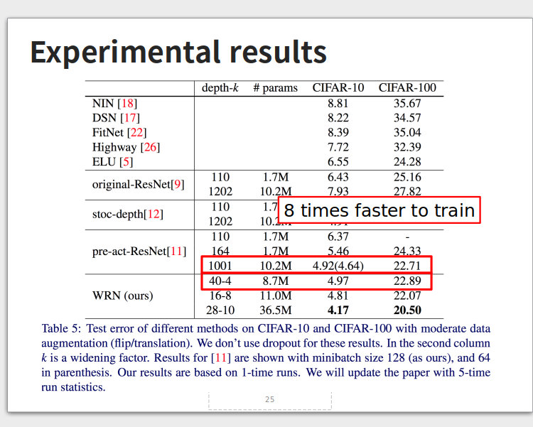
- Depth가 깊어지면 GPU가 아무리 많아도 시간이 길어질 수 밖에 없음(이전 layer가 계산되어야 이번 layer가 계산되므로)

- 채널수를 늘리는 것도 depth와 관계없이 성능향상에 도움이 된다.

- Depth를 늘리는 것보다 채널수를 늘리는게 학습이 쉽다.

## Weakly Supervised Localization

*Learning Deep Features for Discriminative Localization – CVPR2016*

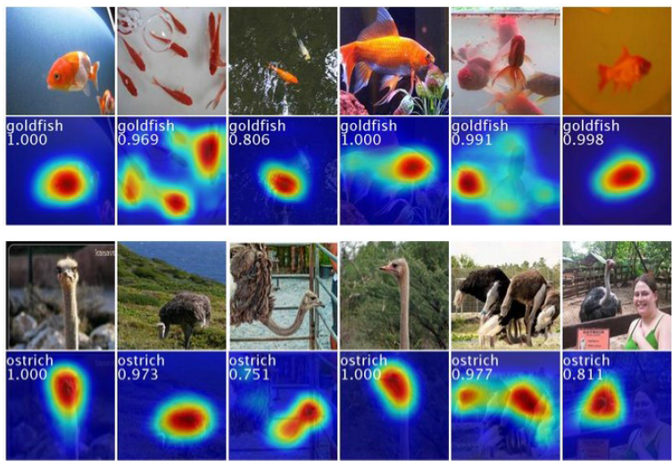

- **Bounding Box 없이** 물체의 위치를 알려준다.
- 의료영상에서 많이 쓰인다고 함.
- CNN을 디버깅하는데 많이 쓰임

### Class Activation Map(CAM)

- Convolutional Feature map의 채널이 의미하는 것은...
  - 각각의 convolutional filter와 우리의 원래 이미지가 얼마나 유사한지
- 여기에 GAP(Global Average Pooling)을 해주면, 특징(부위?)별로 image가 그 특징(부위)를 얼마나 가지고 있는지에 대한 정보를 알 수 있다.

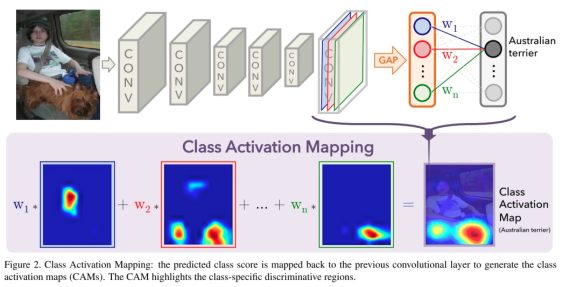

- weight가 의미하는 건, 각각의 feature들의 Class에 대한 중요도

- 채널들은 해당 feature가 원래 이미지에서 어디 많이 나오는지에 대한 heatmap 정보를 담는다.
- GAP는 물체 전반(강아지 전반)을 잡는다, GMP는 단 하나의 구별되는 부분(강아지의 얼굴)을 찾는다.
- 성능이 괜찮다

- Positive Dataset으로 우리의 target이 많이 노출된 데이터를, Negative로 random한, 그냥 outdoor dataset을 이용해서 학습시키면, target이 어딨는지 학습시킬 수 있는 모델(target detector)을 만들 수 있다.

http://tmmse.xyz/2016/04/10/object-localization-with-weakly-supervised-learning/