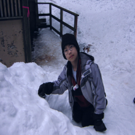
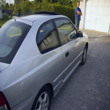
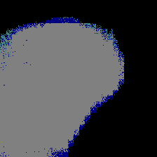
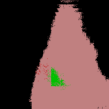
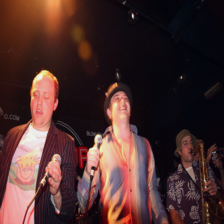
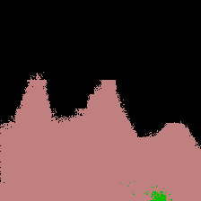

# PyTorch Implementation (WIP)

* Usage
~~~
python trainer.py \
-- data /path/to/VOCdevkit/ \
-- model_name fcn8s \
-- mode finetuning \
-- optimzizer Adam \
-- lr 1e-4 \
-- n_epoch 200 \
-- check_step 20 \
-- batch_size 32 \
~~~

* Dataset: [Pascal VOC 2012](http://host.robots.ox.ac.uk/pascal/VOC/voc2012/)
  * train: "train.txt"(1464) + "val.txt"(772) = 2236 images
  * test: "val.txt"(834)
  
* Result
  * Pixel Accuracy
    * train: 0.97934
    * test: 0.85983
  * train-loss: 0.05790

* Samples

| input image | output mask |
| ----------- | ----------- |
|  |  |
|  |  |
|  |  |
|  |  |
|  |  |
