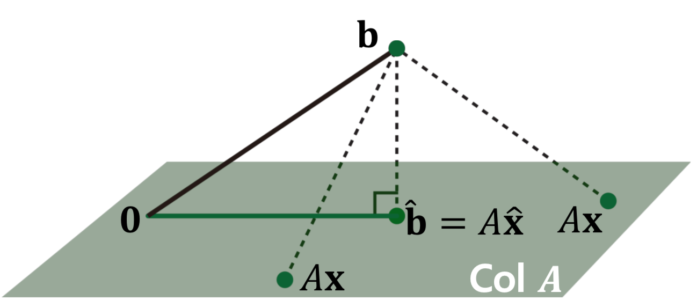
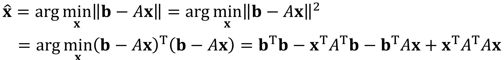
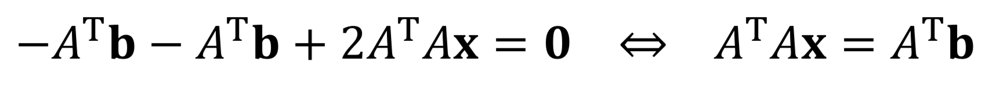

# Linear Equation
책의 2장은 Linear Algebra, 선형대수입니다. 이 부분이 딥러닝을 공부하는 데에 있어서 정말 중요한 부분 중 하나인데, 텍스트만 보고 이해하기에는 무리가 있어 같은 내용을 다루는 주재걸 교수님의 [인공지능을 위한 선형대수](https://www.edwith.org/linearalgebra4ai)를 들으며 공부해보기로 했습니다. 첫번째 파트에서는 다음과 같은 내용을 다룹니다.

*** 목차**
- 2_1. 선형방정식 선형시스템
- 2_2. 선형결합
- 2_3. 선형독립과 선형종속
- 2_4. 부분공간의 기저와 차원
- 2_5. 선형변환
- 2_6. 전사함수와 일대일함수
- 3_1. Least Squares Problem
- 3_2. Least Squares Normal Equation

## 2_1. 선형 방정식
* 변수 $x_1, \cdots, x_n$에 대한 선형 방정식은 다음과 같은 형태로 표현할 수 있다.
$$a_1x_1+a_2x_2+\cdots+a_nx_n=b$$
* 위 식은 아래와 같은 행렬의 방정식으로 간단하게 표현할 수 있다.
$$\mathbf{a}^{T}\mathbf{x}=b$$
이 때,
계수에 해당하는 벡터는 $\mathbf{a}=\begin{bmatrix} a_1 \\ a_2 \\ \vdots \\ a_n \end{bmatrix}$ 
로, 변수에 해당하는 벡터는
$\mathbf{x}=\begin{bmatrix} x_1 \\ x_2 \\ \vdots \\ x_n \end{bmatrix}$
로 나타낼 수 있다.

### 항등 행렬 (Identity Matrix)
* *정의)* 대각선 성분이 모두 1이고, 그 외의 성분은 모두 0인 정사각 행렬을 항등 행렬이라고 한다.
    따라서, n차 항등 행렬은 n차 실수 공간에 존재한다. $I_n \in \mathbb{R}^{n \times n}$

### 역 행렬 (Inverse Matrix)
* *Def)* 임의의 정사각 행렬 $A \in \mathbb{R}^{n\times n}$에 대해, 
    그의 역행렬 $A^{-1}$ 은 다음을 만족한다.
$$A^{-1}A=AA^{-1}=I_n$$.

* 위 정의가 의미하듯이, 왼쪽 곱셈이나 오른쪽 곱셈 모두 그 결과가 항등 행렬이어야 한다.
    - 행렬의 곱셈은 교환법칙이 성립하지 않음
    - 왼쪽 곱셈과 오른쪽 곱셈이 모두 가능해야하므로 정사각 행렬에서만 역 행렬을 정의할 수 있다.

* 예를 들어, 임의의  $2 \times 2$ 행렬 $A=\begin{bmatrix}a&b\\c&d\end{bmatrix}$에 대해,
    그 역행렬 $A^{-1}$은 다음과 같이 정의 된다.  
    $$A^{-1}=\frac{1}{ad-bc}\begin{bmatrix}d&-b\\-c&a\end{bmatrix}$$

* 행렬식(determinant) **$\text{det}A$** 는 행렬 $A$의 역행렬이 존재하는지 존재하지 않는지 알려주는 역할을 한다.
    - 행렬식의 값이 **0**이면 역행렬이 **존재하지 않는다**
    - 행렬식의 값이 **1**이면 역행렬이 **존재한다**

##### 역행렬이 존재하지 않는 행렬 $A$ 에 대한 방정식 $A\mathbf{x}=\mathbf{b}$
* $A$ 의 역행렬이 존재하지 않으면, 방정식 $A\mathbf{x}=\mathbf{b}$ 
    의 해는 **존재하지 않**거나 **무수히 많이 존재**한다.

## 2_2. 선형결합

### 선형 결합 (Linear Combination)
* 벡터 $\mathbf{v}_{1}, \mathbf{v}_2, ..., \mathbf{v}_p \in \mathbb{R}^n$ 와
    스칼라 계수 $c_1, c_2, \cdots, c_p$ 에 대해,
    $$ c_1 \mathbf{v}_1 + \cdots + c_p \mathbf{v}_p$$
    는 $\mathbf{v}_1, \cdots, \mathbf{v}_p$의 **선형 결합**이라 불리고,
    $c_1, \cdots, c_p$는 상수 혹은 가중치라고 불린다.

### Span
* *정의)* 벡터들의 집합 $\mathbf{v}_1, \cdots, \mathbf{v}_p \in \mathbb{R}^n$에 대해,
    *Span ${\mathbf{v}_1, \cdots, \mathbf{v}_p}$*은
    **벡터** $\mathbf{v}_1, \cdots, \mathbf{v}_p$ **로 만들어지는 모든 선형 결합의 집합**을 의미한다.
    

## 2_3 선형독립과 선형종속

### 선형 독립 (Linear Independence)
* 간단히 설명하자면, 벡터들의 집합 $\mathbf{v}_1, \cdots, \mathbf{v}_p \in \mathbb{R}^n$이 있을 때,
    만약 $j=1, \cdots, p$에 대해, $\mathbf{v}_j$가 해당 벡터를 제외한 나머지 벡터들,
    ${\mathbf{v}_1, \mathbf{v}_2, \cdots, \mathbf{v}_p}$, 로 표현될 수 없다면
    벡터 집합은 선형 독립이다.

* *Def)*
    $\mathbf{x}=\begin{bmatrix}x_1 \\x_2\\\vdots\\x_p\end{bmatrix}
    =\begin{bmatrix}0\\0\\\vdots\\0\end{bmatrix}$ 이
    방정식 $x_1\mathbf{v}_1+x_2\mathbf{v}_2+\cdots+x_p\mathbf{v}_p=\mathbf{O}$의 유일한
    해라면, $\mathbf{v}_1, \cdots, \mathbf{v}_p$는 선형 독립이다.

## 2_4. 부분 공간의 기저와 차원
* *Def)* 부분 공간 $H$ 는 실수 공간 
    $\mathbb{R}^n$ 의 부분 집합으로, 선형 결합에 닫혀 있는 집합을 의미한다.

### Basis of a Subspace
* *Def)* 부분 공간 H 의 기저 벡터는 다음 조건들을 만족한다: 
    - 부분 공간 $H$ 전체를 span으로 갖는다.
    - 서로 선형 독립이다.

### Rank
* *Def)* 행렬 matrix A 의 rank는, rank A 라고 쓰고, 
    A의 열 공간의 차원을 의미한다.
    - rank $A =$ dim Col $A$ 

## 2_5. 선형변환

### 용어 정의

- Domain : 정의역
- Co-domain : 공역
- Image : '상'으로 정의되는 개념으로 x를 바탕으로 (given x)변환된 (mapped) y를 x의 image라고 한다.
- Range : 공역 중에 실제 함수 값으로 쓰이는 치역
- 특정 x값의 image는 하나다. (the output mapped by a particular x is uniquely determined.)

### Linear Transformation

- Definition : A transformation (or mapping) T is linear if:

  $T(c\mathbf{u}+d\mathbf{v})=cT(\mathbf{u})+dT(\mathbf{v})$ for all $\mathbf{u}, \mathbf{v}$ in the domain of $T$ and for all scalars $c$ and $d$ 

모든 벡터 $\mathbf{u}, \mathbf{v}$와 상수 $c,d$에 대해서 위의 식이 성립해야 한다.

(Homogeneity property, Additivity property) 

$T(x_1, x_2) = 3x_1+4x_2$ 이런 변환은 위의 정의를 만족하기 때문에 선형 변환이지만, $T(x) = 3x+4$ 는 위의 가정을 만족하지 못하기 때문에 선형변환이 아니다. (상수항에 의해 '이동'되는 것을 포함하는 변환은 Affine Transformation이라고 한다고 합니다.)

- $y=3x+2$ 는 선형 변환일까? 

  위의 예제에서 처럼 $T:\mathbb{R}^1 \rightarrow\mathbb{R}^1 $에서는 참이 아니다.

  하지만 $T:\mathbb{R}^2 \rightarrow\mathbb{R}^1 $의 경우에는 상수가 있어도 변환시 linear transformation의 가정을 만족시킨다.

  Ex. $\begin{bmatrix}3 &  2\end{bmatrix}\begin{bmatrix}x\\1\end{bmatrix}=3x+2$

$\mathbf{u}=\begin{bmatrix}1\\2\end{bmatrix}$,  $\mathbf{v}=\begin{bmatrix}3\\4\end{bmatrix}$ 라고 놓은 뒤 $[T]=\begin{bmatrix}3 &  2\end{bmatrix}$ 를 바탕으로 $T(c\mathbf{u}+d\mathbf{v})=cT(\mathbf{u})+dT(\mathbf{v})$를 해보면 성립하는 것을 볼 수 있다.

### Matrix of Linear Transformation

$T$의 원형을 파악하기 위한 방법. 선형변환인 경우

$T(\mathbf{x})=A\mathbf{x} $ for all $\mathbf{x}$ in $\mathbb{R^n}$

으로 정의되고,
$$
A = \begin{bmatrix}

 T(\mathbf{e_1})& T(\mathbf{e_2}) & \cdots & T(\mathbf{e_n})

\end{bmatrix}
$$
으로 정의된다. 이에 대한 증명은 원숭이책 271p.에 나와있는데,

 

 $\mathbf{x}$를 단위벡터의 선형결합 형태로 분리한 다음, 선형변환의 성질을 이용하여 $T(\mathbf{e}_i)$ 를 column vectors로 사용한다면 $T(\mathbf{x}) = A\mathbf{x}$가 된다.

다음의 예제를 풀면서 조금 더 익숙해져 보자.

Show that the transformation $T:\mathbb{R}^3 \rightarrow\mathbb{R}^2 $ defined by the formula 
$$
T(x_1, x_2, x_3) = (x_1+x_2, x_2-x_3)
$$
is linear and find its standard matrix.

## 선형변환 with Neural Network

- Fully-connected layers (linear layer)

(그림 생략)

선형변환에 의해 나타내어지는 layer를 시각화 한것. 예제는 grayscale의 2x2 이미지를 input으로 하는 NN 구조이다.

밑의 layer는 linear layer가 아닌 affine layer를 시각화한 것이다.

bias term을 넣은것 (위의 1)은 Linear Transformation이 아니고 Affine Transformation (선형변환 + 이동)인데, 이를 선형으로 만들기 위해서는 column combination을 사용한다.

위의 예제의 경우에서는 bias Term을 column으로 추가하고 Input vector의 마지막 dimension에 1이라는 값을 추가했다.

## 2_6. 전사함수와 일대일함수

- Onto(전사) : 공역 = 치역

전체를 투영시켰다는 의미에서 '전사'라고 한다.

- One-to-One(일대일함수) : y의 기준에서 봤을 때, x와 y가 일대일대응

$T:\mathbb{R}^m \rightarrow\mathbb{R}^n​$ 인 선형변환 $T​$에 대해 $m>n​$  이면 정의역보다 공역이 훨씬 작은 사이즈이기 때문에 one-to-one이 될 수 없다.

### Neural Network Example

- Fully-connected layers (비선형변환 생략)

- NN에서의 One-to-One

위의 NN의 경우 Weight, Height, Is_smoking을 입력받아 Life-span을 예측하는 모델이다. 학습을 위해 n개의 데이터가 들어왔을 경우, $\mathbf{x}$는 n X 3 DataFrame 이다. 쉬운 이해를 위해 각각의 벡터에 대해서만 생각해보자.

입력된 데이터를 바탕으로 over-weighted, tall_and_smoking node를 만들어 내는 변환 $T_1$은 $T_1:\mathbb{R}^3 \rightarrow\mathbb{R}^2$ 변환이다. 그렇다면 이 변환은 one-to-one이 될 수 있을까?

$\mathbf{y} = [105, 3]^T$ 라는 값이 있다고 할 때, 이 값을 만들어주는 $\mathbf{x}$가 단 한개라면, 이게 모든 $\mathbf{y}$에 적용이 된다면 one-to-one이다. 하지만, 변환 이후의 dimension이 하나 감소하므로 위의 정의대로 one-to-one이 될 수 없다.

위의 NN을 life-span이라는 의미있는 정보만 남기기 위해 나머지를 버리는 (정보의 손실) 선형 변환이라고 생각할 수 있다.

- Onto

공역이 $\mathbb{R}^2$인데, 치역이 [1,2], [2,4] , [5,10] 이렇게 구성된다면 onto가 될 수 없다. 데이터의 특성에 따라 onto일 수도, 아닐 수도 있다.

### Onto and One-to-one Definition

$T:\mathbb{R}^n \rightarrow\mathbb{R}^m$ 이고 $T(\mathbf{x})=A\mathbf{x} $ for all $\mathbf{x}$ in $\mathbb{R^n}$ 에 대해

- **$T$ is One-to-one if and only if the columns of $A$ are linearly independent. **
- **$T$ maps $\mathbb{R}^n $ onto $\mathbb{R}^m$ if and only if  the columns of $A$ span($\mathbb{R}^m$)**

예제를 풀어보자.

1. one-to-one이기 위해서는 column vectors 끼리 선형독립이어야 한다. first column vector를 상수배해도 second column vector가 나오지 않으므로 one-to-one.
2. 우선  $\mathbb{R}^2 $ 공간이 $\mathbb{R}^3 $ 공간에 전사될 수 없다는 것은 직관적으로도 알 수 있다. onto의 정의에 따르면, column vectors를 span한 것이 span($\mathbb{R}^3 $)과 같아져야 onto인데, 3차원 공간을 완벽하게 커버하기 위해서는 최소 3개의 벡터가 필요하기 때문에 거짓이다. 

#### 스스로 공부하면 좋은 부분들

- Gaussian elimination, row reduction, echelon form

선형대수를 배우면 가장 처음에 하는 것으로, 일종의 '노가다'이다. 연산은 컴퓨터가 해줄 것이기 때문에 가볍게? 넘어갑니다..

- LU factorization

저도 몰라서 공부해봐야 할 것 같습니다!

- Computing invertible matrices

역행렬 잘 구하면 됩니다!

- Invertible matrix theorem for square matrices

역행렬이 존재하면서 정사각행렬인 경우에는 아래의 명제들이 전부 equivalent 한데, 이를 원숭이 책에서는 Unifying Theorem이라고 언급합니다.

# 3. Least squares
## 컨셉
- Over-determined linear systems
$$
60x_1 + 5.5x_2 + 1\cdot x_3 = 66
$$
$$
65x_1 + 5.0x_2 + 0\cdot x_3 = 74
$$
$$
:
$$

    - 방정식의 갯수가 변수의 갯수보다 많을 때
    - 이론적으로 보면 완벽하게 만족시키는 것은 보통 불가능하다.(해가 없다)
    - 해가 존재하려면 좌변의 큰 차원의 벡터 $a_1, a_2, a_3$로 span할 수 있는 공간에 우변의 $b$벡터가 존재해야 하는데 그러지 못한다.
    - 그렇다고 그냥 포기할 수는 없다. 근사적으로라도 최적의 해를 구해보자!
    
## 기본적 내용
그러기 전에 기본적인 내용을 짚고 갑시다.

- 내적
    - 같은 공간의 두 벡터$u, v\in \textit{R}^n$에 대해 같은 위치(elementwise)끼리 곱해서 더하는 것을 내적이라고 한다.
    - 행렬의 곱으로 보자면 첫 벡터를 transpose시키고 오른쪽 벡터를 곱하는 것으로 생각할 수 있다.
    - 기호 : $u\cdot v = v\cdot u = u^Tv$
    - 교환법칙, 결합법칙 성립
    - $(c_1u_1+...+c_pu_p)\cdot w = c_1(u_1\cdot w)+...+c_p(u_p\cdot w)$

- Vector Norm : 벡터의 길이
    - 정의 : $||v|| = \sqrt{v\cdot v} = \sqrt{v_1^2+v_2^2+...v_n^2}$
    - 각 벡터를 $c$배 하면 vector norm도 $c$배가 된다

- Unit Vector : 단위벡터
    - 어떤 벡터든 방향은 바꾸지 않고, 길이만 1로 바꾸는 것을 unit vector라고 함.
    
- Distance between vectors in $R^n$
    - 정의: $dist(u,v) = ||u - v||$

- 내적을 통해 두 벡터간 각도 구하기
    - $u\cdot v = ||u||\space||v||\space cos\theta$
    
- Orthogonal Vector
    - 두개의 벡터가 수직인 경우 이들을 orthogonal 하다고 한다.
    - $u\cdot v = ||u||\space||v||\space cos\theta = 0$

## Error
$$
A x = b
$$

- 방정식 갯수와 미지수 갯수가 같은 상황을 original problem이라고 하고 이 때 구한 solution을 $b$라고 하자.

$$\begin{bmatrix}60 & 5.5 & 1\\65 & 5.0 & 0\\55 & 6.0 & 1\\50 & 50.0 & 0\end{bmatrix}
\begin{bmatrix}x_1\\x_2\\x_3\end{bmatrix}=\begin{bmatrix}66\\74\\78\\72\end{bmatrix}$$

- 여기서 위처럼 식을 하나 추가하게 되면 해는 없겠지만, 추가한 식에서 발생하는 차이를 error라고 생각할 수 있다.
- 수식으로 생각하면, 좌변을 계산하여 나오는 $\hat{b}$와 실제 $b$의 거리를 error라고 볼 수 있다.
- 결국 차이(sum of squared error)를 최소화하는 $A$를 찾는 것이 **최선**의 solution이라고 할 수 있다.

## Objective Function
- 우리가 풀고자 하는 문제를 제대로 정의해보면
$$\hat{x} = argmin ||b-Ax|| $$를 최소화하기 위해 x를 조절한다.

## 어떻게 찾을 것인가?

- 결국 $b$가 $Col A$에 속하지 않기 때문에 이를 근사하는 것이다. 이는 $Col A$에서 $b$와 가장 가까운 $\hat{b}$을 찾아서 $\hat{b}$과 $b$의 거리를 구하면 해결된다.
- 잘보면, $b-\hat{b}$는 $Col A$위의 모든 벡터에 대해 수직이어야 한다. 
$$
(b-\hat{b})\cdot (a_1x_1 + a_2x_2 + a_3x_3 ...)
$$
- 그럼 어떤 열벡터 $a_1$에 대해 $(b-A\hat{x})\cdot a_1=0$인데, 이는 $a_1^T(b-A\hat{x})=0$이 된다.

## Normal Equation: 정규방정식
- 얘도 또다른 선형시스템으로 볼 수 있다
- $A^T(b-A)$를 구하는 과정에서 $Ax\approx b$이므로
$$
A^TA\hat{x} = A^Tb
$$
- 위의 식을 구하는 문제로 되고, 이를 정규방정식이라고 한다. 최적의 해를 구하는 것이 결국 이 방정식을 푸는 방식이 되는 것.
- 즉 우리가 구하고자 하는 최적의 해는 아래와 같다.
$$
\hat{x} = (A^TA)^{-1}A^Tb
$$
- 물론 역행렬이 있는지를 파악해야함(정사각행렬이어야하고)

# 다른 접근 방식
- 길이가 최소가 되는 $\hat{x}$는 길이의 제곱을 최소화하는 $\hat{x}$와 같다.

- 이를 x에 대해 미분하면, 다음과 같다.(이부분 잘 모르겠음)

- 즉, $A^TA$가 역행렬이 존재하면, 최적해는 다음과 같다.
$$
x = (A^TA)^{-1}A^Tb
$$
- Matrix Cookbook: 공식 정리 cheat sheet

# $A^TA$가 역행렬이 없다면?
- 해가 없을 수는 없다(최적이기 때문에), 다만 해가 무수히 많을 수는 있다
- 수선의 발을 표현할 수 있는 여러 선형결합이 존재할 수도 있다
- 일반적으로는 거의 없다.
- 대부분 일반적으로 선형독립일 수가 없기 때문이다.