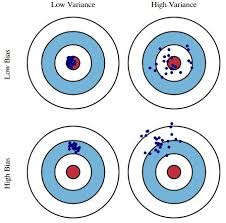
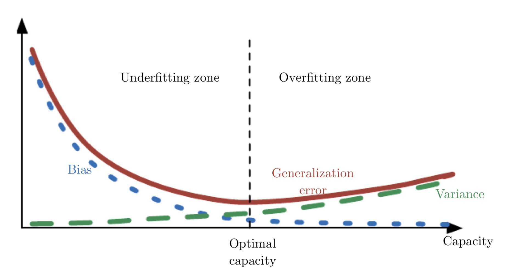

# 5.4 Estimator, Bias and Variance

파라미터 추정, bias, variance와 모델의 일반화, underfitting, overfitting에 대한 기본적인 개념을 다룬다.

## 5.4.1 Point Estimation

#### Point estimation

- 추정하고자 하는 값에 대해 "단 하나의" 예측 값을 찾는 것.
- 이 추정하고자 하는 값은 하나의 파라미터일 수도, 벡터일 수도 있다.

#### Former expression

Let $\{x^{(1)}, \dots, x^{(m)}\}$ be a set of $m$ independent and identically distributed data points.
A **point estimator** or **statistic** is any function of the data:

$$\widehat{\theta}_m=g(x^{(1)}, \dots, x^{(m)}).$$

#### Frequentist perspective

- 추정하고자 하는 값 $\theta$ 는 상수로, 고정되어 있지만 알려져 있지 않다.
- 추정량 $\widehat{\theta}$ 는 데이터를 설명하는 함수로, 이 데이터는 데이터 생성 과정(data generation process)로부터 생성된다.
- 즉, 추정량 $\widehat{\theta}$ 은 확률 변수이다.
- 좋은 estimator는 실제 값 $\theta$ 에 가장 가까운 결과를 만들어내는 함수가 된다.

#### Function estimation
- $\widehat{\theta}$ 는 입력 변수와 타겟 변수의 관계를 의미한다.
- 결과적으로, 함수를 추정하는 것은 위에서 $\theta$를 추정하는 것과 동일한 것으로 이해할 수 있다.

## 5.4.2. Bias

어떤 estimator의 편향(bias)은 다음과 같이 정의된다. 

$$\text{bias}(\widehat{\theta}_m)=\mathbb{E}(\widehat{\theta}_m)-\theta$$

여기서 기대값은 데이터에서의 기대값을 의미하고,

- $\theta$ 는 데이터 생성 과정을 정의하는 참값을 의미한다.
- $\mathbb{E}(\cdot)$ 는 기대값을 의미하는 표기이다.

#### Unbiasedness

- 한 estimator $\widehat{\theta}_m$가 $\text{bias}(\widehat{\theta}_m)=0$ 할 때 **unbiased** 하다고 하며, 이는$\mathbb{E}(\widehat{\theta}_m)=\theta$ 를 의미한다.
- 한 estimator $\widehat{\theta}_m$가 $\text{lim}_{m \rightarrow \infty} \text{bias}(\widehat{\theta}_m)=0$ 할 때 **asymtotically unbiased** 하다고 하며, 이는 $\text{lim}_{m \rightarrow \infty} \mathbb{E}(\widehat{\theta}_m)=\theta$이 만족한다는 것을 의미한다.

## 5.4.3 Variance and Standard Error

분산(variance)는 데이터 샘플이 바뀔 때, 모델이 가지는 변동의 기댓값을 의미한다.

다시 말해서, 데이터 생성 과정을 통해 다른 데이터들이 resample 되었을 때, 학습되는 모델이 지금의 모델에 비해서 얼마나 다를지 확률적으로 계산한 값이라고 할 수 있다.

우리가 한정된 데이터를 가지고 분석을 할 때, 어느 정도 불확실성을 내포할 수 밖에 없는데, 이 때 분산을 활용하여 신뢰 구간을 추정할 수 있게 된다.

이 신뢰 구간을 활용해서 서로 다른 두 알고리즘을 비교할 수 있게 된다.

## 5.4.4 Trading off Bias and Variance

- **Bias** 는 실제 값으로부터 기대되는 편차(deviation)를 의미한다.
- **Variance**는 서로 다른 데이터가 sampled 됐을 때, 모델 간에 발생할 수 있는 차이를 의미한다고 생각하면 된다.

#### Mean squared error

MSE는 전체적인 차이 모두를 반영하는데, 아래와 같이 분해될 수 있다.

$$\begin{split} \text{MSE} & = \mathbb{E}[(\widehat{\theta}_m - \theta)^2]
\\& = \text{Bias}(\widehat{\theta}_m)^2 + \text{Var}(\widehat{\theta}_m)\end{split}$$

#### Underfitting and overfitting

모델의 capacity가 증가하게 되면, 모델의 복잡성이 커져 variance가 커지면서, 학습 데이터에 과적합되고, generalization error가 커지게 된다.
반대로 작은 capacity에서는 모델이 데이터의 복잡성을 충분히 학습하지 못하여, bias가 커지는 underfitting이 일어나게 된다.

## 5.4.5 Consistency

데이터 셋에서 데이터 샘플의 양 $m$이 증가함에 따라서, 점 추정 값이 실제 값에 수렴하게 된다면 이를 consistent하다고 한다.

$$\lim_{m\to\infty} \widehat{\theta}_m \overset{p}{\to} \theta $$ .

$ \overset{p}{\to} $ 는 확률적 수렴 개념을 나타내는 것인데 다음과 같이 정의된다.

$$\begin{split} & \text{for any }\epsilon \ge 0, \\
& P(|\widehat{\theta}_m-\theta |\ge\epsilon)\to0 \text{ as } m\to\infty.\end{split}$$

일반적인 수렴의 정의에 확률의 개념이 더해진 것을 확인할 수 있다.

#### Asymptotic unbiasedness and consistency

- Asymptotic unbiasedness 하다는 것이 consistent 하다는 것을 의미하지는 않는다. 하지만 그 역은 항상 성립한다.

- 예를 들어, 정규 분포 $\mathcal{N}(x;\mu,\sigma^2)$ 를 따르는 데이터 셋 {$x^{(1)}, \dots, x^{(m)}$} 에서 평균 값 $\mu$ 를 추정하는 상황을 가정해보자.

    - 만약 추정값으로 $\widehat{\theta}=x^{(1)}$를 이용하면, $\mathbb{E}(\widehat{\theta}_m)=\mu=\theta$하다는 점에서 *unbiased estimator* 하다고 할 수 있다.
    
    - 이 때, *asymptotic unbiased* 역시 성립하는 것을 알 수 있다.
    
    - 하지만 $\widehat{\theta}_m\to\theta$ as $m\to\infty$가 성립하지는 않는다. 따라서 consistent하지는 않다.
    
    

# 5.5 Maximum Likelihood Estimation

위에서 다룬 내용들과 같이 case by case로 추정량을 찾는 방법 말고 어떤 일반적인 알고리즘이나 과정을 통해
우리가 원하는 함수나 값을 찾을 수 있다면 보다 컴퓨터로 구현하기 쉽고, 여러 가지로 활용할 수 있을 것이다.
그러한 방법 중 하나가
*maximum likelihood principle*.
이다.

maximum likelihood estimator $\theta$ 는 다음과 같이 정의된다.

$$ \begin{split}
\theta_{ML}&=\underset{\theta}{\operatorname{arg max}}p_{\text{model}}(\mathbb{X}; \theta) \\
&=\underset{\theta}{\operatorname{arg max}}\prod_{i=1}^m p_{\text{model}}(x^{(1)}; \theta)
\end{split}$$

where,
- $\mathbb{X}=\{x^{(1)}, \dots, x^{(m)}\}$ is a set of $m$ examples drawn independently from true data generating distribution $p_{\text{data}}(x)$.
- $p_{\text{model}}$ maps any configuration $x$ to a real number estimating the true probability $p_{\text{data}}(x)$.

#### Log-likelihood

- 하지만 곱 연산을 반복해서 하는 것은 계산이 쉽게 복잡해지고, 컴퓨터를 통해 계산하기에도 좋지 못하다.

- 다음과 같이 곱 연산을 합 연산으로 바꿀 수가 있다:
    $$\theta_{ML}=\underset{\theta}{\operatorname{arg max}}\sum_{i=1}^m \log p_{\text{model}}(x^{(i)};\theta)$$

- 합 연산과 기댓값은 앞에 계수를 제외하면 동일하므로,
    $$\theta_{ML}=\underset{\theta}{\operatorname{arg max}}\mathbb{E}_{\mathbf{x}\sim\widehat{p}_{\text{data}} } \log p_{\text{model}}(x^{(i)};\theta)$$
    
- 특히 신경망 모델에서는 확률 계산을 지수 연산으로 하는 경우가 많으므로 로그 연산을 통해 간단히 계산할 수 있다.
    

#### KL divergence
이러한 추정 방법을 바라보는 또 다른 관점 중 하나는,
바로 $\widehat{p}_{\text{data}}$의 분포와 모델이 만들어내는 분포를 일치시켜나가는 과정이라는 것이다.

따라서, 샘플들의 곱이나 합으로 구하는 대신, 분포 전체를 이용해 추정할 수도 있다.

- 이 dissimilarity는 다음과 같이 KL divergence로 구할 수가 있다.
    $$ D_{KL}(\widehat{p}_{\text{data}}||p_{\text{model}}) =
    \mathbb{E}_{\mathbf{x}\sim\widehat{p}_{\text{data}}}[\log \widehat{p}_{\text{data}}(x) - \log p_{\text{model}}(x)]$$

- 위는 아래 식을 최소화하는 것과 완전히 동일하다.
    $$-\mathbb{E}_{\mathbf{x}\sim\widehat{p}_{\text{data}}}[\log p_{\text{model}}(x)]$$

- 결과적으로, KL divergence 를 최소화하는 과정은 분포의 cross-entropy 를 최소화하는 것과 완전히 동일하다.

- KL divergence의 최솟값은 0이라고 알려져 있으므로, maximum likelihood를 KLD를 최소화하는 것으로 바라보는 관점은 최적화 측면에서 유리한 결과를 이끌어내게 된다.

## 5.5.1 Conditional Log-Likelihood and Mean Squared Error

The maximum likelihood estimator 는 다음과 같은 조건부 확률 $P(y|x;\theta)$로 쉽게 일반화될수가 있다.

따라서 위에 나왔던 추정량은 다음과 같이 바꿔 쓸 수 있다.
$$\theta_{ML}= \underset{\theta}{\operatorname{arg max}}P(Y|X;\theta)$$

데이터들이 i.i.d. 하다고 가정하면 이는 다음과 같이 분해될 수 있다.
$$\theta_{ML}=\underset{\theta}{\operatorname{arg max}}\sum_{i=1}^m \log P(y^{(i)}|x^{(i)};\theta)$$

## 5.5.2 Properties of Maximum Likelihood

- The maximum likelihood estimator is the best estimator asymptotically.
    - As the number of examples $m\to\infty$, in terms of its rate of convergence as $m$ increases.

- The maximum likelihood estimator is consistent under appropriate conditions
    - The true distribution $p_{\text{data}}$ must lie within the model family $p_{\text{model}}$. Otherwise, no estimator can recover $p_{\text{data}}$.

    - The true distribution $p_{\text{data}}$ must correspond to exactly one value of $\theta$.
        Otherwise, maximumlikelihood can recover the correct $p_{\text{data}}$, but will not able to determine which value of $\theta$ was used by the data generating processing.

- No consistent estimator has lower mean squared error than the maximum likelihood estimator.

When the number of examples is small enough to yield overfitting behavior, regularization strategies such as weight decay may be used to obtain a biased version of maximum
likelihood that has less variance when training data is limited.

# 5.6 Bayesian Statistics

#### Review: frequentist statistics

- Estimate a single value of $\theta$, then making all predictions thereafter based on that one estimate.

- Assume that true parameter $\theta$ is fixed but unknown

#### Bayesian statistics

- Consider all possible values of $\theta$ when making a prediction.

- Use probability to reflect degrees of certainty of states of knowledge.

- The data is directly observed, so is not random

- The true parameter $\theta$ is unknown or uncertain and thus is represented as a random variable.

#### Prior probability distribution

- We represent our knowledge of $\theta$ using the *prior probability distribution*, $p(\theta)$.

- We generally select a quite broad prior distribution to reflect a high degree of uncertainty in the value of $\theta$

#### Two differences of Bayesian estiamation

1) Make predictions using a full distribution over $\theta$

For example, after observing $m$ examples, the predicted distribution over the next data sample, $x^{(m+1)}$, is given by
$$p(x^{(m+1)}|x^{(1)},\dots,x^{(m)})=\int p(x^{(m+1)}|\theta)\ p(\theta|x^{(1)},\dots,x^{(m)})$$

$\to$ Bayesian approach to the uncertainty in the estimator is to simply integrate over it, while the frequentist approach addresses the uncertainty in a given point estimate of $\theta$ by evaluating its variance.

2) The contribution of the Bayesian prior distribution

The prior has an influence by shifting probability mass density towards regions of the parameters space that are preffered *a priori*.

Bayesian methods typically generalize much better when limited training data is available, but typically suffer from high computational cost when the number of training examples is large.

## 5.6.1 Maximum *A Posteriori* (MAP) Estimation

We can gain some of the benefit of the Bayesian approach by allowing the prior to influence the choice
of the point estimate.

The MAP estimate chooses the point of maximal posterior probablity:
$$\theta_{\text{MAP}}=\underset{\theta}{\operatorname{arg max}}p(\theta|x)=
\underset{\theta}{\operatorname{arg max}}\log p(x|\theta)+\log p(\theta)$$

#### Penalty term and prior distribution

- The prior distribution in the MAP estimation is similar to the penalty term in the MLE.

- As an example, if prior is given by $\mathcal{N}(\omega;0, \dfrac{1}{\lambda}I^2)$, the log-prior term
is proportional to the weight decay penalty $\lambda\omega^T\omega$.

- MAP Bayesian has the advantage of leveraging information that is brought by the prior and cannot be found in the training data.

- This additional information helps to reduce the variance but increase bias.
