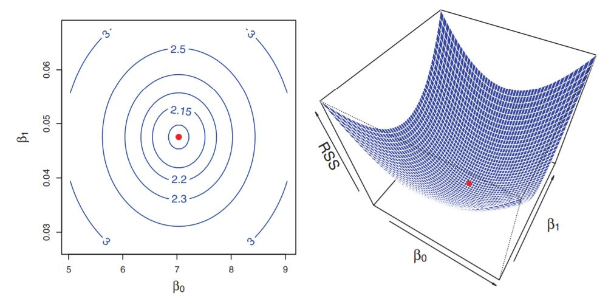
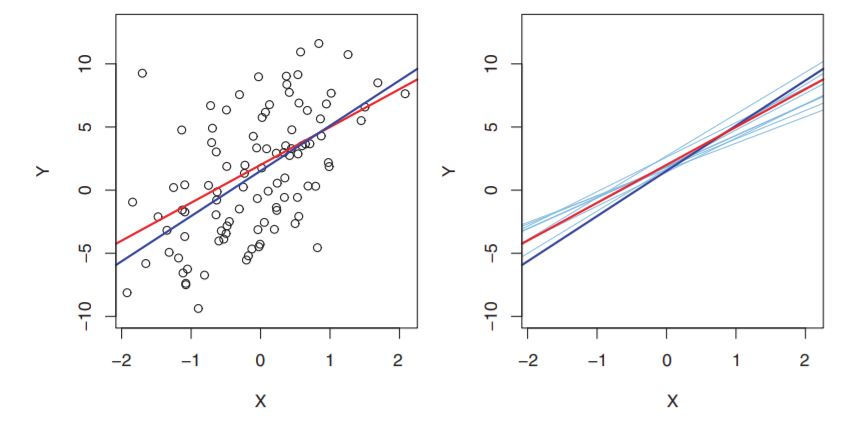
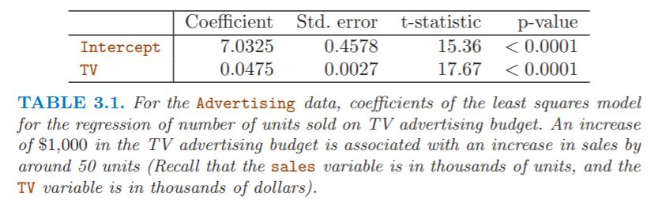
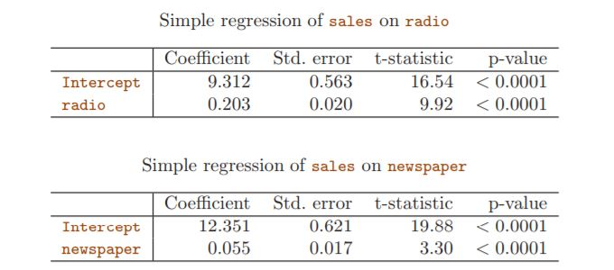
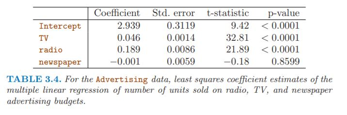
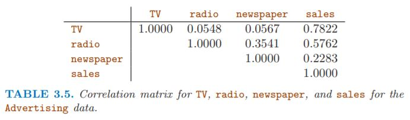
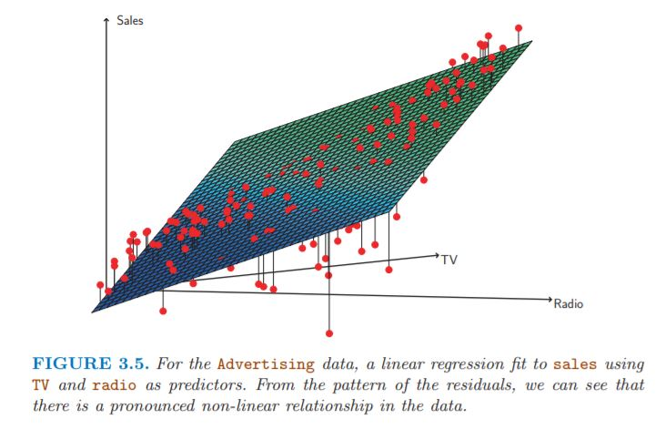
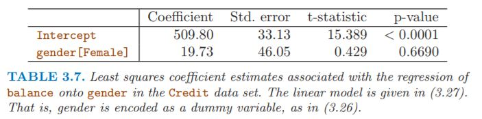
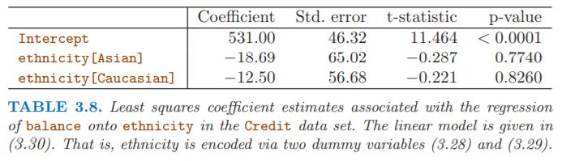
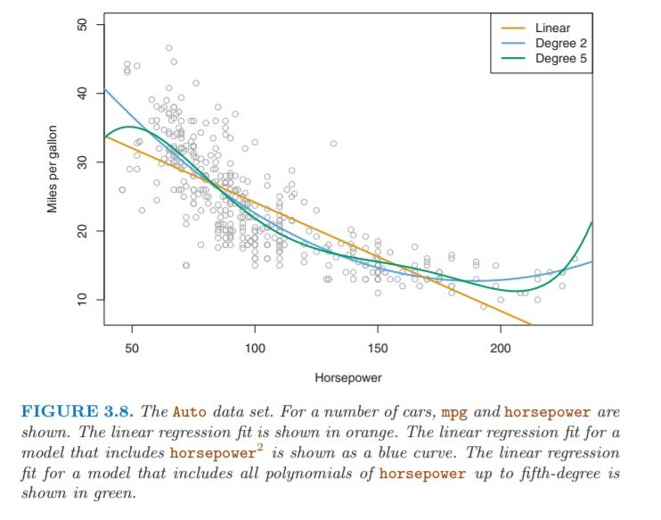

html header: 

# Chapter 3. Linear Regression

## 3.1 Simple Linear Regression

X와 Y사이에 linear relationship이 있는 경우, 아래와 같이 수학적으로 표현한다.

\\(Y={ \beta  }_{ 0 }+{ \beta  }_{ 1 }X\\) (not same, approximately modeled)
\\({ \beta  }_{ 0 }\\) : intercept / \\({ \beta  }_{ 1 }\\) : slope

우리는 training data를 이용하여 \\({ \beta  }_{ 0 }\\)와 \\({ \beta  }_{ 1 }\\)을 \\({ \hat { \beta  }  }_{ 0 }\\)과 \\({ \hat { \beta  }  }_{ 1 }\\)으로 추정한다. 추정한 식은 다음과 같다.
\\(\hat { y } ={ \hat { \beta  }  }_{ 0 }+{ \hat { \beta  }  }_{ 1 }x\\) (\\(\hat { y }\\)는 \\(X=x\\)일 때 Y의 예측값을 나타낸다.)

## 3.1.1 Estimating the Coefficients

\\({ \beta  }_{ 0 }\\)와 \\({ \beta  }_{ 1 }\\)은 unknown이기 때문에, \\(({ x }_{ 1 },{ y }_{ 1 }),({ x }_{ 2 },{ y }_{ 2 }),({ x }_{ 3 },{ y }_{ 3 })...({ x }_{ n },{ y }_{ n })\\)의 데이터를 이용하여, 해당 데이터에 적합한 \\({ \hat { \beta  }  }_{ 0 }\\)과 \\({ \hat { \beta  }  }_{ 0 }\\)를 추정해야만 한다.

추정한 \\({ \hat { \beta  }  }_{ 0 }\\)와 \\({ \hat { \beta  }  }_{ 1 }\\)을 이용하여, \\(X\\)의 \\(i\\)번째 값을 이용하여 추정한 \\(Y\\)값은 \\({ \hat { y }  }_{ i }={ \hat { \beta  }  }_{ 0 }+{ \hat { \beta  }  }_{ 1 }{ x }_{ i }\\) 과 같다. 

추정한 모델의 \\(Y\\)값과 실제 \\(Y\\)값의 차이를 \\({ e }_{ i }={ y }_{ i }-{ \hat { y }  }_{ i }\\) 잔차(\\(residual\\))이라고 부르며, 전체 데이터에 대한 이러한 잔차 제곱합을 \\(residual\\) \\(sum\\) \\(of\\) \\(square\\) (\\(RSS\\))라고 부른다.

\\(RSS={ e }_{ 1 }^{ 2 }+{ e }_{ 2 }^{ 2 }+{ e }_{ 3 }^{ 2 }+...+{ e }_{ n }^{ 2 }\\)

이는 \\(RSS={ ({ y }_{ 1 }-{ \hat { \beta  }  }_{ 0 }-{ \hat { \beta  }  }_{ 1 }{ x }_{ 1 }) }^{ 2 }+{ ({ y }_{ 2 }-{ \hat { \beta  }  }_{ 0 }-{ \hat { \beta  }  }_{ 1 }{ x }_{ 2 }) }^{ 2 }+{ ({ y }_{ 3 }-{ \hat { \beta  }  }_{ 0 }-{ \hat { \beta  }  }_{ 1 }{ x }_{ 3 }) }^{ 2 }+...+{ ({ y }_{ n }-{ \hat { \beta  }  }_{ 0 }-{ \hat { \beta  }  }_{ 1 }{ x }_{ n }) }^{ 2 }\\)으로 다르게 표현 할 수 있다.

우리는 이러한 \\(RSS\\)를 최소화 하는 방향으로 \\({ \hat { \beta  }  }_{ 0 }\\)과 \\({ \hat { \beta  }  }_{ 1 }\\)을 결정 할 것이다. 특정 계산을 통하면, 각 \\(parameter\\)를 다음과 같이 정할 수 있다. (아래 그림 참고)

\\({ \hat { \beta  }  }_{ 1 }=\frac { \sum _{ i=1 }^{ n }{ { ({ x }_{ i }-\bar { x }  }){ ({ y }_{ i }-\bar { y }  }) }  }{ \sum _{ i=1 }^{ n }{ { ({ x }_{ i }-\bar { x }  })^{ 2 } }  } \\)

\\({ \hat { \beta  }  }_{ 0 }=\bar { y } -{ \hat { \beta  }  }_{ 1 }\overline { x } \\)

## 3.1.2 Assessing the Accuracy of the Coefficient Estimates

Mean-zero random error term이 존재하기 때문에(2장 참조), Y와 X간에 선형관계가 있는 경우 아래와 같이 수학적으로 표현해야 한다.

\\(Y={ \beta  }_{ 0 }+{ \beta  }_{ 1 }X+\epsilon \\)

이러한 error term은 \\(X\\)와는 독립적인 것으로 간주된다. error term으로 인해, \\(Y\\)와 \\(X\\)사이에는 완벽한 선형관계가 성립하지는 않는다. 

예를 들어 \\(Y=2+3X+\epsilon \\)이라는 모델로부터, 100개의 \\(X\\)와 이에 대응하는 \\(Y\\)를 아래 그림과 같이 만들었다고 하자.

왼쪽 그림의 빨간 선은 \\(Y=2+3X\\)을 나타내고, 검은 점으로 찍힌 만들어진 100개의 관측치로부터 추정된 식이다. 오른쪽 그림에서는 \\(Y=2+3X+\epsilon \\) 모델로부터 10개의 서로 다른 관측치를 만들어, 각각의 관측치에 적합하는 10개의 추정된 식을 그린 것이다. 서로 다르게 적합된 식이 그려지는 것을 확인 할 수 있다. (error term의 역할)

* \\(Bias\\)

우리가 원하는 모수값을 구하기 위해서, 전체 데이터로부터 sample을 뽑아 추정치를 만들어, 모수값을 추정하려고 한다. 이 때 각 sample로부터 만들어지는 추정치들이, 모수값과 차이를 보일 수 있다. 그럼에도 불구하고, 다양하게 sample을 뽑아 만들어진 추정치들의 평균 = 원하는 모수값이 되는 경우를 \\(Unbiased\\) 하다고 표현한다. 이는 \\(\hat { μ } \\)과 \\(μ\\)의 관계로 쉽게 설명 할 수 있다. 그렇다면 추정치와 모수값이 얼마나 큰 차이를 보일 수 있을까? 이를 \\(Standard\\) \\(Error\\)로 표현 할 수 있다. \\(\hat { μ } \\)의 경우, \\(Var(\hat { μ } )={ SE(\hat { μ } ) }^{ 2 }=\frac { { \sigma  }^{ 2 } }{ n }\\)로 표현 할 수 있다.

\\({ \hat { \beta  }  }_{ 0 }\\)과 \\({ \hat { \beta  }  }_{ 1 }\\)의 \\(Standard\\) \\(Error\\)는 다음과 같다.

\\({ { SE( }{ \hat { \beta  }  }_{ 0 }) }^{ 2 }={ \sigma  }^{ 2 }\left[ \frac { 1 }{ n } +\frac { { \bar { x }  }^{ 2 } }{ \sum _{ i=1 }^{ n }{ { ({ x }_{ i }-\bar { x } ) }^{ 2 } }  }  \right] \\)

\\({ { SE( }{ \hat { \beta  }  }_{ 1 }) }^{ 2 }=\frac { { \sigma  }^{ 2 } }{ \sum _{ i=1 }^{ n }{ { ({ x }_{ i }-\bar { x } ) }^{ 2 } }  } \\)

이러한 \\(Standard\\) \\(Error\\)는 계수의 가설검정에도 사용될 수 있다. 즉 \\(X\\)와 \\(Y\\)의 관계 유무에 대한 가설검정을 할 수 있다.

\\({ H }_{ 0 }\\) : There is no relationship between \\(X\\) and \\(Y\\)

\\({ H }_{ 1 }\\) : There is some relationship between \\(X\\) and \\(Y\\)

\\({ H }_{ 0 }\\) : \\(\beta _{ 1 }=0\\)

\\({ H }_{ 1 }\\) : \\(\beta _{ 1 }\neq 0\\)

이러한 가설검정을 위해서는 \\(\beta _{ 1 }\\)의 추정치인 \\({ \hat { \beta  }  }_{ 1 }\\)가 0과 얼마나 떨리 떨어져 있는지를 측정해야 한다. 만약 충분히 0과 떨어져 있다면, \\(\beta _{ 1 }\\)은 0이 아니다. 따라서 \\({ \hat { \beta  }  }_{ 1 }\\)의 정확도가 중요하기 때문에, 이 때 \\({ { SE( }{ \hat { \beta  }  }_{ 1 }) }\\)가 필요하다. 이 때 \\(t-statistics\\)를 계산하여, 이를 비교한다.

\\(t=\frac { { \hat { \beta  }  }_{ 1 }-0 }{ SE({ \hat { \beta  }  }_{ 1 }) } \\)

\\(p-value\\)를 이용하여 이를 해석한다. \\(p-value\\)가 낮으면 \\({ H }_{ 0 }\\)를 기각하고, 해당 계수는 유의미하다고 판단한다. (아래 테이블 참조)

## 3.1.3 Assessing the Accuracy of the Model

#### RSE 

RSE는 \\(\epsilon\\)의 standard deviation(표준편차)의 추정치이다. 

\\(RSE=\sqrt { \frac { 1 }{ n-2 } RSS } =\sqrt { \frac { 1 }{ n-2 } \sum _{ i=1 }^{ n }{ { ({ y }_{ i }-{ \hat { y }  }_{ i }) }^{ 2 } }  } \\)

RSE는 모델의 데이터에 대한 \\(lack\\) \\(of\\) \\(fit\\)으로 불린다. 모델을 이용하여 추정한 추정치 \\({ \hat { y }  }_{ i }\\)과 실제 outcome \\({ y }_{ i }\\)가 유사할 때, 즉 \\({ \hat { y }  }_{ i }\approx { y }_{ i }\\) 일 때 RSE는 작고, 모델을 데이터에 잘 적합시켰다고 말할 수 있다.

#### \\({ R }^{ 2 }\\)

RSE는 \\(Y\\)의 크기(단위)에 따라 크고 작음이 결정 될 수 있다. 따라서 비율을 나타내어 크기에 영향을 적게 받는 \\({ R }^{ 2 }\\)을 사용한다. 

\\({ R }^{ 2 }=\frac { TSS-RSS }{ TSS } =1-\frac { RSS }{ TSS } \\)

\\(TSS=\sum { { ({ y }_{ i }-\bar { y } ) }^{ 2 } }\\)

\\(TSS\\)는 \\(total\\) \\(sum\\) \\(of\\) \\(square\\)으로, \\(Y\\)전체에 대한 total variance이다. 즉 regression과 같은 모델에 적합시키기 이전에, 처음부터 데이터에 내재되어있는 변동성이라고 할 수 있다. 반면에 \\(RSS\\)는 regression 이후에도 설명되지 않은 채로 남아있는 variability라고 할 수 있다. 따라서 \\(TSS\\) \\(-\\) \\(RSS\\)는 regression을 통해 설명되는(제거되는) 변동성이라고 볼 수 있고, \\({ R }^{ 2 }\\)는 \\(X\\)를 이용하여 설명할 수 있는 \\(Y\\)의 변동성의 비율을 말한다. 즉 모델의 설명력이다. 1에 가까울 수록, 모델의 설명력이 높다. 

## 3.2 Multiple Linear Regression

변수가 여러 개인 경우, 각각의 변수들간의 상관관계를 고려해야 하기 때문에, 각 변수에 대해 simple linear regression을 적용시키는 것은 옳지 않다.

\\(Y={ \beta  }_{ 0 }+{ \beta  }_{ 1 }{ X }_{ 1 }+{ \beta  }_{ 2 }{ X }_{ 2 }+...+{ \beta  }_{ p }{ X }_{ p }+\epsilon \\)

## 3.2.1 Estimating the Regression Coefficients

주어진 데이터가 p개의 변수를 가지고 있다고 하자. 위에서 보인 \\({ \beta  }_{ 0 }\\), \\({ \beta  }_{ 1 }\\), \\({ \beta  }_{ 2 }\\) ... 들은 알려져 있지 않기 때문에, 마찬가지로 추정해야 한다. 계수들을 추정한 식은 다음과 같다.

\\(\hat { y } ={ \hat { \beta  }  }_{ 0 }+{ \hat { \beta  }  }_{ 1 }{ x }_{ 1 }+...+{ \hat { \beta  }  }_{ p }{ x }_{ p }\\)

각 parameter들은 simple linear regression과 마찬가지로, 같은 least squares approach를 이용하여 추정된다. \\({ \beta  }_{ 0 }\\), \\({ \beta  }_{ 1 }\\), \\({ \beta  }_{ 2 }\\),..., \\({ \beta  }_{ p }\\)는 \\(RSS\\)를 최소화 하는 방향으로 추정된다.

\\(RSS=\sum _{ i=1 }^{ n }{ { ({ y }_{ i }-{ \hat { y }  }_{ i }) }^{ 2 } } =\sum _{ i=1 }^{ n }{ { ({ y }_{ i }-{ \hat { \beta  }  }_{ 0 }-{ \hat { \beta  }  }_{ 1 }{ x }_{ i1 }-{ \hat { \beta  }  }_{ 1 }{ x }_{ i2 }-...-{ \hat { \beta  }  }_{ p }{ x }_{ ip }) }^{ 2 } } \\)

아래의 표를 비교해보자.

여러 개의 변수를 가지는 데이터에 simple linear regression을 적용하는 경우, 모델에 사용되는 변수의 계수는 다른 변수들을 무시하고 나오는 결과이다. 

반면에 multiple linear regression에서의 어떤 변수의 계수는, 다른 변수들을 고정시키고 나오는 결과이다. newspaper변수의 경우, simple linear regression에서는 계수가 양수이지만(p-value가 의미가 있지만), multiple linear regression에서는 p-value가 의미가 없다. 이는 어떤 의미일까?

아래의 correlation matrix를 보자.

radio 변수와 newspaper 변수는 상관계수가 높다. simple linear regression의 경우 변수들 간의 상관관계가 고려가 되지 않지만, multiple linear regression은 변수들 간의 상관관계가 고려가 되어 계수가 조정된 것으로 설명할 수 있다.

## 3.2.2 Some Important Questions

multiple linear regression에서, 중요하게 다루는 4가지의 질문이 있다.

1. Is at least one of the predictors X1, X2,...,Xp useful in predicting the response?

2. Do all the predictors help to explain Y , or is only a subset of the predictors useful?

3. How well does the model fit the data?

4. Given a set of predictor values, what response value should we predict, and how accurate is our prediction?

#### One : Is There a Relationship Between the Response and Predictors?

\\({ H }_{ 0 }\\) : \\({ \beta  }_{ 1 }={ \beta  }_{ 2 }={ \beta  }_{ 3 }=...={ \beta  }_{ p }=0\\)

\\({ H }_{ \alpha  }\\) : at least one \\({ \beta  }_{ j }\\) is non-zero.

가설검정은 \\(F-statistics\\)로 이루어진다.

\\(F=\frac { { (TSS-RSS) }/{ p } }{ { RSS }/{ (n-p-1) } } \\)

if \\({ H }_{ 0 }\\) is true, then \\(E\{ { (TSS-RSS) }/{ p }\} ={ \sigma  }^{ 2 }\\)

반면에 if \\({ H }_{ \alpha }\\) is true, then \\(E\{ { (TSS-RSS) }/{ p }\} >{ \sigma  }^{ 2 }\\), so \\(F>1\\) 

따라서 \\(F\\)의 값이 커질수록, \\({ H }_{ 0 }\\)를 기각할 가능성이 높아지고, 최소 하나의 계수라도 \\(Y\\)에 상관관계가 있을 가능성이 커진다. \\(F-statistics\\)는 \\(F-distribution\\)을 따르고, \\(p-value\\)에 따라 \\({ H }_{ 0 }\\)를 기각한다.

그러나 이러한 \\(F\\)검정은 \\(p\\)가 \\(n\\)에 비해 클 때는, 사용 할 수 없다. \\(F\\)검정을 사용하지 못한다기 보다는, least squares를 사용하여 data를 multiple linear regression에 적합시키기 어렵다. 이러한 short-fat data를 다루는 방법은 6장에서 배운다.

#### Two: Deciding on Important Variables

앞의 장에서 최소 하나 이상의 계수가 \\(Y\\)에 연관이 되는 것을 증명하였다고 하자. 다음으로는 어떤 변수가 중요한지를 찾아야 한다. 이 때 \\(variable\\) \\(selection\\)이 사용되는데, 이에 대한 자세한 내용은 6장에서 다룬다.

\\(variable\\) \\(selection\\)의 가장 좋은 방법은, \\(p\\)개의 변수가 있을 때, \\({ 2 }^{ p }\\)개의 모든 모델의 경우의 수에 대하여 통계량을 비교해보는 것이다. 하지만 변수의 수가 많아질 수록 모델의 경우의 수가 너무 많아지기 때문에, 전체 경우를 비교하는 것은 어렵다. 따라서 자동화된 3가지의 selection(Forward, Backward, Mixed)을 사용한다. 

#### Three: Model Fit

\\({ R }^{ 2 }\\)는 모델에 사용되는 변수의 수가 많을수록 무조건 높아진다. 이는 변수를 추가하는 것은 training data에 대해 모델이 더 적합하게 만들기 때문이다. (Overfitting) 

\\(RSE\\)는 다르다. \\(RSE=\sqrt { \frac { 1 }{ n-p-1 } RSS } \\)이다. 변수가 추가되면 \\(RSS\\)는 감소하지만, \\(RSE\\)의 분모도 함께 작아진다. 따라서 변수가 추가되더라도 \\(RSS\\)가 아주 작게 감소하면, 분모가 더 많이 감소하여 \\(RSE\\)는 커질 수 있다.

아래의 그림를 보자.

그림만 봤을 때는, TV와 Radio가 변수로 사용되었지만, 잔차를 보았을 때 선형이 아닌 관계가 더 적합한 것으로 보인다. 실제로도 TV와 Radio는 같은 예산을 공유하기 때문에, 두 변수간의 관계가 있다. 이러한 경우는 선형 관계가 적합하지 않아보이고, 각 변수간의 interaction이 변수로 사용되어야 한다. 

## 3.3 Other Considerations in the Regression Model

## 3.3.1 Qualitative Predictors

지금까지 회귀모형은 전부 \\(quantitative\\)한 변수들이다. 하지만, 때로는 주어진 데이터가 \\(qualitative\\)한 변수인 때가 있다. 

#### Predictors with Only Two Levels

주어진 질적 변수의 클래스가 2개 라면, \\(dummy\\) \\(variable\\)을 만들어서 이를 표현 할 수 있다.

\\({ x }_{ i }=\begin{cases} 1\quad if\quad ith\quad person\quad is\quad female \\ 0\quad if\quad ith\quad person\quad is\quad male \end{cases}\\)

이를 활용하여 회귀모형을 만들면 다음고 같다.

\\({ y }_{ i }={ \beta  }_{ 0 }+{ \beta  }_{ 1 }{ x }_{ i }+{ \epsilon  }_{ i }=\begin{cases} { \beta  }_{ 0 }+{ \beta  }_{ 1 }+\epsilon _{ i }\quad if\quad ith\quad person\quad is\quad female \\ { \beta  }_{ 0 }+{ \epsilon  }_{ i }\quad if\quad ith\quad person\quad is\quad male \end{cases}\\)

이를 해석하면, \\({ \beta  }_{ 0 }\\)는 male(남성)그룹의 평균 card balance(\\(Y\\))값이고, \\({ \beta  }_{ 0 }+{ \beta  }_{ 1 }\\)는 female(여성)그룹의 평균 card balance(\\(Y\\))값이다. 따라서 \\({ \beta  }_{ 1 }\\)은 두 그룹간의 평균 card balance(\\(Y\\))값의 차이라고 볼 수 있다. 

위의 표를 보면 절편 \\({ \beta  }_{ 0 }\\)는 male(남성)그룹의 평균 card balance(\\(Y\\))값이고, \\({ \beta  }_{ 1 }\\)는 두 그룹간의 차이의 평균을 나타낸다. female(여성)그룹의 평균 card balance(\\(Y\\))값은 \\({ \beta  }_{ 0 }+{ \beta  }_{ 1 }\\)으로 529.53$가 된다. 

이러한 \\(dummy\\) \\(variable\\)은 위처럼 남성을 0으로, 여성을 1로 만든 경우이고, 반대로 남성을 1, 여성을 0으로 만들 수 있다. 이러한 경우는 해석이 반대로 된다. 절편 \\({ \beta  }_{ 0 }\\)의 값이 529.53$가 되고, 기울기 \\({ \beta  }_{ 1 }\\)이 -19.73$가 되어, male(남성)그룹의 평균 card balance(\\(Y\\))값은 \\({ \beta  }_{ 0 }+{ \beta  }_{ 1 }\\)으로 509.80$, emale(여성)그룹의 평균 card balance(\\(Y\\))값은 \\({ \beta  }_{ 0 }\\)으로 529.53$가 된다.

또한 \\(dummy\\) \\(variable\\)을 남성을 -1로, 여성을 1로 만들 수도 있다.

\\({ x }_{ i }=\begin{cases} 1\quad if\quad ith\quad person\quad is\quad female \\ -1\quad if\quad ith\quad person\quad is\quad male \end{cases}\\)

\\({ y }_{ i }={ \beta  }_{ 0 }+{ \beta  }_{ 1 }{ x }_{ i }+{ \epsilon  }_{ i }=\begin{cases} { \beta  }_{ 0 }+{ \beta  }_{ 1 }+\epsilon _{ i }\quad if\quad ith\quad person\quad is\quad female \\ { \beta  }_{ 0 }-{ \beta  }_{ 1 }+{ \epsilon  }_{ i }\quad if\quad ith\quad person\quad is\quad male \end{cases}\\)

이러한 경우에는 \\({ \beta  }_{ 0 }\\)의 값은 overall average credit card balance로 남녀 평균 수치인 519.665$가 된다. \\({ \beta  }_{ 1 }\\)의 값은 9.865$로, 19.73$의 절반이 된다.

\\(dummy\\) \\(variable\\)는 다양한 방법으로 설정할 수 있고, 설정 방법에 따라 해석이 달라질 수 있다.

#### Qualitative Predictors with More than Two Levels

\\(dummy\\) \\(variable\\)의 클래스가 3개 이상이라면 어떤 방법을 사용해야 할까? 정답은 \\(dummy\\) \\(variable\\)를 2개 이상 사용하는 것이다. 아래 예시를 보자.

\\({ x }_{ i1 }=\begin{cases} 1\quad if\quad ith\quad person\quad is\quad Asian \\ 0\quad if\quad ith\quad person\quad is\quad not\quad Asian \end{cases}\\)

\\({ x }_{ i2 }=\begin{cases} 1\quad if\quad ith\quad person\quad is\quad Caucasian \\ 0\quad if\quad ith\quad person\quad is\quad not\quad Caucasian \end{cases}\\)

\\({ y }_{ i }={ \beta  }_{ 0 }+{ \beta  }_{ 1 }{ x }_{ i1 }+{ \beta  }_{ 2 }{ x }_{ i2 }+{ \epsilon  }_{ i }=\begin{cases} { \beta  }_{ 0 }+{ \beta  }_{ 1 }+\epsilon _{ i }\quad if\quad ith\quad person\quad is\quad Asian \\ { \beta  }_{ 0 }+{ \beta  }_{ 2 }+\epsilon _{ i }\quad if\quad ith\quad person\quad is\quad Caucasian \\ { \beta  }_{ 0 }+\epsilon _{ i }\quad if\quad ith\quad person\quad is\quad African\quad American \end{cases}\\)

\\({ \beta  }_{ 0 }\\)는 African American의 평균 card balance(\\(Y\\))값으로 해석이 된다. \\({ \beta  }_{ 1 }\\)는 Asian과 African American 두 그룹의 평균 card balance(\\(Y\\))\의 차이로 해석이 된다. \\({ \beta  }_{ 2 }\\)는 Caucasian과 African American 두 그룹의 평균 card balance(\\(Y\\))\의 차이로 해석이 된다. 

## 3.3.2 Extensions of the Linear Model

linear regression은 좋은 모델이지만, 두 가지의 중요한 가정이 필요하다. 독립변수와 종속변수간의 \\(additive\\)와 \\(linear\\)이다. \\(additive\\)가정은 독립변수 \\({ X }_{ j }\\)의 종속변수 \\(Y\\)에 대한 효과는, 다른 독립변수들에 독립적이라는 가정이다. \\(linear\\)가정은 독립변수 \\({ X }_{ j }\\)의 1단위 변화에 따른 종속변수 \\(Y\\)의 변화는 상수, 즉 일정하다는 가정이다.

#### Removing the Additive Assumption

\\(Y={ \beta  }_{ 0 }+{ \beta  }_{ 1 }{ X }_{ 1 }+{ \beta  }_{ 2 }{ X }_{ 2 }+\epsilon \\)

위와 같은 linear model에서는 \\({ X }_{ 1 }\\)를 한 단위 변화시키면, \\({ X }_{ 2 }\\)의 값에 상관없이 \\(Y\\)가 \\({ \beta }_{ 1 }\\)만큼 증가한다.

\\(Y={ \beta  }_{ 0 }+{ \beta  }_{ 1 }{ X }_{ 1 }+{ \beta  }_{ 2 }{ X }_{ 2 }+{ \beta  }_{ 3 }{ X }_{ 1 }{ X }_{ 2 }+\epsilon \\)

이러한 경우를 교호작용, \\(interaction term\\), \\(synergy\\)가 있다고 한다. 교호작용이 있는 모델은 주효과만 있는 모델보다 보통 더 우수한 성능을 보인다. \\(hierarchical principle\\)에 따라, 교호작용을 모델에 추가하는 경우에는 교호작용에 포함되는 주효과를 반드시 모델에 포함시켜야 한다. (만약 해당 주효과의 p-value가 의미없다는 결과가 있어도, 포함시켜야 한다.) 즉 \\({ X }_{ 1 }{ X }_{ 2 }\\) 교호작용이 유의미하다고 하면, \\({ X }_{ 1 }\\)과 \\({ X }_{ 2 }\\)는 모델에 반드시 포함시켜야 한다.

또한 양적변수끼리의 교호작용만 가능한 것이 아니라, 양적변수와 질적변수끼리의 교호작용도 가능하다. 

#### Non-linear Relationships

데이터의 분포를 확인해보면, 완벽한 선형이 아님을 확인 할 수 있다. 이러한 경우에, 단순하게 더 높은 차수의 변수를 사용함으로서 모델을 좀 더 잘 적합시킬 수 있는데, 이를 \\(polynomial regression\\)이라 부른다. 모델로 나타내면 다음과 같다.

\\(mpg={ \beta  }_{ 0 }+{ \beta  }_{ 1 }\times horsepower+{ \beta  }_{ 1 }\times { horsepower }^{ 2 }+\epsilon \\)

이 모델 또한 linear model이다. \\({ X  }_{ 1 }\\) = horsepower, \\({ X  }_{ 2 }\\) = horsepower^2 으로 표혀하면 linear model과 같고, \\({ \beta  }_{ 0 }\\), \\({ \beta  }_{ 1 }\\, \\({ \beta  }_{ 2 }\\도 같은 방법으로 계산 할 수 있다. 

그림에서 보듯이 non-linear한 데이터에 대해서는 높은 차수의 변수를 사용 할 수 있지만, 지나치게 높은 차수의 변수를 사용하면 지나치게 휘어, 데이터에 더 적합하지 않을 수 있다.

이처럼 \\(interaction term\\)과 \\(polynomial regression\\)를 이용하면, linear regression 모델을 더 확장시킬 수 있다. 하지만, inference는 더 떨어지는 모델이기 때문에 사용시에 주의해야 한다. linear regression 모델은 inference에 더 적합하기 때문이다.

