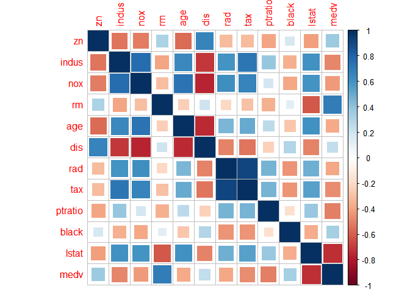
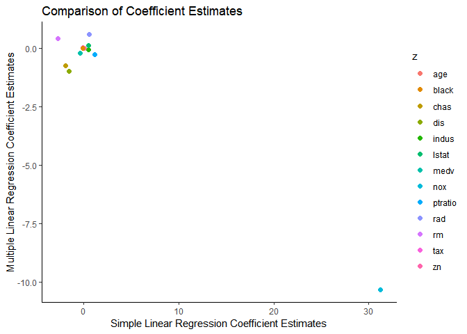
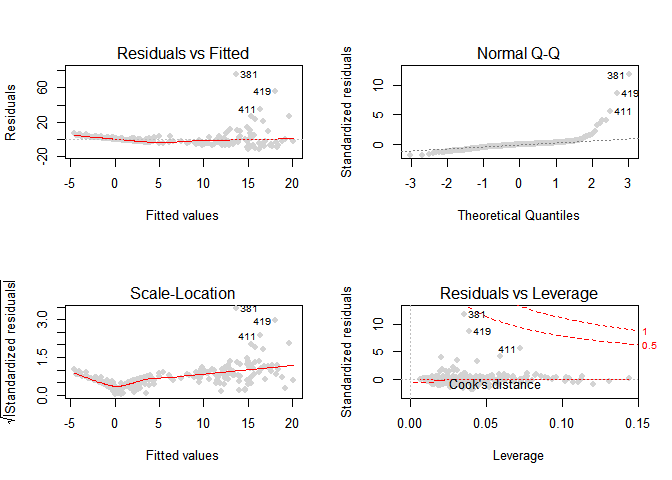
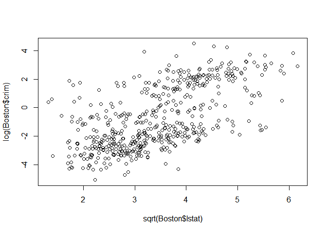
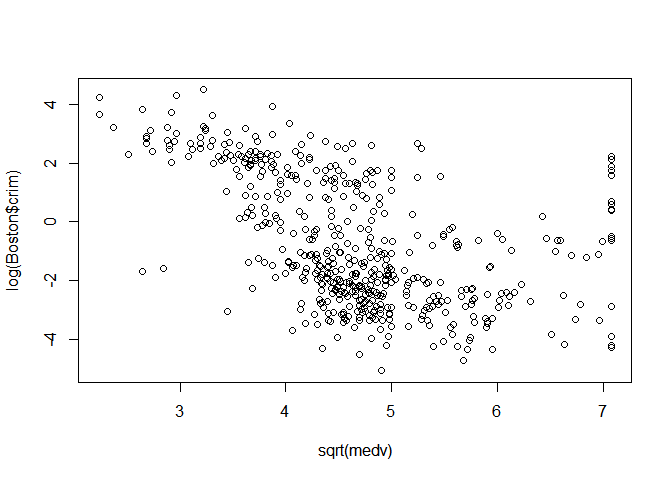
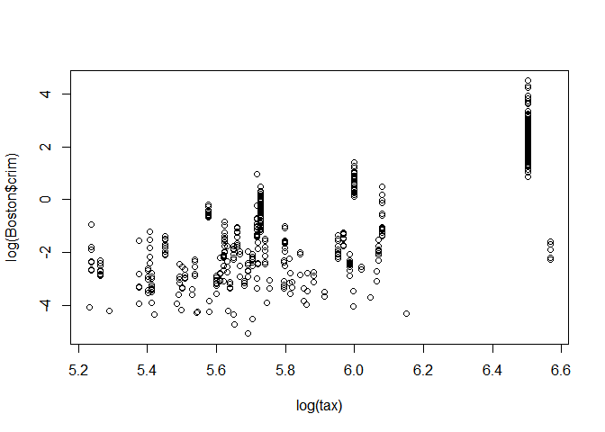
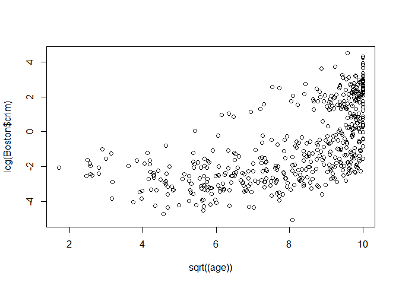
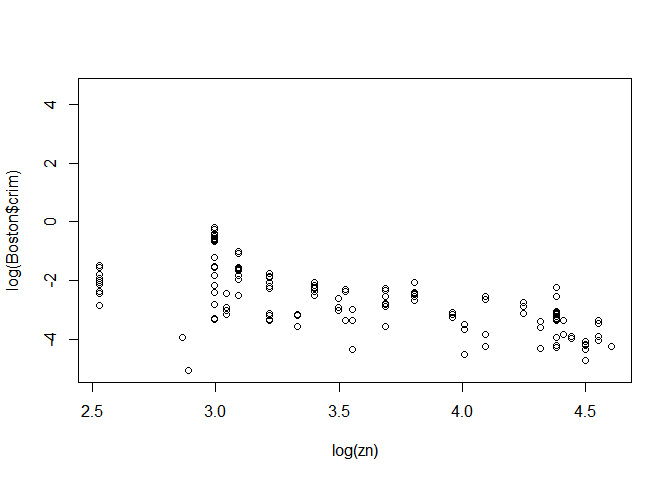
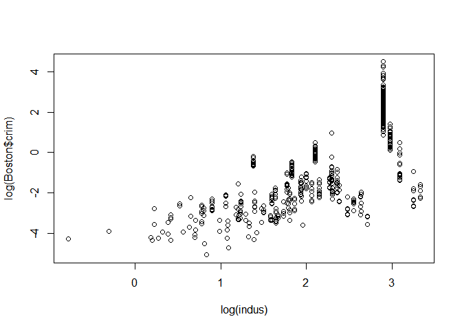
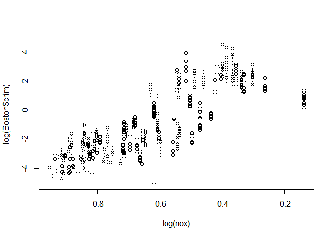

# 03 Regression (Exercise 15)

------------------------------------------------------------------------

### Yeon Soo, Choi

------------------------------------------------------------------------

------------------------------------------------------------------------

15. Boston Data
---------------

------------------------------------------------------------------------

`Boston` 데이터는 `crim`, `zn`, `indus`, `chas`, `nox`, `rm`, `age`, `dis`, `rad`, `tax`, `ptratio`, `black`, `lstat`, `medv` 이렇게 14개의 변수들로 이루어져 있으며,

15번 예제의 경우 **마을 별 인당 범죄율** 에 대한 정보를 갖는 `crim` 변수를 **종속변수** 로 사용하여 예측하는 것이 목표다.

``` r
library(knitr)
library(MASS)
data(Boston)
str(Boston)
```

    ## 'data.frame':    506 obs. of  14 variables:
    ##  $ crim   : num  0.00632 0.02731 0.02729 0.03237 0.06905 ...
    ##  $ zn     : num  18 0 0 0 0 0 12.5 12.5 12.5 12.5 ...
    ##  $ indus  : num  2.31 7.07 7.07 2.18 2.18 2.18 7.87 7.87 7.87 7.87 ...
    ##  $ chas   : int  0 0 0 0 0 0 0 0 0 0 ...
    ##  $ nox    : num  0.538 0.469 0.469 0.458 0.458 0.458 0.524 0.524 0.524 0.524 ...
    ##  $ rm     : num  6.58 6.42 7.18 7 7.15 ...
    ##  $ age    : num  65.2 78.9 61.1 45.8 54.2 58.7 66.6 96.1 100 85.9 ...
    ##  $ dis    : num  4.09 4.97 4.97 6.06 6.06 ...
    ##  $ rad    : int  1 2 2 3 3 3 5 5 5 5 ...
    ##  $ tax    : num  296 242 242 222 222 222 311 311 311 311 ...
    ##  $ ptratio: num  15.3 17.8 17.8 18.7 18.7 18.7 15.2 15.2 15.2 15.2 ...
    ##  $ black  : num  397 397 393 395 397 ...
    ##  $ lstat  : num  4.98 9.14 4.03 2.94 5.33 ...
    ##  $ medv   : num  24 21.6 34.7 33.4 36.2 28.7 22.9 27.1 16.5 18.9 ...

``` r
colSums(is.na(Boston))
```

    ##    crim      zn   indus    chas     nox      rm     age     dis     rad 
    ##       0       0       0       0       0       0       0       0       0 
    ##     tax ptratio   black   lstat    medv 
    ##       0       0       0       0       0

``` r
## chas : Charles River dummy variable (=1 bounds river, =0 otherwise)
Boston$chas=factor(Boston$chas,c(0,1),labels=c('N','Y'))
kable(head(Boston))
```

|     crim|   zn|  indus| chas |    nox|     rm|   age|     dis|  rad|  tax|  ptratio|   black|  lstat|  medv|
|--------:|----:|------:|:-----|------:|------:|-----:|-------:|----:|----:|--------:|-------:|------:|-----:|
|  0.00632|   18|   2.31| N    |  0.538|  6.575|  65.2|  4.0900|    1|  296|     15.3|  396.90|   4.98|  24.0|
|  0.02731|    0|   7.07| N    |  0.469|  6.421|  78.9|  4.9671|    2|  242|     17.8|  396.90|   9.14|  21.6|
|  0.02729|    0|   7.07| N    |  0.469|  7.185|  61.1|  4.9671|    2|  242|     17.8|  392.83|   4.03|  34.7|
|  0.03237|    0|   2.18| N    |  0.458|  6.998|  45.8|  6.0622|    3|  222|     18.7|  394.63|   2.94|  33.4|
|  0.06905|    0|   2.18| N    |  0.458|  7.147|  54.2|  6.0622|    3|  222|     18.7|  396.90|   5.33|  36.2|
|  0.02985|    0|   2.18| N    |  0.458|  6.430|  58.7|  6.0622|    3|  222|     18.7|  394.12|   5.21|  28.7|

(a) 각각의 독립 변수들로 단순 선형 회귀 모형을 적합하고 통계적으로 유의한 모형인지 아닌지 판단하여라.
-----------------------------------------------------------------------------------------------------

``` r
library(caret)
```

    ## Loading required package: lattice

    ## Loading required package: ggplot2

``` r
library(corrplot)
```

    ## corrplot 0.84 loaded

``` r
preds=names(Boston)[c(2:3,5:14)]
## plot response by predictors
featurePlot(x=Boston[,preds],y=Boston$crim,pch=20,cex=1.2)
```


``` r
corrplot(cor(Boston[,preds]),method='square')
```



### ZN : proportion of residential land zoned for lots over 25,000 sq.ft.

``` r
## 13 simple linear regression models
attach(Boston)
## yes
lm.zn = lm(crim~zn)
summary(lm.zn) 
```

    ## 
    ## Call:
    ## lm(formula = crim ~ zn)
    ## 
    ## Residuals:
    ##    Min     1Q Median     3Q    Max 
    ## -4.429 -4.222 -2.620  1.250 84.523 
    ## 
    ## Coefficients:
    ##             Estimate Std. Error t value Pr(>|t|)    
    ## (Intercept)  4.45369    0.41722  10.675  < 2e-16 ***
    ## zn          -0.07393    0.01609  -4.594 5.51e-06 ***
    ## ---
    ## Signif. codes:  0 '***' 0.001 '**' 0.01 '*' 0.05 '.' 0.1 ' ' 1
    ## 
    ## Residual standard error: 8.435 on 504 degrees of freedom
    ## Multiple R-squared:  0.04019,    Adjusted R-squared:  0.03828 
    ## F-statistic:  21.1 on 1 and 504 DF,  p-value: 5.506e-06

### INDUS : proportion of non-retail business acres per town.

``` r
## yes
lm.indus = lm(crim~indus)
summary(lm.indus)
```

    ## 
    ## Call:
    ## lm(formula = crim ~ indus)
    ## 
    ## Residuals:
    ##     Min      1Q  Median      3Q     Max 
    ## -11.972  -2.698  -0.736   0.712  81.813 
    ## 
    ## Coefficients:
    ##             Estimate Std. Error t value Pr(>|t|)    
    ## (Intercept) -2.06374    0.66723  -3.093  0.00209 ** 
    ## indus        0.50978    0.05102   9.991  < 2e-16 ***
    ## ---
    ## Signif. codes:  0 '***' 0.001 '**' 0.01 '*' 0.05 '.' 0.1 ' ' 1
    ## 
    ## Residual standard error: 7.866 on 504 degrees of freedom
    ## Multiple R-squared:  0.1653, Adjusted R-squared:  0.1637 
    ## F-statistic: 99.82 on 1 and 504 DF,  p-value: < 2.2e-16

### CHAS : Charles River dummy variable (= 1 if tract bounds river; 0 otherwise).

``` r
## no
lm.chas = lm(crim~chas) 
summary(lm.chas)
```

    ## 
    ## Call:
    ## lm(formula = crim ~ chas)
    ## 
    ## Residuals:
    ##    Min     1Q Median     3Q    Max 
    ## -3.738 -3.661 -3.435  0.018 85.232 
    ## 
    ## Coefficients:
    ##             Estimate Std. Error t value Pr(>|t|)    
    ## (Intercept)   3.7444     0.3961   9.453   <2e-16 ***
    ## chasY        -1.8928     1.5061  -1.257    0.209    
    ## ---
    ## Signif. codes:  0 '***' 0.001 '**' 0.01 '*' 0.05 '.' 0.1 ' ' 1
    ## 
    ## Residual standard error: 8.597 on 504 degrees of freedom
    ## Multiple R-squared:  0.003124,   Adjusted R-squared:  0.001146 
    ## F-statistic: 1.579 on 1 and 504 DF,  p-value: 0.2094

### NOX : nitrogen oxides concentration (parts per 10 million).

``` r
## yes
lm.nox = lm(crim~nox)
summary(lm.nox)
```

    ## 
    ## Call:
    ## lm(formula = crim ~ nox)
    ## 
    ## Residuals:
    ##     Min      1Q  Median      3Q     Max 
    ## -12.371  -2.738  -0.974   0.559  81.728 
    ## 
    ## Coefficients:
    ##             Estimate Std. Error t value Pr(>|t|)    
    ## (Intercept)  -13.720      1.699  -8.073 5.08e-15 ***
    ## nox           31.249      2.999  10.419  < 2e-16 ***
    ## ---
    ## Signif. codes:  0 '***' 0.001 '**' 0.01 '*' 0.05 '.' 0.1 ' ' 1
    ## 
    ## Residual standard error: 7.81 on 504 degrees of freedom
    ## Multiple R-squared:  0.1772, Adjusted R-squared:  0.1756 
    ## F-statistic: 108.6 on 1 and 504 DF,  p-value: < 2.2e-16

### RM : average number of rooms per dwelling.

``` r
## yes
lm.rm = lm(crim~rm)
summary(lm.rm)
```

    ## 
    ## Call:
    ## lm(formula = crim ~ rm)
    ## 
    ## Residuals:
    ##    Min     1Q Median     3Q    Max 
    ## -6.604 -3.952 -2.654  0.989 87.197 
    ## 
    ## Coefficients:
    ##             Estimate Std. Error t value Pr(>|t|)    
    ## (Intercept)   20.482      3.365   6.088 2.27e-09 ***
    ## rm            -2.684      0.532  -5.045 6.35e-07 ***
    ## ---
    ## Signif. codes:  0 '***' 0.001 '**' 0.01 '*' 0.05 '.' 0.1 ' ' 1
    ## 
    ## Residual standard error: 8.401 on 504 degrees of freedom
    ## Multiple R-squared:  0.04807,    Adjusted R-squared:  0.04618 
    ## F-statistic: 25.45 on 1 and 504 DF,  p-value: 6.347e-07

### AGE : proportion of owner-occupied units built prior to 1940.

``` r
## yes
lm.age = lm(crim~age)
summary(lm.age) 
```

    ## 
    ## Call:
    ## lm(formula = crim ~ age)
    ## 
    ## Residuals:
    ##    Min     1Q Median     3Q    Max 
    ## -6.789 -4.257 -1.230  1.527 82.849 
    ## 
    ## Coefficients:
    ##             Estimate Std. Error t value Pr(>|t|)    
    ## (Intercept) -3.77791    0.94398  -4.002 7.22e-05 ***
    ## age          0.10779    0.01274   8.463 2.85e-16 ***
    ## ---
    ## Signif. codes:  0 '***' 0.001 '**' 0.01 '*' 0.05 '.' 0.1 ' ' 1
    ## 
    ## Residual standard error: 8.057 on 504 degrees of freedom
    ## Multiple R-squared:  0.1244, Adjusted R-squared:  0.1227 
    ## F-statistic: 71.62 on 1 and 504 DF,  p-value: 2.855e-16

### DIS : weighted mean of distances to five Boston employment centres.

``` r
## yes
lm.dis = lm(crim~dis)
summary(lm.dis)
```

    ## 
    ## Call:
    ## lm(formula = crim ~ dis)
    ## 
    ## Residuals:
    ##    Min     1Q Median     3Q    Max 
    ## -6.708 -4.134 -1.527  1.516 81.674 
    ## 
    ## Coefficients:
    ##             Estimate Std. Error t value Pr(>|t|)    
    ## (Intercept)   9.4993     0.7304  13.006   <2e-16 ***
    ## dis          -1.5509     0.1683  -9.213   <2e-16 ***
    ## ---
    ## Signif. codes:  0 '***' 0.001 '**' 0.01 '*' 0.05 '.' 0.1 ' ' 1
    ## 
    ## Residual standard error: 7.965 on 504 degrees of freedom
    ## Multiple R-squared:  0.1441, Adjusted R-squared:  0.1425 
    ## F-statistic: 84.89 on 1 and 504 DF,  p-value: < 2.2e-16

### RAD : index of accessibility to radial highways.

``` r
## yes
lm.rad = lm(crim~rad)
summary(lm.rad)
```

    ## 
    ## Call:
    ## lm(formula = crim ~ rad)
    ## 
    ## Residuals:
    ##     Min      1Q  Median      3Q     Max 
    ## -10.164  -1.381  -0.141   0.660  76.433 
    ## 
    ## Coefficients:
    ##             Estimate Std. Error t value Pr(>|t|)    
    ## (Intercept) -2.28716    0.44348  -5.157 3.61e-07 ***
    ## rad          0.61791    0.03433  17.998  < 2e-16 ***
    ## ---
    ## Signif. codes:  0 '***' 0.001 '**' 0.01 '*' 0.05 '.' 0.1 ' ' 1
    ## 
    ## Residual standard error: 6.718 on 504 degrees of freedom
    ## Multiple R-squared:  0.3913, Adjusted R-squared:   0.39 
    ## F-statistic: 323.9 on 1 and 504 DF,  p-value: < 2.2e-16

### TAX : full-value property-tax rate per $10,000.

``` r
## yes
lm.tax = lm(crim~tax)
summary(lm.tax)
```

    ## 
    ## Call:
    ## lm(formula = crim ~ tax)
    ## 
    ## Residuals:
    ##     Min      1Q  Median      3Q     Max 
    ## -12.513  -2.738  -0.194   1.065  77.696 
    ## 
    ## Coefficients:
    ##              Estimate Std. Error t value Pr(>|t|)    
    ## (Intercept) -8.528369   0.815809  -10.45   <2e-16 ***
    ## tax          0.029742   0.001847   16.10   <2e-16 ***
    ## ---
    ## Signif. codes:  0 '***' 0.001 '**' 0.01 '*' 0.05 '.' 0.1 ' ' 1
    ## 
    ## Residual standard error: 6.997 on 504 degrees of freedom
    ## Multiple R-squared:  0.3396, Adjusted R-squared:  0.3383 
    ## F-statistic: 259.2 on 1 and 504 DF,  p-value: < 2.2e-16

### PTRATIO : pupil-teacher ratio by town.

``` r
## yes
lm.ptratio = lm(crim~ptratio)
summary(lm.ptratio)
```

    ## 
    ## Call:
    ## lm(formula = crim ~ ptratio)
    ## 
    ## Residuals:
    ##    Min     1Q Median     3Q    Max 
    ## -7.654 -3.985 -1.912  1.825 83.353 
    ## 
    ## Coefficients:
    ##             Estimate Std. Error t value Pr(>|t|)    
    ## (Intercept) -17.6469     3.1473  -5.607 3.40e-08 ***
    ## ptratio       1.1520     0.1694   6.801 2.94e-11 ***
    ## ---
    ## Signif. codes:  0 '***' 0.001 '**' 0.01 '*' 0.05 '.' 0.1 ' ' 1
    ## 
    ## Residual standard error: 8.24 on 504 degrees of freedom
    ## Multiple R-squared:  0.08407,    Adjusted R-squared:  0.08225 
    ## F-statistic: 46.26 on 1 and 504 DF,  p-value: 2.943e-11

### BLACK : 1000(Bk - 0.63)^2 where Bk is the proportion of blacks by town.

``` r
## yes
lm.black = lm(crim~black)
summary(lm.black)
```

    ## 
    ## Call:
    ## lm(formula = crim ~ black)
    ## 
    ## Residuals:
    ##     Min      1Q  Median      3Q     Max 
    ## -13.756  -2.299  -2.095  -1.296  86.822 
    ## 
    ## Coefficients:
    ##              Estimate Std. Error t value Pr(>|t|)    
    ## (Intercept) 16.553529   1.425903  11.609   <2e-16 ***
    ## black       -0.036280   0.003873  -9.367   <2e-16 ***
    ## ---
    ## Signif. codes:  0 '***' 0.001 '**' 0.01 '*' 0.05 '.' 0.1 ' ' 1
    ## 
    ## Residual standard error: 7.946 on 504 degrees of freedom
    ## Multiple R-squared:  0.1483, Adjusted R-squared:  0.1466 
    ## F-statistic: 87.74 on 1 and 504 DF,  p-value: < 2.2e-16

### LSTAT : lower status of the population (percent).

``` r
## yes
lm.lstat = lm(crim~lstat)
summary(lm.lstat)
```

    ## 
    ## Call:
    ## lm(formula = crim ~ lstat)
    ## 
    ## Residuals:
    ##     Min      1Q  Median      3Q     Max 
    ## -13.925  -2.822  -0.664   1.079  82.862 
    ## 
    ## Coefficients:
    ##             Estimate Std. Error t value Pr(>|t|)    
    ## (Intercept) -3.33054    0.69376  -4.801 2.09e-06 ***
    ## lstat        0.54880    0.04776  11.491  < 2e-16 ***
    ## ---
    ## Signif. codes:  0 '***' 0.001 '**' 0.01 '*' 0.05 '.' 0.1 ' ' 1
    ## 
    ## Residual standard error: 7.664 on 504 degrees of freedom
    ## Multiple R-squared:  0.2076, Adjusted R-squared:  0.206 
    ## F-statistic:   132 on 1 and 504 DF,  p-value: < 2.2e-16

### MEDV : median value of owner-occupied homes in $1000s.

``` r
lm.medv = lm(crim~medv)
summary(lm.medv)
```

    ## 
    ## Call:
    ## lm(formula = crim ~ medv)
    ## 
    ## Residuals:
    ##    Min     1Q Median     3Q    Max 
    ## -9.071 -4.022 -2.343  1.298 80.957 
    ## 
    ## Coefficients:
    ##             Estimate Std. Error t value Pr(>|t|)    
    ## (Intercept) 11.79654    0.93419   12.63   <2e-16 ***
    ## medv        -0.36316    0.03839   -9.46   <2e-16 ***
    ## ---
    ## Signif. codes:  0 '***' 0.001 '**' 0.01 '*' 0.05 '.' 0.1 ' ' 1
    ## 
    ## Residual standard error: 7.934 on 504 degrees of freedom
    ## Multiple R-squared:  0.1508, Adjusted R-squared:  0.1491 
    ## F-statistic: 89.49 on 1 and 504 DF,  p-value: < 2.2e-16

`chas` 변수를 제외하고 모두 계수의 유의성 검정 결과 유의하다고 결론지었다.

(b) 모든 독립변수들을 사용하여 다중 선형 회귀 모형을 적합하여라. 결과를 설명하고 어떤 독립변수들이 T-검정 하의 단일 계수의 유의성 검정 결과 유의한가?
-----------------------------------------------------------------------------------------------------------------------------------------------------

95% 신뢰 수준에서 T-검정으로 계수의 유의성에 대해 검정한 결과 `zn`, `dis`, `rad`, `black`, `medv` 다섯 가지 변수들이 통계적으로 유의하다고 결론지었다.

``` r
lm.all = lm(crim~., data=Boston)
summary(lm.all)
```

    ## 
    ## Call:
    ## lm(formula = crim ~ ., data = Boston)
    ## 
    ## Residuals:
    ##    Min     1Q Median     3Q    Max 
    ## -9.924 -2.120 -0.353  1.019 75.051 
    ## 
    ## Coefficients:
    ##               Estimate Std. Error t value Pr(>|t|)    
    ## (Intercept)  17.033228   7.234903   2.354 0.018949 *  
    ## zn            0.044855   0.018734   2.394 0.017025 *  
    ## indus        -0.063855   0.083407  -0.766 0.444294    
    ## chasY        -0.749134   1.180147  -0.635 0.525867    
    ## nox         -10.313535   5.275536  -1.955 0.051152 .  
    ## rm            0.430131   0.612830   0.702 0.483089    
    ## age           0.001452   0.017925   0.081 0.935488    
    ## dis          -0.987176   0.281817  -3.503 0.000502 ***
    ## rad           0.588209   0.088049   6.680 6.46e-11 ***
    ## tax          -0.003780   0.005156  -0.733 0.463793    
    ## ptratio      -0.271081   0.186450  -1.454 0.146611    
    ## black        -0.007538   0.003673  -2.052 0.040702 *  
    ## lstat         0.126211   0.075725   1.667 0.096208 .  
    ## medv         -0.198887   0.060516  -3.287 0.001087 ** 
    ## ---
    ## Signif. codes:  0 '***' 0.001 '**' 0.01 '*' 0.05 '.' 0.1 ' ' 1
    ## 
    ## Residual standard error: 6.439 on 492 degrees of freedom
    ## Multiple R-squared:  0.454,  Adjusted R-squared:  0.4396 
    ## F-statistic: 31.47 on 13 and 492 DF,  p-value: < 2.2e-16

### (c) 단순선형회귀에서의 계수 값들을 X축에, 다중선형회귀에서의 계수 값들을 Y축에 그려내 비교하여라.

``` r
x = c(coefficients(lm.zn)[2],
      coefficients(lm.indus)[2],
      coefficients(lm.chas)[2],
      coefficients(lm.nox)[2],
      coefficients(lm.rm)[2],
      coefficients(lm.age)[2],
      coefficients(lm.dis)[2],
      coefficients(lm.rad)[2],
      coefficients(lm.tax)[2],
      coefficients(lm.ptratio)[2],
      coefficients(lm.black)[2],
      coefficients(lm.lstat)[2],
      coefficients(lm.medv)[2])
y = coefficients(lm.all)[2:14]
z = names(Boston)[2:14]
c=data.frame(x=x,y=y,z=z)

library(ggplot2)

ggplot(c)+
  geom_point(aes(x=x,y=y,color=z),size=2)+
  theme_classic()+
  xlab('Simple Linear Regression Coefficient Estimates')+
  ylab('Multiple Linear Regression Coefficient Estimates')+
  ggtitle('Comparison of Coefficient Estimates')
```



`nox` 변수의 경우 단순 선형 회귀 모형에서의 계수가 약 31 이었던 반면 다중선형회귀에서는 약 -10 의 값을 갖는 눈에 띄는 차이가 발견되었다.

### (d) 독립변수와 종속변수 간의 비선형 관계가 존재한다는 증거가 있는가? 이를 확인하기 위해 3차 다항 회귀를 적합하여라.

앞서 그렸던 종속변수 `crim` 에 대해 각각의 독립변수를 그려낸 결과를 통해서도 비선형 관계가 존재한다는 것을 알 수 있다.

``` r
featurePlot(x=Boston[,preds],y=Boston$crim,pch=20,cex=1.2)
```


우선 문제에서 주어진 대로 3차 다항회귀를 적합한 결과는 다음과 같다.

``` r
zn3=lm(crim~poly(zn,3),Boston)
indus3=lm(crim~poly(indus,3),Boston)
nox3=lm(crim~poly(nox,3),Boston)
rm3=lm(crim~poly(rm,3),Boston)
age3=lm(crim~poly(age,3),Boston)
dis3=lm(crim~poly(dis,3),Boston)
rad3=lm(crim~poly(rad,3),Boston)
tax3=lm(crim~poly(tax,3),Boston)
ptratio3=lm(crim~poly(ptratio,3),Boston)
black3=lm(crim~poly(black,3),Boston)
lstat3=lm(crim~poly(lstat,3),Boston)
medv3=lm(crim~poly(medv,3),Boston)
```

### ZN

``` r
## 1,2
summary(zn3)
```

    ## 
    ## Call:
    ## lm(formula = crim ~ poly(zn, 3), data = Boston)
    ## 
    ## Residuals:
    ##    Min     1Q Median     3Q    Max 
    ## -4.821 -4.614 -1.294  0.473 84.130 
    ## 
    ## Coefficients:
    ##              Estimate Std. Error t value Pr(>|t|)    
    ## (Intercept)    3.6135     0.3722   9.709  < 2e-16 ***
    ## poly(zn, 3)1 -38.7498     8.3722  -4.628  4.7e-06 ***
    ## poly(zn, 3)2  23.9398     8.3722   2.859  0.00442 ** 
    ## poly(zn, 3)3 -10.0719     8.3722  -1.203  0.22954    
    ## ---
    ## Signif. codes:  0 '***' 0.001 '**' 0.01 '*' 0.05 '.' 0.1 ' ' 1
    ## 
    ## Residual standard error: 8.372 on 502 degrees of freedom
    ## Multiple R-squared:  0.05824,    Adjusted R-squared:  0.05261 
    ## F-statistic: 10.35 on 3 and 502 DF,  p-value: 1.281e-06

### INDUS

``` r
## 1,2,3
summary(indus3)
```

    ## 
    ## Call:
    ## lm(formula = crim ~ poly(indus, 3), data = Boston)
    ## 
    ## Residuals:
    ##    Min     1Q Median     3Q    Max 
    ## -8.278 -2.514  0.054  0.764 79.713 
    ## 
    ## Coefficients:
    ##                 Estimate Std. Error t value Pr(>|t|)    
    ## (Intercept)        3.614      0.330  10.950  < 2e-16 ***
    ## poly(indus, 3)1   78.591      7.423  10.587  < 2e-16 ***
    ## poly(indus, 3)2  -24.395      7.423  -3.286  0.00109 ** 
    ## poly(indus, 3)3  -54.130      7.423  -7.292  1.2e-12 ***
    ## ---
    ## Signif. codes:  0 '***' 0.001 '**' 0.01 '*' 0.05 '.' 0.1 ' ' 1
    ## 
    ## Residual standard error: 7.423 on 502 degrees of freedom
    ## Multiple R-squared:  0.2597, Adjusted R-squared:  0.2552 
    ## F-statistic: 58.69 on 3 and 502 DF,  p-value: < 2.2e-16

### NOX

``` r
## 1,2,3
summary(nox3)
```

    ## 
    ## Call:
    ## lm(formula = crim ~ poly(nox, 3), data = Boston)
    ## 
    ## Residuals:
    ##    Min     1Q Median     3Q    Max 
    ## -9.110 -2.068 -0.255  0.739 78.302 
    ## 
    ## Coefficients:
    ##               Estimate Std. Error t value Pr(>|t|)    
    ## (Intercept)     3.6135     0.3216  11.237  < 2e-16 ***
    ## poly(nox, 3)1  81.3720     7.2336  11.249  < 2e-16 ***
    ## poly(nox, 3)2 -28.8286     7.2336  -3.985 7.74e-05 ***
    ## poly(nox, 3)3 -60.3619     7.2336  -8.345 6.96e-16 ***
    ## ---
    ## Signif. codes:  0 '***' 0.001 '**' 0.01 '*' 0.05 '.' 0.1 ' ' 1
    ## 
    ## Residual standard error: 7.234 on 502 degrees of freedom
    ## Multiple R-squared:  0.297,  Adjusted R-squared:  0.2928 
    ## F-statistic: 70.69 on 3 and 502 DF,  p-value: < 2.2e-16

### RM

``` r
## 1,2
summary(rm3)
```

    ## 
    ## Call:
    ## lm(formula = crim ~ poly(rm, 3), data = Boston)
    ## 
    ## Residuals:
    ##     Min      1Q  Median      3Q     Max 
    ## -18.485  -3.468  -2.221  -0.015  87.219 
    ## 
    ## Coefficients:
    ##              Estimate Std. Error t value Pr(>|t|)    
    ## (Intercept)    3.6135     0.3703   9.758  < 2e-16 ***
    ## poly(rm, 3)1 -42.3794     8.3297  -5.088 5.13e-07 ***
    ## poly(rm, 3)2  26.5768     8.3297   3.191  0.00151 ** 
    ## poly(rm, 3)3  -5.5103     8.3297  -0.662  0.50858    
    ## ---
    ## Signif. codes:  0 '***' 0.001 '**' 0.01 '*' 0.05 '.' 0.1 ' ' 1
    ## 
    ## Residual standard error: 8.33 on 502 degrees of freedom
    ## Multiple R-squared:  0.06779,    Adjusted R-squared:  0.06222 
    ## F-statistic: 12.17 on 3 and 502 DF,  p-value: 1.067e-07

### AGE

``` r
## 1,2,3
summary(age3)
```

    ## 
    ## Call:
    ## lm(formula = crim ~ poly(age, 3), data = Boston)
    ## 
    ## Residuals:
    ##    Min     1Q Median     3Q    Max 
    ## -9.762 -2.673 -0.516  0.019 82.842 
    ## 
    ## Coefficients:
    ##               Estimate Std. Error t value Pr(>|t|)    
    ## (Intercept)     3.6135     0.3485  10.368  < 2e-16 ***
    ## poly(age, 3)1  68.1820     7.8397   8.697  < 2e-16 ***
    ## poly(age, 3)2  37.4845     7.8397   4.781 2.29e-06 ***
    ## poly(age, 3)3  21.3532     7.8397   2.724  0.00668 ** 
    ## ---
    ## Signif. codes:  0 '***' 0.001 '**' 0.01 '*' 0.05 '.' 0.1 ' ' 1
    ## 
    ## Residual standard error: 7.84 on 502 degrees of freedom
    ## Multiple R-squared:  0.1742, Adjusted R-squared:  0.1693 
    ## F-statistic: 35.31 on 3 and 502 DF,  p-value: < 2.2e-16

### DIS

``` r
## 1,2,3
summary(dis3)
```

    ## 
    ## Call:
    ## lm(formula = crim ~ poly(dis, 3), data = Boston)
    ## 
    ## Residuals:
    ##     Min      1Q  Median      3Q     Max 
    ## -10.757  -2.588   0.031   1.267  76.378 
    ## 
    ## Coefficients:
    ##               Estimate Std. Error t value Pr(>|t|)    
    ## (Intercept)     3.6135     0.3259  11.087  < 2e-16 ***
    ## poly(dis, 3)1 -73.3886     7.3315 -10.010  < 2e-16 ***
    ## poly(dis, 3)2  56.3730     7.3315   7.689 7.87e-14 ***
    ## poly(dis, 3)3 -42.6219     7.3315  -5.814 1.09e-08 ***
    ## ---
    ## Signif. codes:  0 '***' 0.001 '**' 0.01 '*' 0.05 '.' 0.1 ' ' 1
    ## 
    ## Residual standard error: 7.331 on 502 degrees of freedom
    ## Multiple R-squared:  0.2778, Adjusted R-squared:  0.2735 
    ## F-statistic: 64.37 on 3 and 502 DF,  p-value: < 2.2e-16

### RAD

``` r
## 1,2
summary(rad3)
```

    ## 
    ## Call:
    ## lm(formula = crim ~ poly(rad, 3), data = Boston)
    ## 
    ## Residuals:
    ##     Min      1Q  Median      3Q     Max 
    ## -10.381  -0.412  -0.269   0.179  76.217 
    ## 
    ## Coefficients:
    ##               Estimate Std. Error t value Pr(>|t|)    
    ## (Intercept)     3.6135     0.2971  12.164  < 2e-16 ***
    ## poly(rad, 3)1 120.9074     6.6824  18.093  < 2e-16 ***
    ## poly(rad, 3)2  17.4923     6.6824   2.618  0.00912 ** 
    ## poly(rad, 3)3   4.6985     6.6824   0.703  0.48231    
    ## ---
    ## Signif. codes:  0 '***' 0.001 '**' 0.01 '*' 0.05 '.' 0.1 ' ' 1
    ## 
    ## Residual standard error: 6.682 on 502 degrees of freedom
    ## Multiple R-squared:    0.4,  Adjusted R-squared:  0.3965 
    ## F-statistic: 111.6 on 3 and 502 DF,  p-value: < 2.2e-16

### TAX

``` r
## 1,2
summary(tax3)
```

    ## 
    ## Call:
    ## lm(formula = crim ~ poly(tax, 3), data = Boston)
    ## 
    ## Residuals:
    ##     Min      1Q  Median      3Q     Max 
    ## -13.273  -1.389   0.046   0.536  76.950 
    ## 
    ## Coefficients:
    ##               Estimate Std. Error t value Pr(>|t|)    
    ## (Intercept)     3.6135     0.3047  11.860  < 2e-16 ***
    ## poly(tax, 3)1 112.6458     6.8537  16.436  < 2e-16 ***
    ## poly(tax, 3)2  32.0873     6.8537   4.682 3.67e-06 ***
    ## poly(tax, 3)3  -7.9968     6.8537  -1.167    0.244    
    ## ---
    ## Signif. codes:  0 '***' 0.001 '**' 0.01 '*' 0.05 '.' 0.1 ' ' 1
    ## 
    ## Residual standard error: 6.854 on 502 degrees of freedom
    ## Multiple R-squared:  0.3689, Adjusted R-squared:  0.3651 
    ## F-statistic:  97.8 on 3 and 502 DF,  p-value: < 2.2e-16

### PTRATIO

``` r
## 1,2,3
summary(ptratio3)
```

    ## 
    ## Call:
    ## lm(formula = crim ~ poly(ptratio, 3), data = Boston)
    ## 
    ## Residuals:
    ##    Min     1Q Median     3Q    Max 
    ## -6.833 -4.146 -1.655  1.408 82.697 
    ## 
    ## Coefficients:
    ##                   Estimate Std. Error t value Pr(>|t|)    
    ## (Intercept)          3.614      0.361  10.008  < 2e-16 ***
    ## poly(ptratio, 3)1   56.045      8.122   6.901 1.57e-11 ***
    ## poly(ptratio, 3)2   24.775      8.122   3.050  0.00241 ** 
    ## poly(ptratio, 3)3  -22.280      8.122  -2.743  0.00630 ** 
    ## ---
    ## Signif. codes:  0 '***' 0.001 '**' 0.01 '*' 0.05 '.' 0.1 ' ' 1
    ## 
    ## Residual standard error: 8.122 on 502 degrees of freedom
    ## Multiple R-squared:  0.1138, Adjusted R-squared:  0.1085 
    ## F-statistic: 21.48 on 3 and 502 DF,  p-value: 4.171e-13

### BLACK

``` r
## 1
summary(black3)
```

    ## 
    ## Call:
    ## lm(formula = crim ~ poly(black, 3), data = Boston)
    ## 
    ## Residuals:
    ##     Min      1Q  Median      3Q     Max 
    ## -13.096  -2.343  -2.128  -1.439  86.790 
    ## 
    ## Coefficients:
    ##                 Estimate Std. Error t value Pr(>|t|)    
    ## (Intercept)       3.6135     0.3536  10.218   <2e-16 ***
    ## poly(black, 3)1 -74.4312     7.9546  -9.357   <2e-16 ***
    ## poly(black, 3)2   5.9264     7.9546   0.745    0.457    
    ## poly(black, 3)3  -4.8346     7.9546  -0.608    0.544    
    ## ---
    ## Signif. codes:  0 '***' 0.001 '**' 0.01 '*' 0.05 '.' 0.1 ' ' 1
    ## 
    ## Residual standard error: 7.955 on 502 degrees of freedom
    ## Multiple R-squared:  0.1498, Adjusted R-squared:  0.1448 
    ## F-statistic: 29.49 on 3 and 502 DF,  p-value: < 2.2e-16

### LSTAT

``` r
## 1,2
summary(lstat3)
```

    ## 
    ## Call:
    ## lm(formula = crim ~ poly(lstat, 3), data = Boston)
    ## 
    ## Residuals:
    ##     Min      1Q  Median      3Q     Max 
    ## -15.234  -2.151  -0.486   0.066  83.353 
    ## 
    ## Coefficients:
    ##                 Estimate Std. Error t value Pr(>|t|)    
    ## (Intercept)       3.6135     0.3392  10.654   <2e-16 ***
    ## poly(lstat, 3)1  88.0697     7.6294  11.543   <2e-16 ***
    ## poly(lstat, 3)2  15.8882     7.6294   2.082   0.0378 *  
    ## poly(lstat, 3)3 -11.5740     7.6294  -1.517   0.1299    
    ## ---
    ## Signif. codes:  0 '***' 0.001 '**' 0.01 '*' 0.05 '.' 0.1 ' ' 1
    ## 
    ## Residual standard error: 7.629 on 502 degrees of freedom
    ## Multiple R-squared:  0.2179, Adjusted R-squared:  0.2133 
    ## F-statistic: 46.63 on 3 and 502 DF,  p-value: < 2.2e-16

### MEDV

``` r
## 1,2,3
summary(medv3)
```

    ## 
    ## Call:
    ## lm(formula = crim ~ poly(medv, 3), data = Boston)
    ## 
    ## Residuals:
    ##     Min      1Q  Median      3Q     Max 
    ## -24.427  -1.976  -0.437   0.439  73.655 
    ## 
    ## Coefficients:
    ##                Estimate Std. Error t value Pr(>|t|)    
    ## (Intercept)       3.614      0.292  12.374  < 2e-16 ***
    ## poly(medv, 3)1  -75.058      6.569 -11.426  < 2e-16 ***
    ## poly(medv, 3)2   88.086      6.569  13.409  < 2e-16 ***
    ## poly(medv, 3)3  -48.033      6.569  -7.312 1.05e-12 ***
    ## ---
    ## Signif. codes:  0 '***' 0.001 '**' 0.01 '*' 0.05 '.' 0.1 ' ' 1
    ## 
    ## Residual standard error: 6.569 on 502 degrees of freedom
    ## Multiple R-squared:  0.4202, Adjusted R-squared:  0.4167 
    ## F-statistic: 121.3 on 3 and 502 DF,  p-value: < 2.2e-16

------------------------------------------------------------------------

Modeling
--------

------------------------------------------------------------------------

### Train ,Test Split

최종 모델을 만들고 성능을 최대화하기 위해 Train, Test Set을 80:20 으로 split 하였다.

``` r
## train test split
set.seed(0)
idx=createDataPartition(Boston$crim,p=0.8, list=FALSE)

train=Boston[idx,]
test=Boston[-idx,]

cat('train :', dim(train),'\n')
```

    ## train : 406 14

``` r
cat('test :',dim(test),'\n')
```

    ## test : 100 14

앞서 적합했던 모든 변수를 활용한 다중선형회귀 모형으로 적합하여 RMSE를 정의하고 Adjusted R-Squared, Training MSE, Test RMSE를 계산한 결과는 다음과 같다.

``` r
## RMSE 
rmse=function(pred,test){
  return (sqrt(mean((pred-test)^2)))
}
## multiple linear regression model 0
lm.all=lm(crim~.,data=train)
summary(lm.all)
```

    ## 
    ## Call:
    ## lm(formula = crim ~ ., data = train)
    ## 
    ## Residuals:
    ##     Min      1Q  Median      3Q     Max 
    ## -11.585  -2.056  -0.314   0.960  75.271 
    ## 
    ## Coefficients:
    ##               Estimate Std. Error t value Pr(>|t|)    
    ## (Intercept)  14.892402   8.071437   1.845  0.06578 .  
    ## zn            0.037134   0.020486   1.813  0.07064 .  
    ## indus        -0.065881   0.090542  -0.728  0.46728    
    ## chasY        -0.717544   1.326687  -0.541  0.58892    
    ## nox         -10.430999   5.937637  -1.757  0.07974 .  
    ## rm            0.680576   0.663050   1.026  0.30532    
    ## age          -0.001330   0.020322  -0.065  0.94785    
    ## dis          -0.845642   0.307731  -2.748  0.00627 ** 
    ## rad           0.584262   0.101421   5.761 1.69e-08 ***
    ## tax          -0.003118   0.005808  -0.537  0.59174    
    ## ptratio      -0.250424   0.208977  -1.198  0.23151    
    ## black        -0.012120   0.004066  -2.981  0.00306 ** 
    ## lstat         0.187297   0.085497   2.191  0.02906 *  
    ## medv         -0.165184   0.064730  -2.552  0.01109 *  
    ## ---
    ## Signif. codes:  0 '***' 0.001 '**' 0.01 '*' 0.05 '.' 0.1 ' ' 1
    ## 
    ## Residual standard error: 6.497 on 392 degrees of freedom
    ## Multiple R-squared:  0.468,  Adjusted R-squared:  0.4503 
    ## F-statistic: 26.52 on 13 and 392 DF,  p-value: < 2.2e-16

``` r
##
cat('Adjusted R-Squared :',summary(lm.all)$adj.r.squared,'\n')
```

    ## Adjusted R-Squared : 0.4503116

``` r
train_y=predict(lm.all,newdata=train)
test_y=predict(lm.all,newdata=test)
## 
cat('Training RMSE : ',rmse(train_y,train$crim),'\n')
```

    ## Training RMSE :  6.383586

``` r
cat('Test RMSE : ',rmse(test_y,test$crim),'\n')
```

    ## Test RMSE :  6.318677

이제 모형의 개선을 위해 먼저 `lm.all` 의 잔차도를 살펴보았다.

``` r
par(mfrow=c(2,2))
plot(lm.all,pch=20,col='lightgray',cex=1.5)
```



잔차의 분산이 증가하는 추세로 판단되어 이를 해결하기 위해 종속변수의 **Concave** 함수 ") 변환을 고려하였다.

### Log Transformation

``` r
featurePlot(x=Boston[,preds],y=log(Boston$crim),pch=20,cex=1.2)
```


변환 결과 눈에 띄는 독립, 종속 변수간 선형성이 확보되었다.

성능 측면에서도, 모든 독립변수를 사용하고 종속 변수 `crim` 만 log 변환하여 다중선형회귀를 적합한 결과 모형의 R-Squared 는 크게 증가하였지만 RMSE는 조금 증가하는 모습을 보였다.

``` r
## multiple linear regression model 0
lm.alllog=lm(log(crim)~.,data=train)
##
cat('Adjusted R-Squared :',summary(lm.alllog)$adj.r.squared,'\n')
```

    ## Adjusted R-Squared : 0.8729427

``` r
train_y=predict(lm.alllog,newdata=train)
test_y=predict(lm.alllog,newdata=test)
## 
cat('Training RMSE : ',rmse(exp(train_y),train$crim),'\n')
```

    ## Training RMSE :  6.61039

``` r
cat('Test RMSE : ',rmse(exp(test_y),test$crim),'\n')
```

    ## Test RMSE :  6.60867

또한 앞서 확인했던 **Collinearity** 문제를 살펴보자.

``` r
corrplot(cor(Boston[,preds]),method='square')
```


변수 간의 다중공선성이 존재한다. 이를 `vif` 함수를 이용해 찾아보겠다.

``` r
library(car)
```

    ## Loading required package: carData

``` r
vif(lm.alllog)
```

    ##       zn    indus     chas      nox       rm      age      dis      rad 
    ## 2.308185 3.729722 1.087154 4.470080 2.242700 3.121104 4.132339 7.443892 
    ##      tax  ptratio    black    lstat     medv 
    ## 9.125379 1.991624 1.337849 3.549093 3.671576

독립변수의 분산팽창계수값이 출력되었다. 값을 보니 10을 넘는 독립변수는 존재하지 않는다.

### Additional Variable Transformations

#### Sqrt(LSTAT)

``` r
plot(sqrt(Boston$lstat),log(Boston$crim))
```



#### Sqrt(MEDV)

``` r
plot(sqrt(medv),log(Boston$crim))
```



#### Log(RAD)

``` r
plot(log(rad),log(Boston$crim))
```


#### Log(TAX)

``` r
plot(log(tax),log(Boston$crim))
```



#### Sqrt(AGE)

``` r
plot(sqrt((age)),log(Boston$crim))
```



#### Log(DIS)

``` r
plot(log(dis),log(Boston$crim))
```


#### Log(ZN)

``` r
plot(log(zn),log(Boston$crim))
```



#### Log(INDUS)

``` r
plot(log(indus),log(Boston$crim))
```



#### Log(NOX)

``` r
plot(log(nox),log(Boston$crim))
```



``` r
lm.final1=lm(log(crim)~sqrt(lstat)+sqrt(medv)+log(rad)+log(tax)+sqrt(age)+log(dis)+(zn)+log(indus)+log(nox),data=train)

summary(lm.final1)
```

    ## 
    ## Call:
    ## lm(formula = log(crim) ~ sqrt(lstat) + sqrt(medv) + log(rad) + 
    ##     log(tax) + sqrt(age) + log(dis) + (zn) + log(indus) + log(nox), 
    ##     data = train)
    ## 
    ## Residuals:
    ##     Min      1Q  Median      3Q     Max 
    ## -2.0719 -0.5195 -0.0594  0.5055  2.2962 
    ## 
    ## Coefficients:
    ##              Estimate Std. Error t value Pr(>|t|)    
    ## (Intercept) -6.864934   1.495321  -4.591 5.93e-06 ***
    ## sqrt(lstat)  0.126453   0.082002   1.542   0.1239    
    ## sqrt(medv)  -0.018809   0.079528  -0.237   0.8132    
    ## log(rad)     1.056101   0.082449  12.809  < 2e-16 ***
    ## log(tax)     0.872048   0.208532   4.182 3.56e-05 ***
    ## sqrt(age)    0.040039   0.034053   1.176   0.2404    
    ## log(dis)    -0.314417   0.167572  -1.876   0.0613 .  
    ## zn          -0.005383   0.002439  -2.207   0.0279 *  
    ## log(indus)   0.140990   0.093822   1.503   0.1337    
    ## log(nox)     2.570235   0.452253   5.683 2.57e-08 ***
    ## ---
    ## Signif. codes:  0 '***' 0.001 '**' 0.01 '*' 0.05 '.' 0.1 ' ' 1
    ## 
    ## Residual standard error: 0.7894 on 396 degrees of freedom
    ## Multiple R-squared:  0.8695, Adjusted R-squared:  0.8665 
    ## F-statistic: 293.1 on 9 and 396 DF,  p-value: < 2.2e-16

``` r
lm.final2=lm(log(crim)~log(rad)*zn+log(tax)+log(dis)+log(nox),data=train)
summary(lm.final2)
```

    ## 
    ## Call:
    ## lm(formula = log(crim) ~ log(rad) * zn + log(tax) + log(dis) + 
    ##     log(nox), data = train)
    ## 
    ## Residuals:
    ##      Min       1Q   Median       3Q      Max 
    ## -1.96582 -0.50396 -0.00454  0.49870  2.24887 
    ## 
    ## Coefficients:
    ##              Estimate Std. Error t value Pr(>|t|)    
    ## (Intercept) -4.953929   1.161620  -4.265 2.50e-05 ***
    ## log(rad)     1.231726   0.091695  13.433  < 2e-16 ***
    ## zn           0.007350   0.004186   1.756 0.079889 .  
    ## log(tax)     0.724318   0.203846   3.553 0.000426 ***
    ## log(dis)    -0.378470   0.145468  -2.602 0.009620 ** 
    ## log(nox)     2.997089   0.421411   7.112 5.33e-12 ***
    ## log(rad):zn -0.013934   0.003106  -4.487 9.47e-06 ***
    ## ---
    ## Signif. codes:  0 '***' 0.001 '**' 0.01 '*' 0.05 '.' 0.1 ' ' 1
    ## 
    ## Residual standard error: 0.7809 on 399 degrees of freedom
    ## Multiple R-squared:  0.8713, Adjusted R-squared:  0.8694 
    ## F-statistic: 450.2 on 6 and 399 DF,  p-value: < 2.2e-16

``` r
cat('Adjusted R-Squared :',summary(lm.final2)$adj.r.squared,'\n')
```

    ## Adjusted R-Squared : 0.8693522

``` r
train_y=predict(lm.final2,newdata=train)
test_y=predict(lm.final2,newdata=test)
## 
cat('Training RMSE : ',rmse(exp(train_y),train$crim),'\n')
```

    ## Training RMSE :  6.954659

``` r
cat('Test RMSE : ',rmse(exp(test_y),test$crim),'\n')
```

    ## Test RMSE :  6.103154
