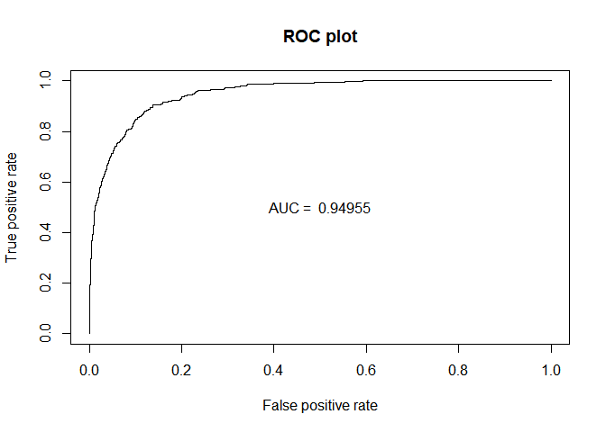
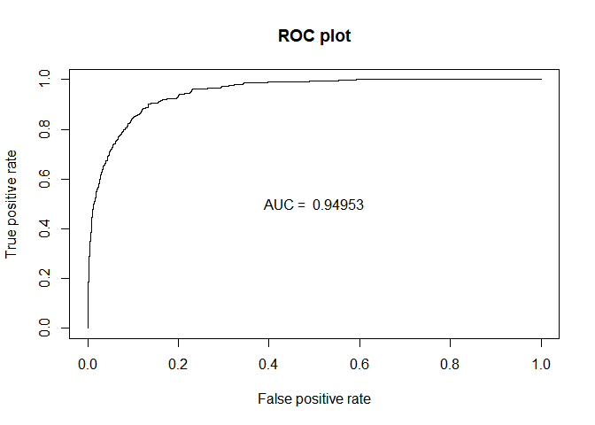
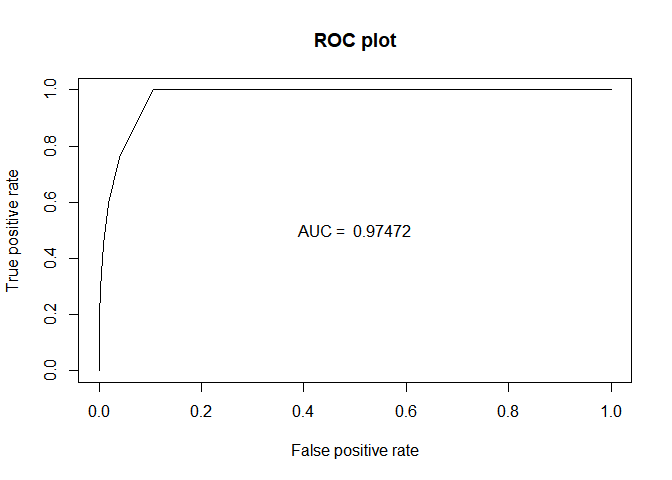

# Classification & CV Example

------------------------------------------------------------------------

### Yeon Soo, Choi

------------------------------------------------------------------------

------------------------------------------------------------------------

Application with Default Data
-----------------------------

------------------------------------------------------------------------

`ISLR` 패키지의 `Default` 데이터를 이용해 전처리 및 EDA 과정은 생략하고 공부한 Classification 모델의 구현 그리고 Cross-Validation 의 과정까지 포함해 모델을 적합하여 성능을 비교하는 실습을 진행하였다.

``` r
library(ISLR)
library(knitr)
library(ggplot2)
library(caret)
```

    ## Loading required package: lattice

``` r
library(MASS)
```

`Defaut` 데이터는 `income` 과 `balance` 그리고 종속변수로서 부도 여부에 대한 정보를 제공하는 `default` 변수를 포함하고 있다.

``` r
dim(Default)
```

    ## [1] 10000     4

``` r
kable(head(Default))
```

| default | student |    balance|     income|
|:--------|:--------|----------:|----------:|
| No      | No      |   729.5265|  44361.625|
| No      | Yes     |   817.1804|  12106.135|
| No      | No      |  1073.5492|  31767.139|
| No      | No      |   529.2506|  35704.494|
| No      | No      |   785.6559|  38463.496|
| No      | Yes     |   919.5885|   7491.559|

종속변수가 'Yes' , 'No' 로 **Binary Classification** 문제이기 때문에 적절한 분류 모형의 선택과 복잡도를 Cross-Validation (10-Fold) 과정을 통해 보정과 함께 최적화하는 과정을 진행할 것이다.

독립변수인 `income` 과 `balance` 를 모두 사용하여 `default` 에 대한 예측을 위한 분류 모형으로 공부한 **Logistic Regression Model, LDA, QDA, KNN** 들을 고려하였다.

------------------------------------------------------------------------

Fitting Logistic Regerssion Model
---------------------------------

------------------------------------------------------------------------

10-Fold CV 로 모델의 성능을 추정할 것이므로 이를 진행하고 모델 적합을 실시한다.

``` r
set.seed(2013122044)
# define training control
train_control= trainControl(method="cv", number=10)

logistic=train(default~.,data=Default,trControl=train_control,method='glm')

logistic
```

    ## Generalized Linear Model 
    ## 
    ## 10000 samples
    ##     3 predictor
    ##     2 classes: 'No', 'Yes' 
    ## 
    ## No pre-processing
    ## Resampling: Cross-Validated (10 fold) 
    ## Summary of sample sizes: 9000, 8999, 9000, 9000, 9000, 9000, ... 
    ## Resampling results:
    ## 
    ##   Accuracy   Kappa    
    ##   0.9730992  0.4202143

``` r
summary(logistic)
```

    ## 
    ## Call:
    ## NULL
    ## 
    ## Deviance Residuals: 
    ##     Min       1Q   Median       3Q      Max  
    ## -2.4691  -0.1418  -0.0557  -0.0203   3.7383  
    ## 
    ## Coefficients:
    ##               Estimate Std. Error z value Pr(>|z|)    
    ## (Intercept) -1.087e+01  4.923e-01 -22.080  < 2e-16 ***
    ## studentYes  -6.468e-01  2.363e-01  -2.738  0.00619 ** 
    ## balance      5.737e-03  2.319e-04  24.738  < 2e-16 ***
    ## income       3.033e-06  8.203e-06   0.370  0.71152    
    ## ---
    ## Signif. codes:  0 '***' 0.001 '**' 0.01 '*' 0.05 '.' 0.1 ' ' 1
    ## 
    ## (Dispersion parameter for binomial family taken to be 1)
    ## 
    ##     Null deviance: 2920.6  on 9999  degrees of freedom
    ## Residual deviance: 1571.5  on 9996  degrees of freedom
    ## AIC: 1579.5
    ## 
    ## Number of Fisher Scoring iterations: 8

모형 적합 결과 `income` 변수가 유의하지 않다는 결과가 확인되어 이를 제하고 다시 모형을 적합하였다.

``` r
## logistic regression
logistic=train(default~student+balance, data=Default,trControl=train_control,method='glm')
logistic
```

    ## Generalized Linear Model 
    ## 
    ## 10000 samples
    ##     2 predictor
    ##     2 classes: 'No', 'Yes' 
    ## 
    ## No pre-processing
    ## Resampling: Cross-Validated (10 fold) 
    ## Summary of sample sizes: 9000, 9000, 8999, 9001, 9000, 9000, ... 
    ## Resampling results:
    ## 
    ##   Accuracy   Kappa    
    ##   0.9732002  0.4223812

``` r
summary(logistic)
```

    ## 
    ## Call:
    ## NULL
    ## 
    ## Deviance Residuals: 
    ##     Min       1Q   Median       3Q      Max  
    ## -2.4578  -0.1422  -0.0559  -0.0203   3.7435  
    ## 
    ## Coefficients:
    ##               Estimate Std. Error z value Pr(>|z|)    
    ## (Intercept) -1.075e+01  3.692e-01 -29.116  < 2e-16 ***
    ## studentYes  -7.149e-01  1.475e-01  -4.846 1.26e-06 ***
    ## balance      5.738e-03  2.318e-04  24.750  < 2e-16 ***
    ## ---
    ## Signif. codes:  0 '***' 0.001 '**' 0.01 '*' 0.05 '.' 0.1 ' ' 1
    ## 
    ## (Dispersion parameter for binomial family taken to be 1)
    ## 
    ##     Null deviance: 2920.6  on 9999  degrees of freedom
    ## Residual deviance: 1571.7  on 9997  degrees of freedom
    ## AIC: 1577.7
    ## 
    ## Number of Fisher Scoring iterations: 8

적합 결과 분류 모델의 성능을 확인해보자.

``` r
## predictions
pred_logistic=predict(logistic,Default)
                      #type='prob'

## confusion matrix
kable(table(pred_logistic,Default$default))
```

|     |    No|  Yes|
|-----|-----:|----:|
| No  |  9628|  228|
| Yes |    39|  105|

``` r
## estimated test error rate from 10-fold CV
estimated_test_error_logistic=1-logistic$results[,2]

## ROC Curve
library(ROCR)
```

    ## Loading required package: gplots

    ## 
    ## Attaching package: 'gplots'

    ## The following object is masked from 'package:stats':
    ## 
    ##     lowess

``` r
prediction=prediction(predict(logistic,Default,type='prob')[,2],Default$default)


perf_AUC=performance(prediction,"auc") 
AUC_logistic=perf_AUC@y.values[[1]]

perf_ROC=performance(prediction,"tpr","fpr") 
plot(perf_ROC, main="ROC plot")
text(0.5,0.5,paste("AUC = ",format(AUC_logistic, digits=5, scientific=FALSE)))
```



------------------------------------------------------------------------

Fitting LDA
-----------

------------------------------------------------------------------------

``` r
## lda
lda=train(default~student+balance, data=Default,trControl=train_control,method='lda')
lda
```

    ## Linear Discriminant Analysis 
    ## 
    ## 10000 samples
    ##     2 predictor
    ##     2 classes: 'No', 'Yes' 
    ## 
    ## No pre-processing
    ## Resampling: Cross-Validated (10 fold) 
    ## Summary of sample sizes: 8999, 8999, 9000, 9000, 8999, 9001, ... 
    ## Resampling results:
    ## 
    ##   Accuracy   Kappa    
    ##   0.9725012  0.3481767

적합 결과 분류 모델의 성능을 확인해보자.

``` r
## predictions
pred_lda=predict(lda,Default)
                      #type='prob'

## confusion matrix
kable(table(pred_lda,Default$default))
```

|     |    No|  Yes|
|-----|-----:|----:|
| No  |  9644|  252|
| Yes |    23|   81|

``` r
## estimated test error rate from 10-fold CV
estimated_test_error_lda=1-lda$results[,2]

## ROC Curve
library(ROCR)
prediction=prediction(predict(lda,Default,type='prob')[,2],Default$default)


perf_AUC=performance(prediction,"auc") 
AUC_lda=perf_AUC@y.values[[1]]

perf_ROC=performance(prediction,"tpr","fpr") 
plot(perf_ROC, main="ROC plot")
text(0.5,0.5,paste("AUC = ",format(AUC_lda, digits=5, scientific=FALSE)))
```


------------------------------------------------------------------------

Fitting QDA
-----------

------------------------------------------------------------------------

실제 Decision Boundary가 선형이 아닐 경우, 즉 더 복잡한 모델의 경우인 QDA 적합을 시도하였다.

``` r
## lda
qda=train(default~student+balance, data=Default,trControl=train_control,method='qda')
qda
```

    ## Quadratic Discriminant Analysis 
    ## 
    ## 10000 samples
    ##     2 predictor
    ##     2 classes: 'No', 'Yes' 
    ## 
    ## No pre-processing
    ## Resampling: Cross-Validated (10 fold) 
    ## Summary of sample sizes: 9000, 8999, 9001, 9000, 9000, 9001, ... 
    ## Resampling results:
    ## 
    ##   Accuracy  Kappa    
    ##   0.972799  0.3785879

적합 결과 분류 모델의 성능을 확인해보자.

``` r
## predictions
pred_qda=predict(qda,Default)
                      #type='prob'

## confusion matrix
kable(table(pred_qda,Default$default))
```

|     |    No|  Yes|
|-----|-----:|----:|
| No  |  9637|  244|
| Yes |    30|   89|

``` r
## estimated test error rate from 10-fold CV
estimated_test_error_qda=1-qda$results[,2]

## ROC Curve
library(ROCR)
prediction=prediction(predict(qda,Default,type='prob')[,2],Default$default)


perf_AUC=performance(prediction,"auc") 
AUC_qda=perf_AUC@y.values[[1]]

perf_ROC=performance(prediction,"tpr","fpr") 
plot(perf_ROC, main="ROC plot")
text(0.5,0.5,paste("AUC = ",format(AUC_qda, digits=5, scientific=FALSE)))
```



------------------------------------------------------------------------

Fitting KNN
-----------

------------------------------------------------------------------------

k값을 1에서 100까지 조절해가며 KNN 적합 또한 시도하였다.

`caret` 패키지에서는 k-Fold Cross Validation 까지 진행하며 Accuracy가 가장 큰 K값 또한 찾아주기 때문에 이를 이용해 K=9 값을 이용하여 계산하였다.

``` r
## KNN 
knn=train(default~student+balance, data=Default,trControl=train_control,method='knn')
knn
```

    ## k-Nearest Neighbors 
    ## 
    ## 10000 samples
    ##     2 predictor
    ##     2 classes: 'No', 'Yes' 
    ## 
    ## No pre-processing
    ## Resampling: Cross-Validated (10 fold) 
    ## Summary of sample sizes: 9000, 9000, 9000, 9000, 9000, 9000, ... 
    ## Resampling results across tuning parameters:
    ## 
    ##   k  Accuracy   Kappa    
    ##   5  0.9683000  0.3893633
    ##   7  0.9707002  0.3999523
    ##   9  0.9717003  0.4158985
    ## 
    ## Accuracy was used to select the optimal model using the largest value.
    ## The final value used for the model was k = 9.

적합 결과 분류 모델의 성능을 확인해보자.

``` r
## predictions
pred_knn=predict(knn,Default)
                      #type='prob'

## confusion matrix
kable(table(pred_knn,Default$default))
```

|     |    No|  Yes|
|-----|-----:|----:|
| No  |  9620|  218|
| Yes |    47|  115|

``` r
## estimated test error rate from 10-fold CV
estimated_test_error_knn=1-knn$results[3,2]

## ROC Curve
library(ROCR)
prediction=prediction(predict(knn,Default,type='prob')[,2],Default$default)

perf_AUC=performance(prediction,"auc") 
AUC_knn=perf_AUC@y.values[[1]]

perf_ROC=performance(prediction,"tpr","fpr") 
plot(perf_ROC, main="ROC plot")
text(0.5,0.5,paste("AUC = ",format(AUC_knn, digits=5, scientific=FALSE)))
```



지금까지 적합한 모델들의 성능을 비교해본 결과는 다음과 같다.

### Accuracy (Estimated Test Error Rate)

``` r
error_rate_final=data.frame(Logistic=estimated_test_error_logistic,LDA=estimated_test_error_lda,QDA=estimated_test_error_qda,KNN=estimated_test_error_knn)

kable(error_rate_final)
```

|   Logistic|        LDA|       QDA|        KNN|
|----------:|----------:|---------:|----------:|
|  0.0267998|  0.0274988|  0.027201|  0.0282997|

오차율의 측면에서는 CV 결과 **로지스틱 회귀 모형**의 성능이 가장 좋았다.

결국 실제 decision boundary 들이 선형으로 설명될 수 있는 간단한 모형이 적절하다는 것이다.

따라서 이 데이터를 가지고 복잡한 모형들을 적합시켰을 때 오히려 모형의 성능이 더 좋지 않았을 것이라고 짐작 가능하다.

하지만, Confusion Matrix 를 기반으로한 ROC Curve 그리고 AUC 를 통해서 본 결과는 조금 다르다.

### Confusion Matrix, ROC, AUC

``` r
auc_final=data.frame(Logistic=AUC_logistic,LDA=AUC_lda,QDA=AUC_qda,KNN=AUC_knn)

kable(auc_final)
```

|   Logistic|        LDA|        QDA|        KNN|
|----------:|----------:|----------:|----------:|
|  0.9495476|  0.9495584|  0.9495317|  0.9747236|

AUC 의 값은 KNN 의 값이 가장 높다. 하지만 이 또한 `train` 하에서 계산된 값이기 때문에 절대 정확하다고 할 수 없다.

전체적인 오차율보다는 공부한 민감도와 False Positive Rate 까지 고려했을 때 좋은 모형은 무엇일까라는 의문이 들어 이에 대해 쓰이는 지표 중에 하나인 **F1 Score** 를 찾을 수 있었다.


따라서 이 지표에 대해 10-Fold CV 까지 진행한 결과 최적의 모델이 무엇인지 확인하기 위해 F1-Score 가 최대화되는 모델을 찾는 과정을 수행하였다.

``` r
library(MLmetrics)
```

    ## 
    ## Attaching package: 'MLmetrics'

    ## The following objects are masked from 'package:caret':
    ## 
    ##     MAE, RMSE

    ## The following object is masked from 'package:base':
    ## 
    ##     Recall

``` r
##f1 score
f1=function(data, lev = NULL, model = NULL) {
  f1_val=F1_Score(y_pred = data$pred, y_true = data$obs)
  c(F1 = f1_val)
}

##
train_control= trainControl(method="cv", number=10,summaryFunction=f1)

## logistic
logistic=train(default~student+balance, data=Default,trControl=train_control,method='glm',metric='F1')
f1_logistic=logistic$results[,2]
## lda
lda=train(default~student+balance, data=Default,trControl=train_control,method='lda',metric='F1')
f1_lda=lda$results[,2]
## qda
qda=train(default~student+balance, data=Default,trControl=train_control,method='qda',metric='F1')
f1_qda=qda$results[,2]
## knn
knn=train(default~student+balance, data=Default,trControl=train_control,method='knn',metric='F1')
f1_knn=knn$results[3,2]

f1_final=data.frame(Logistic=f1_logistic,LDA=f1_lda,QDA=f1_qda,KNN=f1_knn)

kable(f1_final)
```

|   Logistic|        LDA|        QDA|        KNN|
|----------:|----------:|----------:|----------:|
|  0.9863772|  0.9859941|  0.9860356|  0.9855377|

최종적으로 F1-Score 의 경우에도 로지스틱 회귀 모형이 가장 성능이 좋다는 것을 확인할 수 있다.
