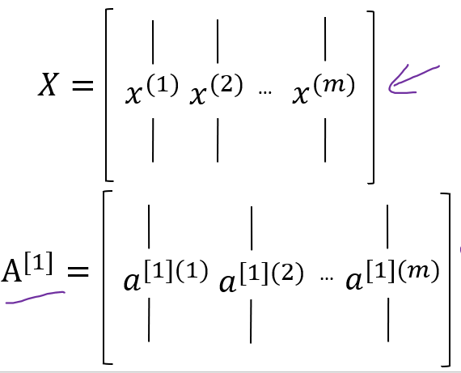
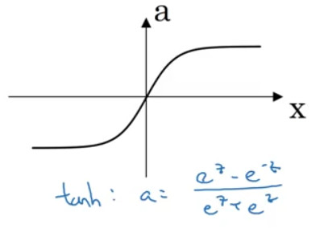
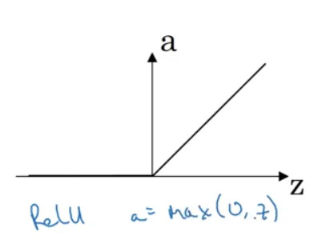
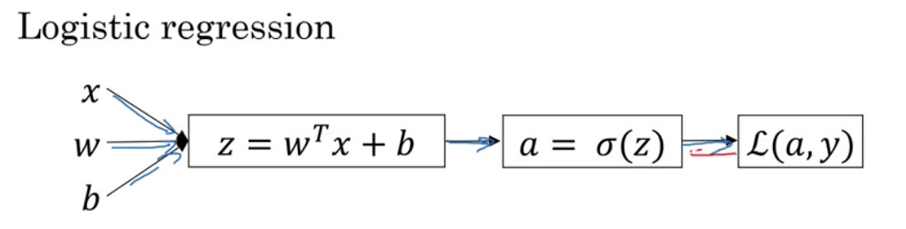

## Neural Network Representation
이제부터 다룰 neural network의 기본적인 구조는 다음과 같다..

다음의 그림에서 각 열을 레이어라고 부르며 구체적으로,

- $x1, x2, x3$ : input layer
- 중간 레이어 : hidden layer, 각각은 hidden unit에 해당.
- $\hat{y}$ : output layer

라고 부른다. 또한 위의 그림과 같은 경우를 2 layer neural network라고 부르는데, 일반적으로 input layer는 layer의 수에 포함시키지 않기 때문이다.

neural network는 그림에서 직관적으로 파악할 수 있듯, 화살표가 가리키는 방향으로 값을 전달한다. 따라서 input layer에서는 $x_n$을 hidden layer의 입력값으로 전달한다. 다음으로 이를 전달받아 hidden layer에서 어떠한 함수를 통해 최종적으로 값을 산출하며, 이 값을 $a^\text{[1]}$로 표기한다.
$a^\text{[1]}$는 다시 output layer의 입력값이 되며, output layer에서 또다른 함수를 통해 최종적으로 $\hat{y} = a^\text{[2]} $를 산출한다.

또한 hidden layer는 두 개의 파라미터를 가지는데, 가중치 행렬인 $w^\text{[1]}$ 과 bias $b^\text{[1]}$이 있다. 후술하겠지만, 위의 예제에서 가중치 행렬은 (4, 3), bias는 (4, 1) 벡터가 된다.

정리하자면 neural network는 input, hidden, output의 세 종류의 layer로 구분될 수 있으며, 각각의 레이어에서 사용되는 표기법은 다음과 같은 것들이 있다.

| |input layer|hidden layer|output layer|
-|-|-|-|
|output value|$X = a^\text{[0]}$|$a^\text{[1]} = \begin{bmatrix} a_1^\text{[1]}\\a_2^\text{[1]}\\a_3^\text{[1]}\\a_4^\text{[1]} \end{bmatrix} $|$\hat{y} = a^\text{[2]} $|
|parameters||weight $w^\text{[1]}$ 과 bias $b^\text{[1]}$|weight $w^\text{[2]}$ 과 bias $b^\text{[2]}$|
|dimensions||$w$는 (4, 3), $b$는 (4, 1)|$w$는 (1, 4), $b$는 (1, 1)|

## Computing a Neural Network's output
이제 하나의 unit 별로 어떠한 연산이 이루어지는지를 알아보자! 다음의 예시는 hidden layer에 하나의 unit만이 존재하는 경우 어떻게 결과값을 산출하는지를 나타내는 그래프이다.

입력값 $x$는 $z = W^{\rm T}x + b$를 거쳐 최종적으로 $ a = \sigma{(z)} = \hat{y}$를 산출한다.

위에서 살펴본 2 layer neural network의 hidden layer의 경우 이를 여러 unit으로 확장한 것에 불과하므로, 다음과 같은 식을 통해 $z_n^{[1]}$와 $a_n^{[1]}$를 산출한다.

실제 신경망 구현에서는 위의 연산을 반복문을 통해 구현하지 않고, 행렬로 표현하여 다음과 같이 계산한다.
$$ z^{[1]} = \begin{bmatrix} z_1^{[1]}\\z_2^{[1]}\\z_3^{[1]}\\z_4^{[1]}\end{bmatrix}= \begin{bmatrix} w_1^{[1]\rm T}\\w_2^{[1]\rm T}\\w_3^{[1]\rm T}\\w_4^{[1]\rm T} \end{bmatrix} \begin{bmatrix} x_1\\x_2\\x_3 \end{bmatrix} + \begin{bmatrix} b_1^{[1]}\\b_2^{[1]}\\b_3^{[1]}\\b_4^{[1]}\end{bmatrix}$$
$$ a^{[1]}=  \begin{bmatrix} a_1^{[1]}\\a_2^{[1]}\\a_3^{[1]}\\a_4^{[1]}\end{bmatrix} = \sigma{(z)} $$

## Vectorizing across multiple examples
i개의 training data가 있을 때의 학습은 다음과 같이 이루어진다.
$$\text{for i = 1 to m: }\\
z^{[1](i)} = w^{[1]}x^{(i)} + b^{[1]}\\
a^{[1](i)} = \sigma{(z^{[1](i)})}\\
z^{[2](i)} = w^{[2]}a^{[1](i)} + b^{[2]}\\
a^{[2](i)} = \sigma{(z^{[2](i)})}$$

실제로 구현할 때에는 반복문을 사용하지 않고 다음과 같이 각 training data를 열벡터로 두는 행렬을 만들어 계산하게 된다.

## Explanation for Vectorized Implementation
이번 강의는 위에서 설명한 구현 방법에 대해 좀 더 상세하게 설명한다.

## Activation function

지금까지 다루어왔던 예제에서 회귀를 통해 예측된 $z$는 activation function(활성함수)을 통해 변환된다. 이전의 강의에서는 이 activation function으로 시그모이드 함수를 사용해 왔다. 이번 강의에서는 여러 activation function을 소개하고 있다.

(1) tanh
  - -1과 +1 사이의 값을 가짐
  - 데이터를 centering하는 역할을 수행함으로써 데이터들의 평균이 0에 근접하도록 한다. 이 경우 다음 레이어에서의 학습이 보다 수월하게 이루어질 수 있다.

(2) RELU
  - z값이 너무 크거나 너무 작으면 시그모이드와 tanh의 값이 1과 -1에 가까워질 수 있다. 즉 기울기가 0에 가까워지며, gradient descent가 느려질 수 있다. 이 단점을 보완하는 활성함수
  - z과 0보다 작으면 0으로 만들지만, 그렇지 않으면 계속 증가함( = $max(0, z)$)
  - 기울기가 0에 가까워지지 않고 z에 따라 달라지기 때문에, tanh에 비해 학습이 빠르다.

(3) Leaky ReLU
  - $z$가 양수인 경우에는 ReLU와 동일하지만
  - $z <0$인 경우

강의에서는 결과값이 binary classification인 경우에는 시그모이드 함수를 사용하고, 다른 경우에는 ReLU나 tanh를 사용하라고 권유한다.

| |수식|특징|
-|-|-|
|sigmoid|</img>|* 데이터가 $0\le a \le 1 $ 사이의 값을 가짐 * binary classification시 사용|
|tanh|</img>|* 데이터가 $-1\le a \le 1 $ 사이의 값을 가짐 *데이터의 평균이 0이 되도록 centering|
|ReLU|</img>|* sigmoid와 tanh에 비해 학습이 빠름|
|leaky ReLU|</img>|* ReLU와 유사!|

## Why do you need non-linear activation functions?
활성함수에는 선형 활성함수와 비선형 활성함수가 존재한다. 비선형 활성함수에는 위에서 다룬 sigmoid, ReLU 등이 있으며, 선형 활성함수는 다음과 같이 정의된다. $$ g{(z)} = z $$
즉 input과 output이 동일한 함수를 선형 활성함수라고 하는데, 둘이 동일하기 때문에 이를 identity function이라고 부른다.

hidden layer에서는 선형 활성함수를 사용해서는 안된다. 간단한 예시를 통해 직관적으로 이해할 수 있다. 만약 각 unit의 활성함수가 선형이라고 하면 다음과 같이 계산될 것이다.

a[1] = w[1] * x[0] + b[1]
a[2] = w[2] * a[1] + b[2] = w[2] * ( w[1] * x[0] + b[1] ) + b[2]
a[3] = w[3] * a[2] + b[3] = ...

이므로 각각의 레이어를 합쳐서 하나의 선형 함수로 표현할 수 있다. 즉 레이어를 쌓는 의미가 없어지기 때문에, 활성함수는 비선형적이어야 한다.

## Derivatives of activation functions
역전파 알고리즘을 이용할 때에는 각 활성 함수의 기울기를 구해야 한다.

| |수식|특징|도함수|
-|-|-|-|
|sigmoid|</img>|* 데이터가 $0\le a \le 1 $ 사이의 값을 가짐 * binary classification시 사용| $ g'{(z)} = g{(z)}(1-g{(z)}) $|
|tanh|</img>|* 데이터가 $-1\le a \le 1 $ 사이의 값을 가짐 *데이터의 평균이 0이 되도록 centering| $ g'{(z)} = 1 - tanh{(z)}^2 $ |
|ReLU|</img>|* sigmoid와 tanh에 비해 학습이 빠름|$\begin{equation} g'{(z)}  =\begin{cases} 0 \quad \text{if}\,\, z < 0 \\ 1 \quad \text{if}\,\, z > 0 \\ \text{undef} \quad \text{if}\,\, z == 0 \\ \end{cases} \end{equation} $|
|leaky ReLU|</img>|* ReLU와 유사!|$\begin{equation} g'{(z)}  =\begin{cases} 0 \quad \text{if}\,\, z < 0 \\ 1 \quad \text{if}\,\, z \ge 0  \end{cases} \end{equation} $|

## Gradient descent for Neural Networks
다음의 식을 통해 로지스틱 회귀의 값을 구했다고 가정하자.

## Random Initialization
