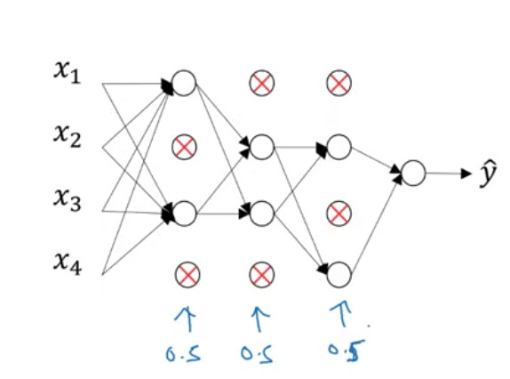

# Setting up your Machine Learning Application
-----
## 데이터 확보 시 유의사항

신경망을 학습할 때 하이퍼파라미터는 고정된 값이 아니라 데이터와 모델에 따라 달라지는 값이기 때문에, 학습할 때마다 하이퍼파라미터를 조정하여 적절한 값을 설정할 수 있다.
따라서 실제로 우리가 가지고 있는 데이터를 이용해 모델을 발전시키기 위해서는 학습에 사용될 데이터와 실제 평가에 사용할 데이터를 분리하여 각각 활용하여야 한다.

전통적인 머신러닝에서는 데이터를 test / dev / test set으로 나누어 test는 모델링에, dev set과 test set은 평가에 사용한다. 또한 각 데이터셋의 사이즈를 70% - 30%(dev + test) 혹은 60% - 20% - 20%로 나누어 이용하는 것이 일반적이다.

그러나 데이터의 개수가 많아지면 이 비율을 조정할 수도 있다. 예를 들어 100만개의 데이터가 있다면, 그 중 1만 개의 데이터만을 평가에 사용해도 무리가 없을 것이다.

또한 데이터를 확보할 때 중요한 것은 train data set과 dev / test set이 같은 분포(distribution)을 갖도록 하는 것이다. 하지만 실제로 데이터를 확보하는 일은 어렵기 때문에, 적어도 dev와 test set만큼은 같은 분포를 갖도록 데이터를 확보하여야 한다.

마지막으로 만약 데이터가 수가 많지 않을 경우 test set 없이 학습해도 된다. test set은 모델의 불편추정량을 얻기 위해 사용하는 데이터이다. 그러나 딥러닝에 있어서 굳이 불편추정량을 얻을 필요는 없으므로 이를 생략할 수 있다고 한다.

## Bias / Variance
이번 챕터의 내용은 ISL에서 정말 많이 강조했던 bias-variance trade-off와 관련이 있다.


실제값과 예측값의 차이를 이용해 모델의 성능을 평가하는 MSE는 다음의 식으로 분해될 수 있다.

$$ E(y_{0} - \hat{f}(x_{0})) = Var(\hat{f}(x_{0})) + [Bias(\hat{f}(x_{0}))]^2 + Var(\epsilon)$$

여기에서 variance는 모델이 학습 데이터에 대해 얼마나 민감하게 반응하는지, bias는 실제 현상을 단순화함으로써 발생하는 필연적인 오차를 의미한다. 따라서 위의 그래프에서 좌측의 high bias case의 경우 선형에 가까운 모델을 이용함으로써 실제 현상과 예측 모델의 차이가 크고, 반면 데이터에 대해서는 덜 민감한(low variance) 경우를 보여준다. 반면 우측의 그래프는 데이터에 대해서 매우 민감하게 반응하는 반면 오차는 매우 작아지므로 이는 high variance 이면서 low bias인 경우로 볼 수 있다.
머신러닝의 목표는 $E(y_{0} - \hat{f}(x_{0}))$를 최소화하는 것이므로, low bias와 low variance를 둘 다 추구하는 것이 중요하다. 하지만 그래프를 통해서 직관적으로 파악할 수 있듯, bias와 variance는 서로 trade off 관계에 있다.

다음의 이미지는 특징의 수가 좀 더 많은 경우에 bias와 varaince의 정도를 파악하는 방법을 보여준다.


특징이 여러 개일 때 bias와 variance를 파악할 때는 train set error와 dev set error의 차이를 비교할 수 있다. 우선 적절한 오차율을 설정한 다음, 해당 오차율과 train set error 그리고 dev set error를 서로 비교한다. 여기에서도 구체적으로 정해진 기준은 없고, 우리가 설정한 오차율 등을 고려하여 bias와 variance에 대한 판단을 내려야 한다.

## Basic Recipe for Machine Learning
위의 진단 방법으로 모델이 high bias와 high variance 중 어떤 문제를 가지고 있는지 파악했다면 이제 다음과 같은 해결법을 고려해볼 수 있다.

1. high bias(==underfitting)
    - 이 경우 training set에 대한 성능이 떨어진다고 볼 수 있다.
    - 따라서 hidden layer를 더 깊게 쌓거나, 더 많은 hidden unit을 생성하거나, 아니면 좀 더 학습을 시켜볼 수 있다.
    - 혹은 최적화 알고리즘을 바꿔 보거나, 다른 신경망 구조를 적용시켜볼 수도 있다.

2. high variance(==overfitting)
    - dev set에 대한 성능이 낮은 경우
    - 더 많은 데이터를 확보하기
    - 데이터 확보가 불가능한 경우에는 regularization을 시도해보기.
    - 다른 신경망 구조를 적용해보기
    - 다시 1로 돌아가 학습하기

그러면 앞서 설명한 bias-variance trade-off는 어떻게 조절해야 할가? 머신 러닝에서는 bias를 높이면 variance가 낮아지고, 반대로 bias를 낮추면 variance가 높아진다고 알려져 있다. 따라서 둘의 적절한 균형점을 찾는 과정이 필요하다.
하지만 딥러닝에서는 앞서 설명된 방법을 학습에 적용하면, 아주 약간의 trade-off만 bias나 variance만 낮추는 것이 가능하고 알려져 있다. 따라서 여기에서는 bias-variance trade-off를 고려하지 않아도 된다!

-----
# Regularizing your neural network
-----
## Regularization
Regularization은 high variance, 혹은 신경망의 과적합 문제를 방지하기 위한 방법으로, 로지스틱 회귀의 cost function $ \underset{w, b}{min}\,J(w, b)$을 정규화하는 방법과 유사하다.
로지스틱 회귀에서의 정규화는 다음의 식과 같이 loss function에 하이퍼 파라미터 람다를 더함으로써 이루어진다.

$$J(w, b) = \frac{1}{m}\sum_{i=1}^{m}\,L(\hat{y^{(i)}, y^{(i)}}) +  \frac{\lambda}{2m}\begin{Vmatrix}w\end{Vmatrix}_2^2$$
$$\begin{Vmatrix}w\end{Vmatrix}_2^2 = \sum_{j=1}^{n_{x}}w_{j}^{2} = w^{T}w$$

하이퍼 파라미터 람다에 L2-norm을 곱하기 때문에 이를 L2 regularization이라고 부른다.

신경망에서의 regularization 역시 유사한 방식으로 이루어진다.
이전에 정의한 것처럼 신경망의 cost function을 다음과 같이 정의하고, 여기에 L2 norm을 더해 정규화할 수 있다.

$$ J(w^{[1]}, b^{[1]}, w^{[2]}, b^{[2]}, ...) = \frac{1}{m}\sum_{i=1}^m L(y^{T(i)}, y^{(i)}) + \frac{\lambda}{2m} \sum_{l=1}^{L} \begin{Vmatrix} w^{[l]} \end{Vmatrix} $$
$$\begin{Vmatrix} w^{[l]} \end{Vmatrix}_{F}^{2} = \sum_{i=1}^{n^{[l-1]}} \sum_{j=1}^{n^{[l]}}(w_{ij}^{[l]})^{2}$$

그리고 이에 대해서 역전파 알고리즘을 적용할 때 역시 regularization 을 추가해 주어야 하는데, 다음의 식을 적용하면 된다.

$dw^{[1]} = \text{from backprop} + \frac{\lambda}{m}w^{[l]}$

특히 역전파 알고리즘에서 regularizaion을 적용하는 것을 weight decay라고도 부르는데, 그 이유는
$$ \begin{matrix}w^{[l]} &:=& w^{[l]} - \alpha dw \\
&=& w^{[l]} - \alpha(\text{from backprop} + \frac{\lambda}{m}w^{[l]}) \\
&=& w^{[l]} - \alpha*\text{from backprop} - \alpha * \frac{\lambda}{m}w^{[l]}  \end{matrix}$$

위의 식에서처럼 $w^{[l]} - \alpha * \frac{\lambda}{m}w^{[l]}$ 가중치를 업데이트할 때 람다에 의해 w가 보정되는 효과를 가져오기 때문이다.

## Why regularization reduces overfitting?

regularization이 과적합을 방지할 수 있는 이유는 람다를 이용하여 w의 몇몇 element를 0에 가까운 값으로 만듦으로써 보다 단순한 신경망을 만들 수 있다는 데에 있다. 다음의 이미지에서 x표시는 w에 의해 출력값이 0에 가까운 값이 된 unit을 의미한다.


또한 regularization은 활성 함수의 선형적인 부분을 이용할 수 있게 한다. 다음의 tanh는 z값이 0에 가까울수록 선형인데, 람다 값을 크게 주면 z가 0에 가까워질 것이다. course1에서 배운 것처럼 활성함수가 선형인 경우 전체 네트워크가 선형이 된다. 이 말은 즉, decision boundary가 선형으로 나타날 것이고 그만큼 variance는 낮아질 것이다.


## Dropout Regularization


dropout regularizaion은 regularization의 한 종류로, 일정 확률로 임의의 unit을 학습에서 제외하는 방법이다.
학습을 할 때에는 위의 그림에서와 같이 각 레이어에서 일정 확률로 임의의 unit을 제거하면서 학습을 진행하며, 제거되는 유닛은 매 학습 시마다 달라질 수 있다. unit을 제거하게 되면 해당 unit의 출력값이 다음 unit으로 전달되지 않게 되므로, 그만큼 신경망이 단순해질 것이다.

학습을 끝내고 신경망의 성능을 평가할 때에는 dropout을 하지 않고 전체 네트워크에 대해서 평가를 수행한다.

## Understanding Dropout

그렇다면 이러한 dropout은 어떠한 효과를 가져올까?


위의 이미지를 다시 보면, 하나의 unit은 여러 입력값을 받는데, 매번 다른 feature를 입력값으로 받게 된다. 어떤 feature가 입력될 지는 모르기때문에 이를 통해서 신경망이 하나의 feature에 과도한 가중치를 부여하는 것을 방지할 수 있게 된다. 이를 통해 가중치는 축소될 것이고, 따라서 L2 regularization과 유사한 효과를 낼 수 있다.
dropout과 L2 regularization의 가장 큰 차이점은 dropout의 경우 각 레이어마다 확률을 다르게 부여할 수 있다는 점이다. 예를 들어 hidden unit이 많고 여러 하이퍼 파라미터가 적용되어서 과적합이 발생할 것으로 짐작되는 레이어에는 낮은 확률을, 과적합을 걱정하지 않아도 되는 레이어에는 높은 확률을 부여할 수 있을 것이다.
dropout은 컴퓨터 비전 영역에서 자주 사용된다. 왜냐하면 수집할 수 있는 데이터의 수가 많지 않은 경우 과적합이 발생할 가능성이 높기 때문이다. 즉 앞에서도 설명했듯 regularization은 high variance를 방지하기 위한 테크닉이기 때문에, 과적합이 발생하지 않는 경우에는 굳이 적용할 이유가 없다.
한편 dropout은 하나의 단점이 존재한다. 반복해서 학습을 할 때마다 임의의 unit을 삭제하기 때문에 cost function을 명확하게 정의하기 어렵다는 것이다. 따라서 cost function을 정의할 때에는 dropout을 사용해서는 안된다.

## Other regularization methods
L2나 dropout 외에도 여러 정규화 방법이 존재하는데, 첫째로 Data augmentation이 있다. 이는 이미지를 좌우반전하거나, 일부를 자르는 식으로 데이터를 늘리는 방법이다.


두번째로 Early stopping은 학습 도중에 overftting이 감지되면 학습을 강제로 종료시키는 방법이다.


가중치 w에 대해 random initialization을 수행할 때 초기에 w는 0에 가까운 작은 값으로 초기화되고, 반복 횟수가 많아질 수록 이 값은 점점 커지게 된다. 여기에서 early stopping은 dev set error > training error가 되는 지점까지만 학습을 시킴으로써 가중치 w를 적절한 크기로 조절하는 역할을 한다.
하지만 early stopping에는 하나의 단점이 존재한다. 신경망 학습에 있어서 cost function을 최적화하는 것과 과적합을 방지하는 것은 별개의 작업이다. 하지만 early stopping을 이용한다면  dev set error > training error이 되는 지점에서 학습이 종료되기 때문에 cost function의 최적화가 불가능해진다. 하지만 L2 regularization이나 dropout과 달리 특별한 하이퍼파라미터를 필요로 하지 않기 때문에 결과를 보다 빨리 얻을 수 있다는 장점이 있다.

-----
# Setting up your optimization problem
-----

## Normalizing inputs


data normalization을 수행하는 이유는 위의 강의노트의 예시를 보면 직관적으로 이해할 수 있다.

예를 들어 x1과 x2라는 두 개의 input이 있을 때, 각각 1~1000, 0~1의 범위를 갖는다고 하자. 그러면 당연히 가중치 역시 한쪽은 매우 크고, 다른쪽은 작은 값을 갖게 될 것이다. 그러면 다음과 같은 비용함수가 그려진다.
반면 normalize를 수행하면 우측 그래프와 같이 대칭적인 그래프가 그려진다. 각각에 대해 gradient descent 알고리즘을 적용하면 좌측의 경우 w와 b의 변화가 급격하게 일어날 수밖에 없게 된다.

참고로 data normalization은 다음의 식을 통해 이루어진다. 또한 normalization을 할 때에는 train/dev set을 나누기 전에 해 주어야 한다.
$$ x := \frac{x - \mu}{\sigma^{2}} $$

## Vanishing / Exploding gradients
딥러닝에서 발생할 수 있는 문제점 중 하나는 Vanishing gradient라는 문제이다. 다음의 신경망 구조에서 활성함수 g(z)가 선형이라고 하면 $\hat{y}$는 맨 아래의 식처럼 정의될 것이다.


만약 이 경우 가중치가 1보다 큰 경우 $\hat{y}$은 기하급수적으로 증가할 것이고, 1보다 작은 경우 기하급수적으로 감소할 것이다. 이는 gradient descent를 느리게 만드는 원인이 된다.

## Weight Initialization for Deep Networks

Vanishing gradient 문제를 해결할 수 있는 방법 중 하나는 가중치를 초기화할 때 w의 표준편차를 줄이는 항을 도입하는 것이다.
다음의 코드를 이용해서 초기화를 수행하면 랜덤하게 생성된 값들이 정규분포의 형태로 초기화되어 Vanishing gradient 문제를 해소할 수 있게 한다.

`````r
W = np.random.randn(dim) * 0.01

# Xavier Initialization ->
W = np.random.randn(dim) * np.sqrt(1/n[l-1])

#He Initialization
W = np.random.randn(dim) * np.sqrt(2/n[l-1])
`````

## Numerical approximation of gradients

역전파 알고리즘을 구현한 다음 해야할 일은 제대로 구현이 되었는지(버그는 없는지) 확인하는 것이다. 이를 gradient checking이라고 부른다.


## Gradient Checking
Gradient Checking을 위해서는 모든 파라미터를 giant vector $\theta$로 바꾸어주어야 한다.


그런 다음 모든 i에 대해

$$ d\theta_{approx} = \frac{J(\theta_{1}, \theta_{2}, ... \theta_{i} + \epsilon, \theta_{i+1}) - J(\theta_{1}, \theta_{2}, ... \theta_{i} - \epsilon, \theta_{i+1})}{2\epsilon}$$
를 구하고 이 값이 $d\theta_{approx} \approx d\theta$ 인지의 여부를 확인하면 된다.

일반적으로 둘의 차이가 $10^{-7}$보다 작은 경우 제대로 구현되었다고 할 수 있다.

## Gradient Checking Implementation Notes


