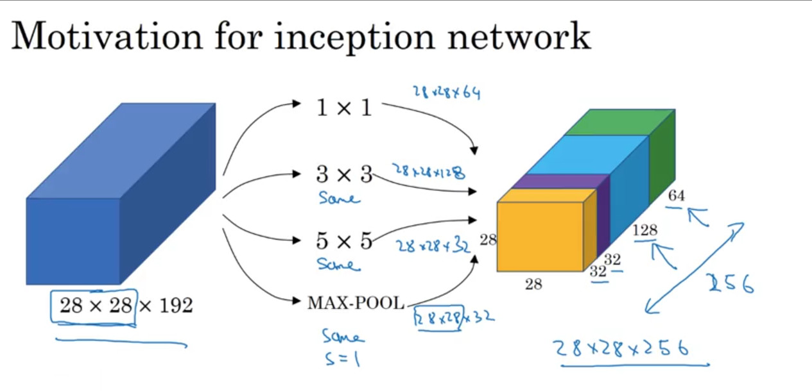

## Classic Networks
-----

### LeNet-5

맨 처음 살펴볼 내용은 LeNet-5이다. 이것은 0~9까지의 숫자를 분류하기 위해 개발되었다. 대략 6만개의 하이퍼 파라미터가 이용되었다. 이 네트워크의 특징은 레이어가 깊어짐에 따라서 점차 가로와 세로 폭이 감소한다는 점이다. 또한 conv-pooling-conv-pooling이 반복되는 구조이다.

### AlexNet

LeNet과 유사하지만, 더 큰 모델이다. 따라서 이 AlexNet은 6천만 개 정도의 파라미터를 튜닝해야 한다. 또한 AlexNet은 비선형 함수로 ReLU를 사용했다는 특징이 있다.

### VGG-16

VGG-16은 더 간단한 네트워크를 사용하는 방법이다. CONV 레이어에는 3 X 3 필터를, Max pooling에는 2X2 매트릭스를 이용해서 다음과 같은 구조를 가진다.

한편 이름의 16이 의미하는 것은 이 네트워크가 16개의 레이어에 가중치를 부여하기 때문이다. 또한 이 네트워크는 상대적으로 깊은 네트워크이므로, AlexNet에 비해 더 많은 하이퍼파라미터가 사용된다.
하지만 VGG-16은 심플한 구조를 가지고 있다. 즉, 네트워크가 conv-pooling의 일관적인 구조가 반복된다는 것을 위의 그림을 통해 확인할 수 있다. 한편 필터의 개수가 레이어별로 2의 제곱씩 늘어나는 반면, pooling을 통해 가로세로 폭은 축소된다는 특징이 존재한다.

## ResNets

깊은 네트워크는 vanishing/exploding gradient 문제로 인해 학습시키기 어렵다. 이번 챕터에서 다루는 내용은 일반적인 신경망과는 달리, 뉴런의 output을 더 깊은 레이어의 input으로 주는 방법을 통해 깊은 네트워크를 학습시키는 기법을 다루고 있다.

위의 이미지처럼 연산의 결과를 한 레이어를 뛰어넘어 다음 레이어에서 ReLU를 적용하기 이전 단계로 forwarding하게 되는데, 이 결과로
$$ a^{[l+2]} = g(z^{[l+2]} + a^{[l]})$$이라는 식이 도출된다.

ResNet은 이러한 Residual block을 쌓아서 깊은 네트워크를 구성한 것을 말한다. 다음의 이미지는 Residual Network의 구조를 보여준다.

위의 이미지는 5개의 residual block을 쌓아서 신경망을 구성한 것이다. 하단의 두 개의 그래프는 일반적인 신경망(plain network, residual block을 적용하지 않은 것)의 학습에 따른 error의 감소 형태와, residual network의 감소 형태를 비교한 그래프이다. 왼쪽의 그래프가 시간이 지남에 따라 error가 증가하는 것과는 달리, 오른쪽은 지속적으로 감소하는 것을 볼 수 있다. 하지만 일정 시점이 지남에 따라 점차 수렴하게 되므로 한계가 존재한다.

## Why ResNet works?

위에서 나온 식을 다시 전개하면 다음과 같이 전개할 수 있다.

$ a^{[l+2]} = g(z^{[l+2]} + a^{[l]})$
$ a^{[l+2]} = g(w^{[l+2]}a^{[l+1]} + b^{[l+2]} + a^{[l]})$

만약 위의 식에서 $ w^{[l+2]}a^{[l+1]} + b^{[l+2]} = 0$인 경우 결국
$ a^{[l+2]} = g(a^{[l]}) = a^{[l]}$ 이 될 것이고, 이는 중간의 두 개 정도의 레이어를 뛰어넘는(skip) 효과를 가진다. 이것이 ResNet이 skip connection이라고도 불리는 이유이다.

이렇게 함으로써 Residual network는 성능을 떨어뜨리지 않을 뿐만 아니라, 성능을 향상시킬 수도 있다.

또한 ResNet에서 주목해야 할 것은 $ g(z^{[l+2]} + a^{[l]}) $의 식에서 z와 a가 동일한 차원이어야 한다는 점이다. 만약 둘의 차원이 다르다면 a에 가중치 행렬을 곱해 z의 차원과 동일하도록 바꾸어 주어야 한다.

## Networks in Networks and 1x1 Convolutions

1X1 필터를 사용하면 어떤 점이 좋을까? 위의 그림은 대략적인 1X1 필터의 작동 과정을 나타낸 그림이다. 이 필터를 적용시킨 결과를 보면 가로와 세로는 그대로 유지되지만, channel은 감소한다. 1X1은 이처럼 channel의 수를 감소시키기 위해 사용하는 것이 일반적이다. 하지만 channel의 수를 감소시키지 않는 경우에도, 각 픽셀에 비선형성을 추가하기 위해 사용할 수도 있다.

## Inception Network Motivation

inception network의 기본 구조는 위와 같다. 기본적인 아이디어는 각 레이어에 어떤 필터를 적용할지를 고민하지 말고 여러 가지를 시도해 본 다음에 각각을 stacking해서 오른쪽 그림과 같은 output을 만들어내는 것이다.
이러한 학습의 문제점은 학습 시간이 매우 오래 걸리며, 많은 비용이 든다는 점이다. 이 때 사용할 수 있는 방법으로 위에서 나온 1x1 필터를 적용하는 방법이 있다.

위의 예제는 1x1 필터를 이용하여 채널의 크기를 감소시킨 다음, 다시 Convolution을 수행하는 예제이다. 이렇게 함으로써 연산량을 크게 감소시킬 수 있다. 위에서 중간의 레이어를 bottleneck layer라고도 부른다.

## Inception Networks

이제 실제로 Inception network를 어떻게 구현하는지를 알아보자.

위의 이미지처럼 적용하고자 하는 convolution이나 pooling 방식 등을 설정한 후 오른쪽과 같이 쌓으면 하나의 inception module이 완성된다. 그리고 인셉션 네트워크가 하는 일은 이 모듈들을 한데 모으는 작업이다.

복잡해 보이는 그림이지만, 빨간색 블록은 하나의 인셉션 모듈을 나타내고, 각각의 블록은 다른 인셉션 모듈이다. 즉 inception network는 각 모듈을 다음과 같은 구조로 학습시키는 것이다. 한편 초록색 동그라미는 output을 예측하는 데 사용되는 레이어이다. 즉, 학습 도중에 예측 성능을 측정하여 과적합을 방지하는 장치라고 볼 수 있다.
