
# course 4. Convolutional Neural Networks
## week 1. Foundations of Convolutional Neural Networks  

 
 

##  4.1.1. Computer Vision
* Computer Vision Issue : **Image Classification, Object Detection, Neural Style Transfer** 
* **이미지 데이터의 RGB**
	- 64x64 pixel의 경우 64x64x3 = 12288 의 크기를 갖는 입력값
	- 이미지 크기가 크면 parameter의 수가 많아져 과적합의 문제와 계산 및 메모리 부적합의 문제 발생   
	(1000 x 1000 pixel과 같은 고해상도 이미지의 경우,  standard fully connected network를 사용한다면 첫번째 은닉층에서 30억 개 정도의 parameter)
	- 합성곱 신경망(Convolutional Neural Networks, CNN)의 연산이 이미지 크기에 대한 고민을 해결. 
 
 
 

## 4.1.2. Edge Detection Example
 - **Edge Detection**  
 단순한 것에서부터 복잡한 것으로 점차 발견해나가는 과정: 모서리 인식- 가능성있는 부분 인식- 온전한 물체를 인식 

   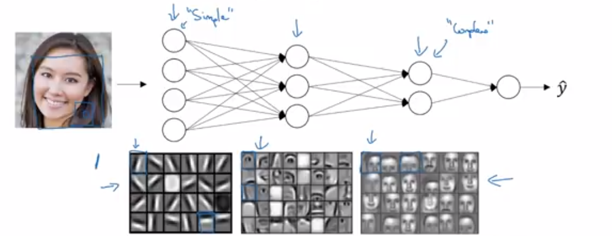
 
   
- **합성곱 연산의 방식**  
 - 합성곱 연산은 합성곱 신경망의 핵심 요소
 - 필터(또는 커널) 행렬을 입력 이미지의 왼쪽위에서부터 시작하여 오른쪽과 밑으로 옮겨가며 대응 행렬 값끼리 곱한 후 모두 더해주는 방식. 
 
 
       
  
 
 
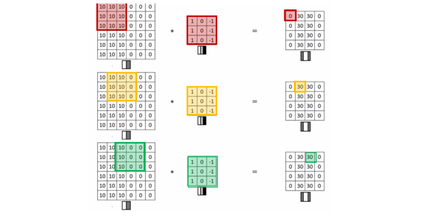     

 
 
  
 
## 4.1.3.  More Edge Detection
- **밝기 전환**  
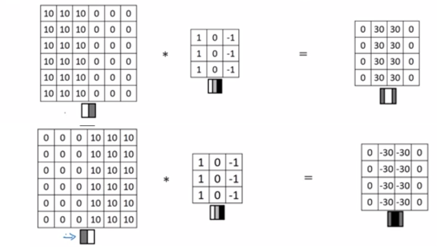
  

 
  입력 이미지가 6 X 6 pixel의 Grayscale 이미지라면, 별도의 RGB 채널이 없기 때문에 6 x 6 x 3 의 행렬이 아닌 6 x 6 x 1 의 행렬이 된다.  위 사례에서 음영이 반대인 이미지를 뒤집어서 동일한 필터로 합성곱을 하여 결과 이미지에서 30 대신 -30 의 값이 얻어졌다. 그 결과 이미지의 가운데 구분 영역으로 입력 이미지의 가운데에 강한 경계선이 있을 뿐만아니라, 양과 음의 윤곽선의 차이로 인한 밝기의 전환을 확인할 수 있다. 두 종류의 차이가 중요하지 않다면, 결과 행렬에 절대값을 씌워줄 수 있다. 
 
- **합성곱 필터의 종류** 
 
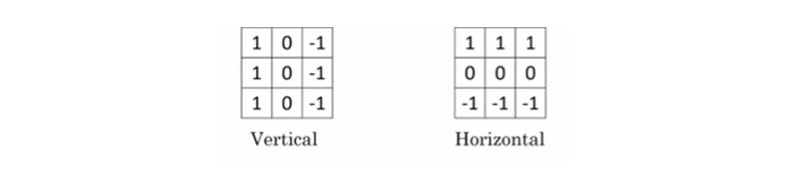
 
 
 
 CNN에서는 합성곱 필터 행렬의 값들이 parameter가 된다. 필터 행렬의 숫자 요소들을 변수로 두고 데이터로부터 학습함으로써 신경망이 이미지 내에서 윤곽선같은 하위 단계의 속성을 학습할 수 있게 된다.   
 
- **딥러닝 프레임워크의 합성곱 연산 함수**
  -  Tensorflow: tf.nn.conv2d
  -  Keras: Conv2d

 
 
 

## 4.1.4. Padding

- **합성곱 연산에서 이미지 축소의 문제점** 
	- 수백 개의 층을 거쳐 아주 작은 이미지만 남게 될 수 있다. 
	- 이미지 가장자리의 정보들을 버리게 된다.    
 	
- **Padding** 
이미지 축소의 문제점을 해결하기 위해 이미지를 덧대어 입력값으로 넣어주는 변형 방식.  
6 x 6 이미지의 가장자리에 1 픽셀만큼 가장자리에 더해주면, 기존의 8 x 8 이미지가 되어 3 x 3 필터와 합성곱을 한 후 동일한 6x6 사이즈의 결과 이미지가 나온다.
 

 

 위 예시에서는 stride가 2라서 결과 이미지의 크기가 줄어들었지만,  stride가 0이라면 기존 이미지와 같은 6 x 6 크기를 얻게 된다.  
 따라서, padding을 하면 가장자리의 정보를 모두 취할 순 없지만 버리는 양을 줄일 수 있다. 
 

-  **패딩의 양 선택**
 - **Vaild (유효 합성곱)**: 패딩이 없는 경우.  
	n x n 이미지, f x f 필터일 경우, 결과 이미지 (n - f + 1) x (n - f + 1) 
 - **Same (동일 합성곱)**: 패딩이 있는 경우. 입출력 이미지 크기가 동일.  
	n x n 이미지, f x f 필터, p=패딩의 양일 경우, 결과 이미지 크기 = (n + 2p - f + 1) x (n + 2p - f + 1)   
	n = (n + 2p - f + 1)   
	p = (f - 1) / 2  
	- 일반적으로 필터 크기 f x f 에서  f 는 3, 5, 7과 같은 홀수이다. f가 짝수이면 패딩이 비대칭이 되고, 홀수의 경우에는 중심 위치가 존재하기 때문에 필터의 위치 파악이 용이하다.
    
 
 
 

## 4.1.5. Strided Convolutions
- **Stride**  
	합성곱 필터 적용시 stride 값의 간격을 두어 칸을 옮기며 연산하는 것.  

    
 
  
 

- **Strided Convolutions**  
 
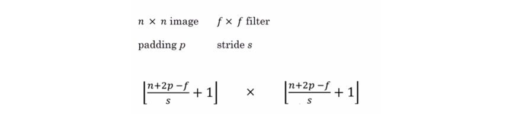    
 
  분수값이 정수가 아닐 경우 내림 연산하여 필터가 밖으로 나온 경우 계산에 포함하지 않는다. 일반적으로는 필터가 패딩된 이미지에 맞도록 설정한다. 
  
- **Cross correlation과 Convolution**  
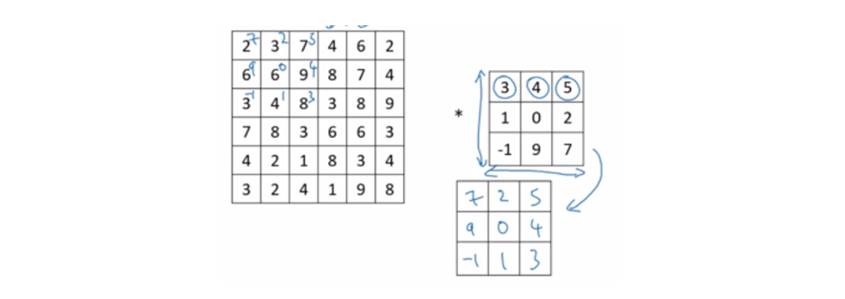
 일반적인 수학 교재에서 정의하는 Convolution은 가로축과 세로축으로 뒤집어 주는 mirroring 단계가 있다. 딥러닝 분야에서는 유용하지 않으므로 미러링 과정을 생략하므로 Cross correlation라고 해야 하지만, 관습적으로 Convolution이라 부른다. 
   

## 4.1.6. Convolutions Over Volume

* **RGB 이미지 3D 필터**
	* 너비x 높이x 채널의 수
	* 이미지의 채널 수와 필터의 채널 수가 일치
 
 
 
* **RGB 필터**
  - 빨간색의 윤곽선을 감지하는 필터       
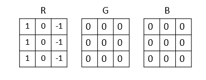   
  - 특정색과 상관 없이 감지하는 필터      
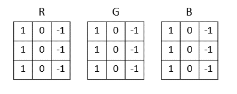  
 	  

* **다중 필터**
	 - 세로와 가로, 또는 45도 혹은 70도 기울어진 윤곽선을 모두 감지  
	 - 검출하고자 하는 특성의 수 = 필터의 채널 수  
 

   

## 4.1.7. One Layer of a Convolutional Network

* **Forward Propagation** 
  
 

* **One Convolutional Layer**  
  
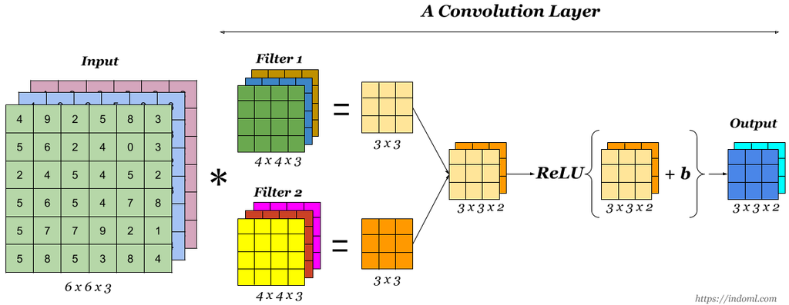  
 
 
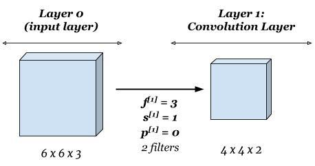
 
 
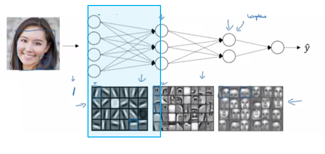
 
* **Notation**  
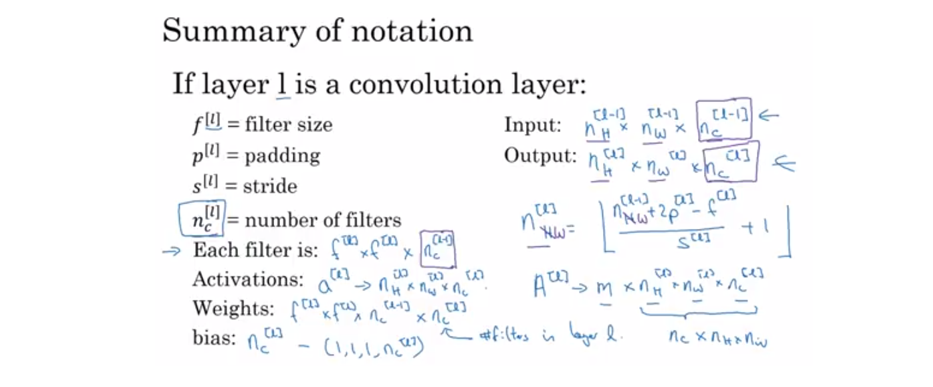
 
   

## 4.1.8. Simple Convolutional Network Example
- **CovnNet Example**  
 - 신경망 깊이가 깊어질 수록 입력값의 높이와 너비가 줄어들고, 채널의 수는 늘어나는 경향
  
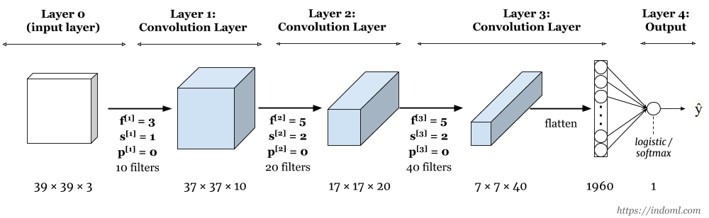
 
- **Types of layer in CNN**  
 -Convolution (CONV)  
 -Pooling (POOL)  
 -Fully Connected (FL)   

    
## 4.1.9. Pooling Layers
- **Pooling Layers**  
표현 크기를 줄임으로써 계산 속도와 특성 검출의 정확도 증가  
  
    
 
  

- **hyper-parameters**
	-   filter size  (_f_) 
	-   stride  (_s_) 
	-   pooling type  (max or avg)    
    
    
-  hyper-parameter가 고정값이기 때문에 gradient descent로 학습 하지 않는다. 
- f = 2, s = 2: 높이와 너비를 절반으로 줄임  

     
## 4.1.10. CNN Example
   
 
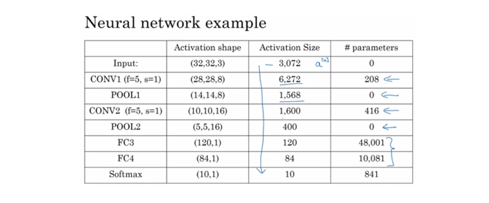  
  
- **신경망의 층의 개수**: 일반적으로는 가중치와 변수를 가지는 층을 말한다. Pooling layer는 가중치와 변수가 없고 하이퍼파라미터만 있기 때문에, CONV와 POOL을 하나의 층(Layer) 으로 묵는다.

   
### 4.1.11. Why Convolutions?
-  **Convoltion의 장점**
 - **Parameter sharing**: 입력 이미지의 여러 위치에서 동일한 필터를 사용함으로써 학습해야 할 parameter의 갯수 감소.
 - **Sparsity of Connection**: 입출력 결과가 필터의 크기만큼만 영향을 받아 parameter의 갯수 감소 

    

#### Additional Reference
https://indoml.com/2018/03/07/student-notes-convolutional-neural-networks-cnn-introduction/ 
