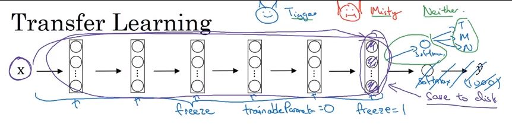
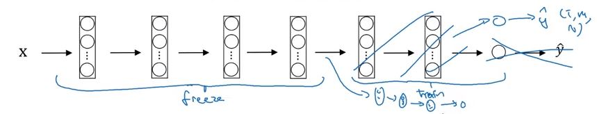
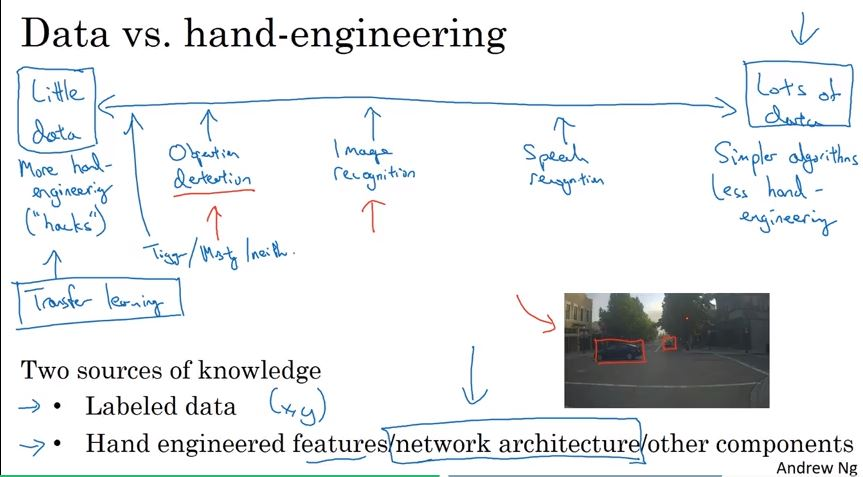

# course 4. Convolutional Neural Networks  

## week 2. Deep convolutional models: case studies (2)

  
### 1. Using Open Source Implementation
- 결론 : Open Source 활용하기
- 이유 
	- 이미 여러 연구자들, 공부하는 사람들이 구현해 놓은 성능이 입증된 구현체들이 많다. 
	- 여러 개의 GPU로 몇 달에 걸쳐 학습한 파라미터들 제공. 
	- 원하는 목적을 효율적으로 달성 가능
	- 구현되어 있는 것을 따라가는 것도 어렵지만, 처음부터 혼자 모두 구조를 만드는 것은 더 어렵다.  
   

### 2. Transfer Learning
- 그렇다면 Open Source를 어떻게 이용할까? 오픈 소스 가중치를 초기값으로 사용하여 훈련!
- 3가지를 분류하는 Classification하는 모델을 가정 

 
- Open Source에서 architecture를 가중치와 같이 가져오고, 뒤의 softmax classification 부분만 3가지(고양이1,2,없음) 결과가 나오도록 구조를 수정.
- 작업에 필요한 훈련 세트가 작을 때  
1) 앞의 layer들은 고정(freeze)하여 softmax classification 부분만 학습.  
    딥러닝 프레임워크의 훈련 여부 결정은 훈련 가능한 prameter=0 또는 freeze=1  
2) 고정함수가 되는 훈련 세트의 활성값을 저장   
    이미지 X 를 입력해서 특성 벡터를 계산한 후 softmax 모델 훈련. 매번 freeze된 부분이 연산되지 않도록 함.)  
 

 
- input Data가 많을 수록 freeze 부분은 줄고 훈련시킬 부분이 증가.  
- 작업에 필요한 훈련 세트가 클 때  
1) 하나의 softmax unit만 훈련하는 것이 아니라 마지막 layer들을 조합한 작은 network를 훈련.  
2) 오픈 소스 네트워크와 가중치 전부를 초기화 과정으로 사용하여 전체를 다시 훈련.  
  
 
### 3. Data Augmentation
 
- 기존의 data를 변형하여 사용함으로써 성능 향상.
    - mirroring: 반전 효과
    - Random Cropping: 무작위로 일부를 잘라내기
    - Rotation,  Shearing,  Local warping: 복잡성을 고려, 비교적 적게 사용
    - color shifting: RGB색상 변환

 

 
- 이미지 내용에 대한 레이블은 유지 (고양이냐 아니냐)
- 이미지 변화와 왜곡에 강력해짐.  

  
### 4.2.4 State of Computer
 

 
- 지식의 원천은 1) x-y 쌍으로 레이블이 지정된 데이터와 2) Hand-engineering
- data가 많을 경우, 적은 hand-engineering: 거대한 신경망, 단순한 아키텍처 
- data가 적을 경우, 많은 hand-engineering: 시스템 요소들을 수동으로 조작->tranfer learning
  

