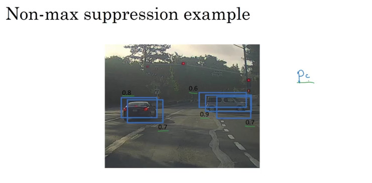
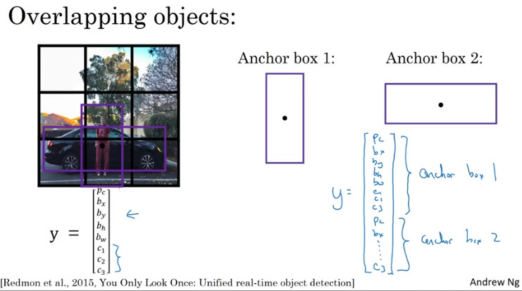
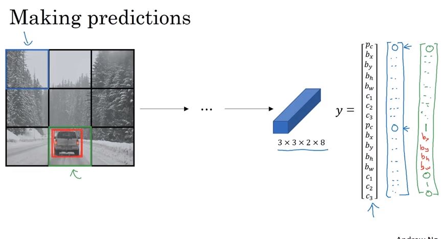
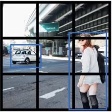

# course 4. Convolutional Neural Networks  

## week 3.Object detection (2)  

 
 

### 6. Intersection over Union(IoU)

- IoU(Intersection over union) :
  - 두 개의 bounding box가 위치적으로 얼마나 근접한가를 측정하는 기준
  - IoU = size of Intersection / size of union

### 7.Non-max suppression

- 위의 이미지처럼 여러 개의 detection이 발생한 경우 이를 처리할 수 있는 방법
- 구체적인 알고리즘은 다음과 같음

- 
  - p_c를 True/False가 아니라 output의 확률로 둠. 이 확률이 0.6 보다 작은 box들은 정확히 탐지했다고 보기 어려우므로 제거함
  - 남은 bounding box들에 대해서
    - 가장 높은 p_c를 선택
    - 선택된 p_c와의 IoU값이 0.5이상인 bounding box를 제거

### 8.Anchor box
- 그리드 셀 단위로 물체를 탐지할 때의 문제 : 각 그리드 셀 당 하나의 물체만을 탐지 가능
- Anchor box
 - 
 - 위의 이미지와 같이 서로 다른 크기의 사각형 두 개를 병렬적(?)으로 예측에 이용하는 방법

- 
  - 기존 방법과의 비교
    - 기존의 y : 각 물체는 그리드 셀에 할당되고, 물체의 중심점을 포함(3X3X8)
    - anchor box y : 중심점과 함께 "가장 높은 IoU"값을 갖는 anchor box의 정보를 포함(3X3X(2X8))

- 논의
  - 19 X 19 그리드 셀에서 위와 같이 물체가 겹치는 일이 자주 발생할까?
    - 거의 발생하지 않음
    - 그럼에도 Anchor box는 몇몇 output unit이 직사각 형태의 물체를 인식하는 데 특화될 수 있게끔 함
  - anchor box의 선택
    - 사람이 직접 선택
    - k-means clustering : 얻고자 하는 물체들에 대한 그룹화(?)를 해서 anchor box를 생성
    - 탐지하고자 하는 물체의 대표적인 형태를 선택

### 9.YOLO Algorithm

- YOLO Algorithm을 정리하자면 현재까지 본 개념들을 모두 합한 것
	- CNN
	- Bounding Box Detection with Grid
	- IOU(Intersection Over Union)
	- Non-max Suppression
	- Anchor Boxes

- YOLO Algorithm의 label
  -

    - grid는 3x3이기 때문에 label의 shape에 3x3이 포
    - target의 class가 3개이기 때문에 detection 한 개당 차원이 8
    - Anchor Boxes가 2개(세로로 긴 첫번째 박스와 가로로 긴 두번째 박스)이므로 총 차원은 3x3x2x8 또는 3x3x16이 됩니다. 3x3x16은 grid당 Anchor Boxes 두 개의 output을 concat 해준 것입니다.
    - grid의 수가 증가하거나 Achor Box의 수가 증가하면 차원이 증가함

-
  - 모델이 예측하는 결과
    - 주어진 class에 포함되는 target이 없다고 예측하면 Pc에는 0이 들어가고 나머지 값들은 의미없는 값으로 채워짐
    - 각 값들이 가져야하는 범위들이 있는데 이 것은 모델을 만들 때 지정해줍니다.
    - 원하는 output의 형태대로 predict하고 나면 Non-max Suppression을 해줍니다.

  - predict를 하게 되면 위와 같이 grid마다 anchor box의 모양대로 detection됩니다.

  - Non-max Suppression을 해주면 object당 최대 한 개의 Detection(prediction)만 남게 되고 이 것이 최종 output입니다.
