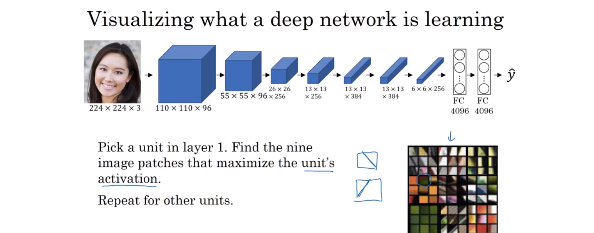
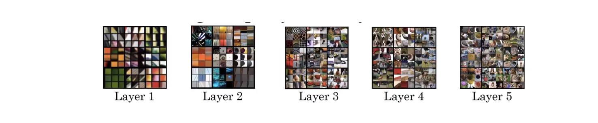
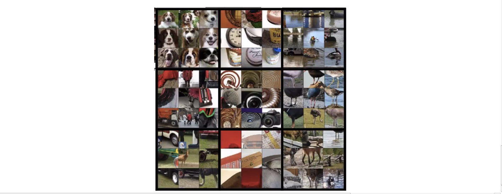
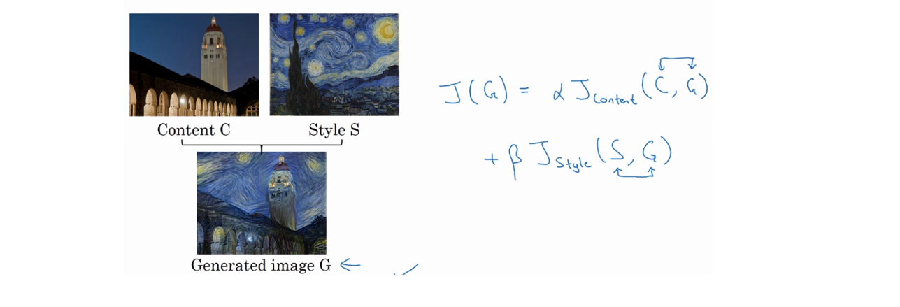
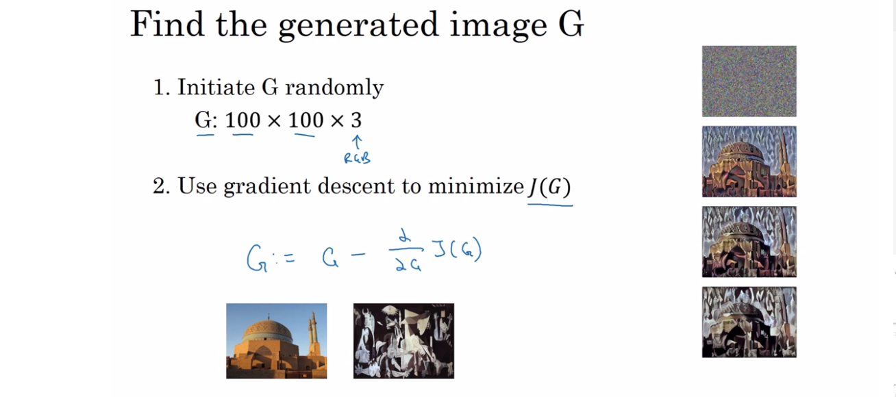
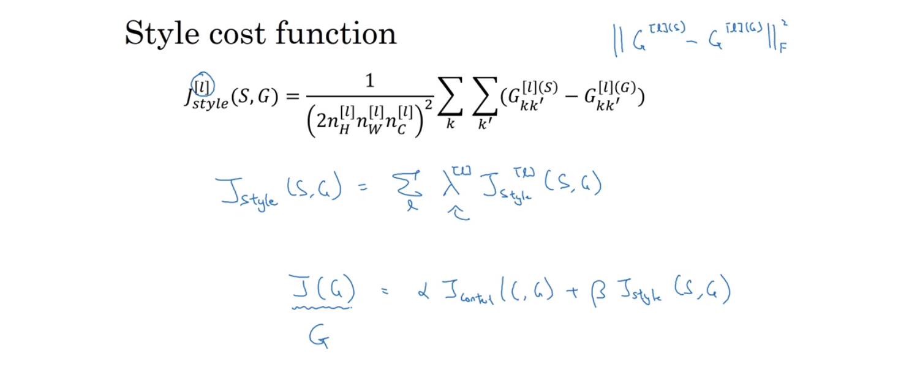
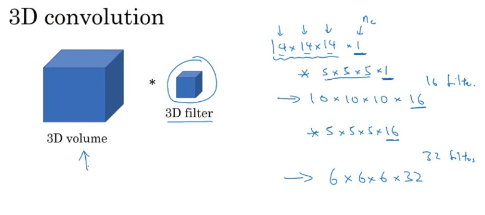

# Course 4. Convolutional Neural Networks
## Week 4.2. Neural Style Transfer
      

### 4.2.1. What is neural style transfer?
  
   
   

### 4.2.2. What are deep ConvNets learning?

 - 신경망 학습에 대한 직관을 위한 시각화 (예시는 AlexNet)
  - layer 1 부터 각 은닉 유닛의 활성값을 최대화하는 이미지 또는 이미지 조각을 살펴 본 후, 각 layer의 9개의 은닉 유닛에 대해 여러 번 반복하여 각 유닛을 고도로 활성화 시키는 이미지 조각들을 비교.
  - 단순한 모서리 부분만 보는 1번째 layer 부터 깊은 층으로 갈 수록 복잡하고 패턴에서 나아가 구체화된 물체를 점점 검출하게 되는 양상.  
   
    - layer 1

    - layer 2

    - layer 3

    - layer 4

    - layer 5

   
   
###4.2.3. Cost Function

 - **style transfer의 두 가지  비용 함수**
    
    

   - Content cost Function: 내용 이미지 C(Content)와 생성된 이미지 G(Gnerated)와의 비슷한 정도
   - Style cost function:  스타일 이미지 S(Style)와 생성된 이미지 G(Gnerated)와의 비슷한 정도  

      

- **Cost Function 정의**  
  - $J{(G)} = \alpha J_{content}{(C,G)} + \beta J_{style}{(S,G)}$
  - 상대적 가중치를 두기 위한 두 하이퍼파라미터 α, β  

   

- **생성되는 이미지 G(generated) 찾기**   

   

 1. Cost Function인 J(G)를 정의
 2. 생성 이미지 G를 무작위로 초기화 → 초기 생성 이미지는 흰 노이즈 이미지
 3. Gradient descent로 J(G)를 최소화 →  픽셀값이 업데이트되어 내용 이미지와 스타일 이미지가 융합된 이미지가 생성

   

###4.2.4. Content Cost Function
- **content cost function을 정의하는 법**
  - content cost를 계산하기 위해서 은닉층 중 하나를 선택
    - 보통 은닉층 중간 정도에 있는 레이어를 선택함
  - 미리 학습된 네트워크를 선택
  - $a^{[1](C)}$와 $a^{[1](G)}$를 각각 원본과 생성된 이미지 대한 activation라고 할 때, 두 값이 유사하다면 두 이미지가 유사한 내용을 가지고 있다고 할 수 있음
  - $J_{content}(C, G) = \alpha * ||a^{[1](C)} - a^{[1](G)}||^{2}$로 정의   

   
   

### 4.2.5.  Style Cost Function
- **Image Style**  
 
  
 
  - 한 레이어 안에서 다른 채널들의 활성 사이의 상관 관계로 스타일을 정의.
  - 한 레이어의 활성 블록을 nh x nw x nc라 할때, 모든 nh x nw 위치에서의 Style을 표현   
  
- **Intuition about style of an image**  
 
      
 
  - CNN에서 각 layer의 output(activation)은 input을 여러 channel로 convolution한 image들의 집합
  - 위 사진에서 activation의 빨강, 노랑, 파랑 등의 부분은 input을 다른 channel로 convolution한 것 결과. 즉, 각각 input에서 뽑아낸 특징
  - activation의 빨강 부분은 input image에서 세로 선들을 뽑아낸 것, 노랑 부분은 빨간색, 주황색 계열을 뽑아낸 것
  - activation의 빨강 부분, 노랑 부분 들의 correlation로 Style을 정의
  - Style은 세로 선이 존재 할 때 붉은 계열도 존재하는지의 상관관계를 구하는 것
  - 모든 channel에 의한 activation들의  correlation로 Style을 정의  
  - Style을 구하기 위해 사용하는 layer들은 pre-trained된 CNN 모델을 사용(ex) vgg
 
- **Style Matix**
 
  
 
  - G(Gram matrix 또는 Style matix)는 correlation matrix
  - 레이어 l, 높이 i, 너비 j, 채널 k(1,...,nc) 일 때 nc x nc 차원의 제곱 매트릭스
  - G는 채널 k에서의 활성화와 채널 k'에서의 활성화가 얼마나 상관 관계가 있는지를 측정한 것으로,   
     (k,k')값은 activation k번째 channel로 conv한 것과 k'로 한 것에서 같은 위치(nh, nw)에 있는 값들을 곱해서 합한 것
      
  - 목표는 S(Style)와 G(Generated)의 "Gram matrix"차이를 줄이는 것
  - Gram matrix 차이의 norm에 행렬의 크기에 관련된 숫자($beta$를 곱할 것이기 때문에 크게 중요하지 않음.)를 나눠주고 $beta$를 곱해주면 $l$번째 layer에서의 Style loss function. 
  - 모든 Layer에 대해서 Style Loss Function을 더하면 Style Cost Function    
             
- **Style cost function**
 
  
 
  - Style Cost Function은 Content Cost Function과 다른 방식이지만 마찬가지로  pre-trained된 모델을 사용
  - 핵심은 'Style을 activation에서 channel별로 Correlation으로 정의 하는 것'   
    - 전체 Style cost function = λ^[l]\*(추가적 가중치를 둔 Style cost)들의 합
    - 전체 Cost function =  α\*(C, G의 전체 cost) + β\*(S, G의 전체 style cost)

     

###4.2.6. 1D and 3D Generalizations
- **1차원 데이터에 convolution을 적용하는 방법**
 
  
 
  - ex) 각 시간 단위마다의 심장의 전압?을 측정하는 심전도
  - 2D convolution의 경우
    - 14 * 14 * 3 데이터에 대해 5 * 5 * 3필터 적용 : 10 * 10 convolution
  - 1D의 경우
    - 14 * 1 데이터에 대해 5 * 1 필터 적용 : 10 convolution
    - 2D와 동일한 방식으로 실행하여 결과를 얻을 수 있음
    - 이런 시계열 데이터와 같은 경우에는 RNN을 사용할 수도 있으며 각각을 사용할 때의 장단점이 존재
      - RNN 파트에서...
 
- **3차원 데이터에 적용하는 방법**
 
  
   
  - ex) CT 스캔(신체의 각 단면을 촬영한 사진이지만 각각의 사진을 하나의 input으로 이용함)
  - 이 경우 필터가 3차원으로 변경됨
      
