# Chapter 3. 선형회귀

## 3.2 다중선형회귀

실생활에서는 단일 설명변수가 아닌 **복수의 설명변수들**이 필요하다. 그러면 추가적인 설명변수들을 어떻게 포함시킬 수 있을까?

1. *각 설명변수마다 다른 단순선형회귀모델 사용*

  => BUT 서로 다른 회귀방정식에 연관되어 있기 때문에 주어진 설명변수들로 "하나의" 예측값을 파악하기 힘듦

​                 각각의 회귀방정식에서 회귀계수를 추정할 때 다른 설명변수들을 고려하지 x

2. *<u>하나의 모델에서 각 설명변수에 다른 기울기 계수 할당</u>*

​         $$Y= \beta_0+\beta_1X_1+\beta_2X_2+...+\beta_pX_p+\epsilon$$

  

### 3.2.1 회귀계수의 추정

$$\hat{y}= \hat{\beta_0}+\hat{\beta_1}x_1+\hat{\beta_2}x_2+...+\hat{\beta_p}x_p$$

$$\hat{\beta_0},\hat{\beta_1},...,\hat{\beta_p}$$들은 잔차제곱합(RSS)를 최소화하도록 **최소제곱법**을 사용하여 결정됨

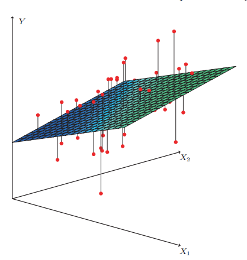

Q) 그렇다면 단순회귀를 적용했을 때와 다중회귀를 적용했을 때 추정계수값에 차이가 날까?

   *Advertising data*를 살펴보자.(sales: 반응변수, TV/radio/newspaper: 설명변수)

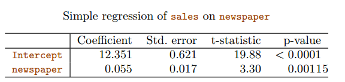

A) newspaper를 기준으로 보면, 추정계수값 자체에도 차이가 있고, 특히 p-value 값이 약 0.86으로 더이상 유의하지 않다. 이는 단순회귀의 경우 TV와 radio 같은 다른 설명변수들을 고려하지 않고 계수를 추정하기 때문이다. 

Q) 왜 단순선형회귀는 sales와 newspaper 사이에 상관관계가 있음을 나타내는데, 다중회귀는 그 반대 결과를 나타내는 것인가?

A) 위의 표는 3개의 설명변수와 반응변수의 상관행렬을 나타낸다. radio와 newspaper의 상관성은 0.35인데, 이는 radio 광고에 지출을 많이 하는 마켓일수록 newspaper 광고에도 지출을 많이 하는 경향이 있음을 말해준다. newspaper 광고가 sales에 미치는 직접적인 영향은 없지만, radio 광고는 sales를 증가시킨다고 가정해보자. radio 광고에 지출을 더 많이 하는 마켓은 sales도 더 높을 것이고, 상관계수에서 볼 수 있듯이 newspaper 광고 지출도 더 높아지는 경향을 보일 것이다. 그러므로 다른 설명변수들과의 관계를 고려하지 않는 단순선형회귀모델에서는 newspaper 광고지출이 증가할수록 sales도 증가하는 양상이 보였던 것이다.  즉, newspaper 광고에 의한 sales는 실제로는 radio 광고에 의한 것이며 sales에 직접적으로 영향을 미치지 않는다. 

### 3.2.2 몇 가지 중요한 질문

> 반응변수와 설명변수 사이에 상관관계가 있는가?

 	$$H_0:\beta_1=\beta_2=...=\beta_p=0$$	vs     $$H_1:$$ 적어도 하나의 $\beta_j$는 영이 아니다 (가설검정 by F-통계량)

​        $$F=\frac{(TSS-RSS)/p}{RSS/(n-p-1)}=\frac{ESS/p}{RSS/(n-p-1)}=\frac{MSR}{MSE}=\frac{explained\ varaince}{unexplained\ variance}$$  

​	 $$where$$   $$TSS=\sum(y_i-\bar{y})^2$$  ,  $$ESS=\sum(\hat{y}_i-\bar{y})^2$$,  $$RSS=\sum(y_i-\hat{y}_i)^2$$

​        [ TSS(종속변수의 분산) = ESS(예측종속변수의 분산) + RSS(오차의 분산) ]

​	if 선형모델 가정이 맞다면 => $$E[RSS/(n-p-1)]=E[MSE]=\sigma^2$$

​	if $H_0$가 맞다면 =>  $$E[(TSS-RSS)/p]=E[MSR]=\sigma^2$$

​	=> 반응변수와 설명변수들 사이에 상관관계가 없다면 F-통계량은 값이 **1**에 가까울 것이고,  반응변수와 설명			 변수들 사이에 상관관계가 있다면 회귀모델이 전체 변동성의 많은 부분을 설명할 것이므로 $$E[(TSS-RSS)/p]=E[MSR]>\sigma^2$$이 될 것이고, F-통계량 값은  **1**보다 커질 것이다.

Q) $H_0$를 기각하고 반응변수와 설명변수들 사이에 상관관계가 있다고 결론을 내리려면 F-통계량이 

​      얼마나 커야 하는가?

A) **n**(관측치 개수)과 **p**(설명변수 개수)에 따라 다름(F분포를 사용하여 계산된 p-값을 사용해 기각여부 결정하므로)

​       n이 큰 경우 => F-통계량이 1보다 약간만 크면 귀무가설 기각 가능

​       n이 작은 경우 => F-통계량이 더 커야 함

​	<특정 q개 계수가 0인지 검정하고 싶은 경우>

​	 $$H_0:\beta_{p-q+1}=\beta_{p-q+2}=...=\beta_p=0$$

​	$$F=\frac{(RSS_0-RSS)/q}{RSS/(n-p-1)}$$

​        => q=1인 경우 모델에 그 변수를 추가하는 것에 대한 부분적 효과 나타냄

​              (다중선형회귀의 q가 1인 경우 F검정 = 단순선형회귀의  t 검정)

​	

​	Q) 각 변수에 대한 p-값이 존재하는데 왜 F-통계량을 확인해야 하는가?

​	A) 설명변수의 개수인 p가 큰 경우, "각 변수에 대한 p-값 중 어느 하나라도 작으면 적어도 하나의

​             설명변수는 반응변수와 상관성이 있을 가능성이 높다 "라는 논리에 문제가 생기기 때문이다.

 p=100이고, $$H_0:\beta_1=\beta_2=...=\beta_{100}=0$$이 참인 경우를 고려해보자. 실제로는 반응변수와 설명변			                 수들 간에 상관관계가 없지만, 각 변수에 연관된 p값 중 약 5%는 우연히 0.05보다 작을 것이다. 이는 설명변수와 반응변수 사이에 연관성이 있다는 잘못된 판단으로 이끈다. 하지만 F-통계량은 설명변수의 개수와 상관없이 항상 하나의 p-값만 나오기 때문에 이러한 문제가 발생하지 않는다. 다만 F-통계량은 p가 상대적으로 작고 n과 비교해서도 작을 때 작동 가능하다. 관측치 수보다 추정할 계수의 수가 더 많은 경우에는 다중선형회귀 적합을 사용할 수 없다. 이 경우에는 **전진선택**과 같은 방법을 사용한다.

> 중요 변수의 결정

**변수선택**: 어느 설명변수가 반응변수와 상관성이 있는지 결정하는 것

p=2인 경우 총 4개의 모델이 가능하다

1) 설명변수가 하나도 없는 모델  2) $X_1$만 포함하는 모델   

3) $X_2$만 포함하는 모델  4) $X_1$과 $X_2$ 둘 다 포함하는 모델

이러한 모델의 quality를 평가하기 위해 맬로우즈 $C_p$, AIC, BIC, Adjusted $R^2$ 등이 사용된다(=>CH.6)

But p가 커질수록 가능한 모델의 수는 $2^p$로 기하급수적으로 증가한다

그럼 다른 방법은 없을까?

- 전진선택

  절편만 포함하고 설명변수는 없는 영모델에서 시작

  p개의 단순선형회귀를 적합해 가장 낮은 RSS가 발생되는 변수를 영모델에 추가

  특정 정지규칙을 만족할 때까지 반복

- 후진선택

  모델의 모든 변수를 가지고 시작해 가장 큰 p-값을 가지는 변수를 제외

  특정 정지규칙을 만족할 때까지 반복

- 혼합선택

  전진선택처럼 변수가 없는 모델로 시작해 최상의 적합을 제공하는 변수를 하나씩 추가

  모델의 변수들 중 어느 하나에 대한 p-값이 특정 임계치보다 커지면 그 변수를 제외

  모델에 포함되는 모든 변수들이 충분히 작은 p-값을 가지고 모델에서 제외된 변수들이 모델에 추가될 경우 p-값이 커지게 될 때 중지

> 모델 적합

모델 적합의 대표적인 수치적 측도 2가지

- $R^2$

  $$R^2=\frac{TSS-RSS}{TSS}=\frac{ESS}{TSS}$$

  BUT 모델에 변수가 추가될수록, 추가된 변수와 반응변수의 상관관계가 아주 약하더라도 $R^2$은 증가

- **RSE**(잔차표준오차)

  $$RSE=\sqrt{\frac{1}{n-p-1}RSS}$$

  BUT  $Y$의 단위가 커질수록 $$RSE​$$도 커지는 문제 발생 

  Q) newspaper 변수가 모델에 추가될 경우 RSS가 감소해야  하는데, 어떻게 RSE가 증가할 수 있는가?

  A) RSS 감소량이 p 증가에 비해 상대적으로 작을 경우 RSE가 높아질 수 있음

> 예측

다중선형회귀모델을 적합한 후 설명변수를 기반으로 반응변수를 예측하는 데에 모호한 3가지가 있다

1. 계수추정의 부정확도(reducible error)

2. 모델 편향(reducible error)

3. irreducible error

**신뢰구간**: 설명변수 $$X$$가 어떤 특정값 $$X=x_0$$의 값일 때 **반응변수 $$Y$$의** **평균**을 추정할 때

**예측구간**: 설명변수 $$X$$가 어떤 특정값 $$X=x_0$$의 값일 때 **개별적인 $$Y$$의 값**을 추정할 때

즉, 개별 반응변수 값 $$Y=f(X)+\epsilon$$을 예측하고자 한다면 예측구간을 사용하고, 평균반응변수값인 $$f(X)$$를 예측하고자 한다면 신뢰구간을 사용한다. 예측구간은 reducible error와 irreducible error($$\epsilon$$)를 둘 다 포함하므로 신뢰구간보다 항상 더 넓다. 

## 3.3 회귀모델에서 다른 고려할 사항

### 3.3.1 질적 설명변수

지금까지는 설명변수가 quantitative라고 가정하였지만, 실제로는 qualitative한 경우도 많다.

*Credit 자료* - balance(반응변수)와 age,cards,education 등의 설명변수들을 가지는 자료를 참고해보자

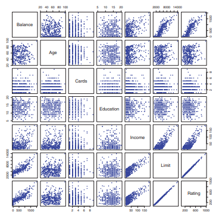

> 레벨 수가 2인 설명변수

gender에 따른 balance를 조사한다고 해보자. 2개의 값을 가지는 indicator나 더미 변수를 생성하면 된다. 

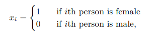

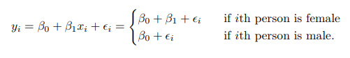

여기서 $\beta_0$는 남성의 평균 balance, $\beta_1$은 여성과 남성의 balance의 평균 차이로 해석 가능하다.

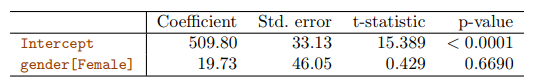

위의 표는 gender에 대한 balance의 회귀와 관련된 최소제곱 계수 추정치인데, 가변수에 대한 p-값이 매우 높음을 확인할 수 있다. 즉, balance에 있어서 gender에 따른 차이가 존재한다는 통계적 증거가 없다는 의미다.

> 레벨 수가 3 이상인 질적 설명변수

해당 경우에는, 하나의 가변수만으로 가능한 모든 값을 포함할 수 없다. 따라서 가변수를 여러 개 만들어야 하는데, ethnicity 변수를 예로 들어보자. 

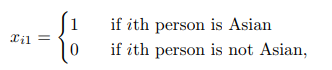

​                       

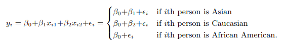

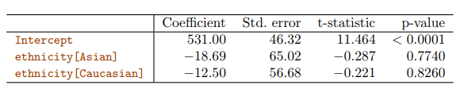

위의 표에서 볼 수 있듯이, 두 가변수에 대한 p-값은 매우 큰데, 이는 balance가 인종에 따라 차이가 발생한다는 통계적 근거가 없음을 말해준다. 가변수의 코딩 선택에 따라 예측은 변함없이 동일하지만, 계수들과 t 통계량에 따른  p-값들은(t 검정은 한번에 하나의 계수만 검정하므로 여러 개의 p-value 나옴) 달라질 수 있다. 하지만 F-검정은 개별 계수에 의존적이지 않아(모든 회귀계수들에 대한 유의성을 검정해서 하나의 p-value만 가지므로) 가변수 코딩에 따라 달라지지 않는다. 

### 3.3.2 선형모델의 확장

$$Y= \beta_0+\beta_1X_1+\beta_2X_2+...+\beta_pX_p+\epsilon$$

이와 같은 표준선형회귀모델은 실제로는 성립하지 않는 몇가지 제한적인 가정을 사용한다.

첫번째는 가산성 가정으로, 설명변수 $X_j$의 변화가 반응변수 $Y$에 미치는 영향은 다른 설명변수 값에 독립적이라는 것이다. 

두번째는 선형성 가정으로, $X_j$의 한 유닛 변화로 인한  $Y$의 변화는 $X_j$의 값에 관계없이 상수라는 것이다.

> 가산성 가정의 제거

$$Y= \beta_0+\beta_1X_1+\beta_2X_2+\epsilon$$라는 2개의 설명변수를 가지는 표준선형모델을 고려해보자.

$X_2$의 존재여부와는 상관없이 $X_1$이 한 유닛 증가하면 $Y$는 평균 $\beta_1$만큼 증가할 것이다. 

여기에 **상호작용 항**이라는 새로운 설명변수를 추가하면 모델을 확장할 수 있다. 

$$Y= \beta_0+\beta_1X_1+\beta_2X_2+\beta_3X_1X_2+\epsilon$$

Q) 상호작용 항을 포함하는 것과 가산성 가정의 제거는 어떤 관련이 있는가?

A)   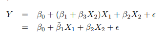

$Y$에 대한 $X_1$의 효과는 더 이상 상수가 아니고, $X_1$과 $X_2$는 서로 영향을 미치게 된다.

실제로 *Advertising 자료*에서, 주효과($X_1$, $X_2$)만 포함하는 모델의 $R^2$은 89.7%인데, 상호작용 항($X_1 X_2$)을 포함하는 모델의 $R^2$은 96.8%로 더 훌륭한 성능을 보여준다. 

하지만 상호작용 항($X_1 X_2$)은 매우 작은 p-값을 가져 유의미하지만, 관련된 주효과($X_1$, $X_2$)는 그렇지 않은 경우가 있다. 이러한 경우에는, 주효과의 p-값이 유의미하지 않더라고 모델에 포함해야 한다. 상호작용 항이 유의미하다면, 각각의 주효과의 계수가 0인지의 여부는 중요하지 않기 때문이다. 또한 상호작용 항은 보통 주효과와 관련이 있어서 이를 제외하는 것은 합리적이지 않다. 

> 비선형 상관관계

**다항식회귀**를 사용하여 비선형 상관관계 수용

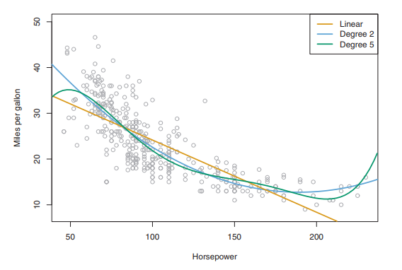

위의 그림은 *Auto 자료*의 자동차들에 대한 Horsepower(마력)과 MPG을 나타낸다. 오렌지색 선은 선형회귀적합을 나타내는데, 점들로 이루어진 데이터들을 보면 그 관계가 명백히 비선형적이라는 것을 확인할 수 있다. 그러면 horsepower의 비선형 함수를 사용해 mpg를 예측해보자. 

$mpg=\beta_0+\beta_1$ x $horsepower+\beta_2$ x $horsepower^2+\epsilon$

하지만 이는 $X_1=horsepower, X_2=horsepower^2$을 가지는 다중선형회귀모델이라 생각할 수도 있다. 즉, 선형회귀모델을 통해 비선형적합을 수행할 수 있다. 하지만 이를 통해 모델의 성능을 높일 수 있다고 해서  $horsepower^5$와 같은 고차원의 다항식을 계속 포함하게 되면 overfitting의 문제가 발생하니 주의해야 한다. 

### 3.3.3 잠재적 문제

선형회귀모델을 특정자료에 적합할 때, 많은 문제가 발생할 수 있다.

> 반응변수-설명변수 상관관계의 비선형성

선형회귀모델은 반응변수와 설명변수 사이에 직선의 상관관계가 있다고 가정하므로, 실제 데이터가 비선형적 관계를 보인다면 모델 적합 결과는 좋지 않을 것이다.

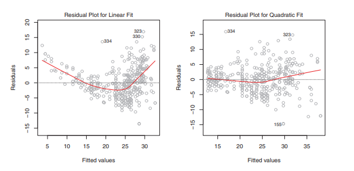

**잔차 그래프**는 비선형성을 식별하는 데 유용한데, 우리가 설정한 선형모델이 잘 맞다면 인지할만한 패턴을 보이지 않을 것이다.  잔차란 회귀식이 설명하지 못하여 남아있는 부분인데, 설명하지 못한 부분에 특이한 사항이 남아있지 않다는 것은 회귀식이 설명변수와 반응변수의 관계를 잘 설명했다고 볼 수 있기 때문이다. 만약 잔차 그래프에서 비선형 상관성을 확인한다면, $logX, \sqrt X,  X^2$와 같이 설명변수들을 비선형적으로 변환하는 방법이 있다.

> 오차항의 상관성

선형회귀모델에서 오차항들 $\epsilon_1,...,\epsilon_n$은 서로 상관되어 있지 않다고 가정한다. 하지만 실제로는 오차항들 사이에 상관성이 있는 경우 추정된 표준오차는 실제 표준오차를 과소추정하는 경향이 있을 것이고, 이는 표준오차를 사용하는 신뢰구간과 p-값 등에 영향을 미칠 것이다.  

오차항들 사이의 상관관계는 주로 시계열 데이터에서 자주 발생하는데, 이웃하는 시점에 얻어진 관측치들은 양의 상관성을 가지는 오차를 가질 것임을 예측해볼 수 있다. 

> 오차항의 상수가 아닌 분산

선형회귀모델에서는 오차항들의 분산 $Var(\epsilon_i)=\sigma^2$이 상수라고 가정한다.

하지만 오차항들의 분산은 반응변수의 값에 따라 증가할 수 있는 등 상수라는 보장이 없다.

오차의 비상수 분산은 **잔차 그래프**에 **깔때기 형태**가 있는지의 여부로 식별 가능하다.

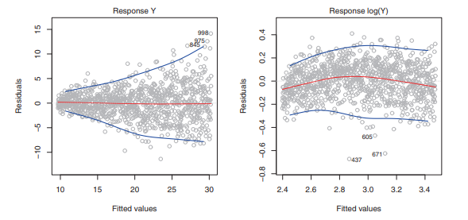

> 이상치

**이상치**: $y_i$가 모델의 예측값과 크게 다른 점

이상치는 설명변수 값이 특이한 것이 아니어서, 최소제곱적합에 큰 영향을 미치지 않는다. 하지만 이상치의 제외여부는 RSE값에 영향을 미치고, RSE는 신뢰구간 및 p-값을 계산하는 데 활용되기 때문에 해석에 큰 영향을 줄 수 있다. 

Q) 특정 점이 이상치라고 판단하려면 잔차가 얼마나 커야 하는가?

A) 각 잔차 $e_i$를 추정표준오차로 나눈 **스튜던트화 잔차**를 이용한다. 스튜던트화 잔차의 절대값이 3보다 큰 관측치가 이상치라고 판단한다. 하지만 이상치는 필요한 설명변수가 없는 것과 같이 모델의 결함이 원인일 수 있으므로 무작정 제외해서는 안 된다. 

> 레버리지가 높은 관측치

**높은 레버리지**를 가지는 관측치: 대응하는 $x_i$ 값이 보통 수준과 다른 관측치

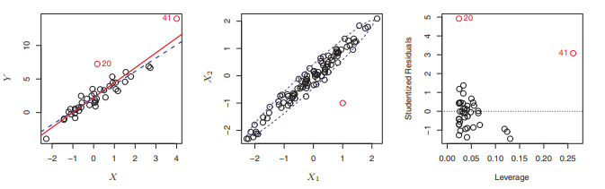

레버리지가 높은 관측치를 제외하는 것이 이상치를 제외하는 것보다 최소제곱적합에 더 큰 영향을 미침을 확인할 수 있다. 

가운데 그림은 관측치가 각 개별 설명변수 값의 범위 내에 있지만 전체 설명변수를 고려하면 보통 수준과는 다른 경우를 보여준다. 

관측치의 레버리지를 수량화하기 위해 **레버리지 통계량**을 사용하는데, 통계량이 클수록 관측치의 레버리지가 높다고 해석하면 된다. 단순선형회귀의 레버리지 통계량은 아래와 같다. 

모든 관측치에 대한 평균 레버리지는 항상 $\frac {(p+1)}n$이므로, 이보다 더 큰 레버리지 통계량을 가지면 높은 레버리지를 가지는 관측치라 의심해볼 수 있다. 

> 공선성

**공선성**: 두 개 또는 그 이상의 설명변수들이 서로 밀접하게 상관되어 있는 경우

회귀에서 공선성의 존재는 위험할 수 있는데, 이는 반응변수에 대한 공선형 변수들의 개별 효과를 분리하기 어렵기 때문이다.  

각 타원은 동일한 RSS에 대응하는 계수들의 집합을 나타내는데, 중심에 가장 가까운 타원이 가장 낮은 RSS 값을 가진다. 오른쪽 그림에서 Limit과 Rating은 높은 공선형성을 보이는데, 이 등고선은 좁은 계곡을 이루며 동일한 RSS에 이르게 되는 계수 추정치들의 범위가 넓다. 즉, 데이터의 작은 변화가 최소제곱 추정치들이 이 계곡을 따라 어디로든 움직일 수 있도록 하며, 이는 계수 추정치의 불확실성으로 이어진다. 

공선성은 회귀계수 추정치의 정확성을 낮추므로 $\hat{\beta}_j$에 대한 표준오차를 증가시키고, t-통계량을 줄이며, 이는 귀무가설을 기각하지 못하게 할 수 있다. 즉, 공선성이 가설검정의 power를 낮출 수 있다는 말이다.

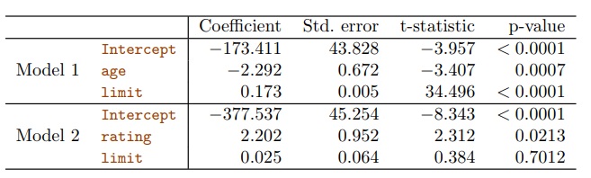

Model 1에서 age와 limit의 p-값은 모두 유의미하지만, Model 2에서는 설명변수 간의 공선성으로 인해 limit변수의 p-값이 커지며 그 중요성이 가려진다. 

Q) **공선성**은 어떻게 검출할 수 있는가?

A) 설명변수들의 **상관행렬**에서 절대값이 큰 쌍을 찾으면 된다. 

Q) **다중공선성**(3개 이상의 변수들 사이의 공선성)은 어떻게 검출할 수 있는가?

A) **VIF(분산팽창인수)**: full model 적합 $\hat{\beta}_j$의 분산을 자신만의 적합에 대한 $\hat{\beta}_j$의 분산으로 나눈 비율

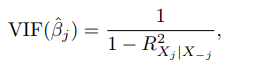

​    여기서 $R^2_{X_j|X_{-j}}$는 $X_j$의 회귀에서 모든 다른 설명변수로의 $R^2$이다. 보통 VIF 값이 5 또는 10을 초과하면 문제가 있을 정도의 공선성을 나타낸다. 

Q) 공선성 문제가 있을 경우 어떻게 해결하는가?

A)  1. 문제가 있는 변수들 중 하나를 제외

​      2. 공선성 변수들을 단일 설명변수로 결합

## 3.5 선형회귀와 K-최근접이웃의 비교

**선형회귀**는 $f(X)$를 선형함수로 가정하기 때문에 **모수적 기법**이다. 이러한 기법은 추정해야 할 계수의 수가 적고, 계수들에 대한 해석이 간단하다는 장점이 있다. 하지만 실제 함수형태가 선형적이지 않다면 결과예측의 정확도가 낮을 것이다. 반면에 **비모수적 기법**은 $f(X)$에 대한 형태를 명시적으로 가정하지 않아 더욱 유연한 모델이 가능하다. 가장 단순하고 잘 알려진 방법은 **KNN 회귀**이다. 

> KNN 회귀

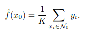

주어진 K 값과 예측포인트 $x_0$에 대해, 먼저  $x_0$에 가장 가까운 K개의 훈련 관측치 $N_0$를 식별한다. 그 후에, $N_0$ 내의 모든 훈련 관측치들에 대한 반응변수 값들의 평균을 사용해 $f(x_0)$를 추정한다. 

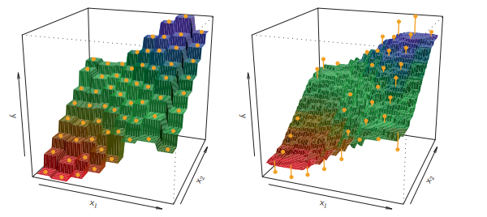

왼쪽은 K=1일 경우 오른쪽은 K=9인 경우의 KNN 적합함수이다. K 값이 작으면 유연성이 높아져 편향은 낮지만 분산이 커진다. 

Q) 어느 경우에 최소제곱선형회귀와 같은 모수적 방식이 KNN회귀와 같은 비모수적 방식보다 나은가?

A)  선택된 모수 형태가 $f$의 실제 형태에 가까운 경우에 비모수적 방식보다 더 낫다.

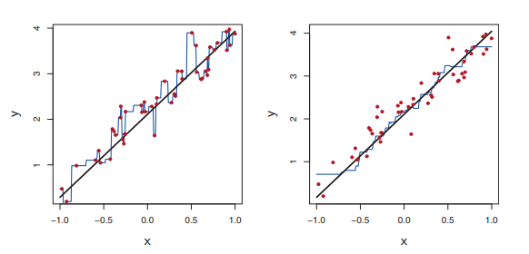

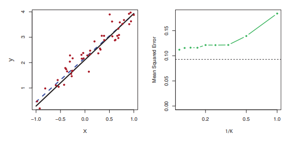

위의 그림은 1차원 선형회귀모델을 사용하여 생성한 데이터이다. 상위 2개의 그림에서 파란색 곡선은 각각 K=1, K=9인 경우의 KNN 적합을 나타내는데, 실제 모함수와 잘 맞지 않음을 확인할 수 있다. 밑의 왼쪽 그림에서 파란색 파선은 선형회귀 적합을 나타내는데, 모함수와 비교했을 때 정확도가 꽤 높음을 확인할 수 있다. 

위의 그림은 데이터의 비선형성 정도를 증가시키면서 선형회귀적합과 KNN 적합의 성능을 비교한 것이다. 상위 2개 그림의 경우, 선형회귀에 대한 검정 MSE는 K값이 작으면 KNN보다 더 낫다. 하지만 K가 4 이상일 경우, KNN이 선형회귀보다 훨씬 낫다. 아래의 그림 2개는 데이터가 더욱 비선형적인 경우를 보여준다. 이 경우, KNN은 모든 K 값에 대해 선형회귀적합보다 더 나은 결과를 제시한다. <u>KNN회귀의 검정 MSE는 비선형성의 정도가 증가해도 변화가 거의 없지만 선형회귀의 검정 MSE는 크게 증가함을 확인할 수 있다.</u> 

Q) 그러면 실제 상관관계를 파악할 수 없는 현실에서는 선형회귀 대신 KNN을 사용해야 하는가?

A) 그렇지 않다. 실제 상관관계가 비선형적이더라도 KNN이 선형회귀보다 성능이 안 좋을 수 있기 때문이다. 보통 차원이 높은 경우 KNN은 선형회귀보다 성능이 떨어진다. 

위의 표는 비선형적 정도가 심한 데이터를 이용해 KNN회귀(초록색)와 선형회귀(검은색)의 MSE를 비교한 것이다.  p=1,2인 경우 KNN이 선형회귀보다 MSE가 더 낫지만, p가 4 이상 되는 경우 선형회귀가 KNN보다 우수하다. KNN은 고차원으로 갈수록 표본크기가 실질적으로 줄어드는 효과가 있기 때문에, 차원이 증가함에 따라 성능이 나빠진다. 

이 데이터에는 100개의 훈련 관측치가 있다. 따라서 p=1이면 $f(X)$를 추정할 충분한 정보가 있지만, p=20인 경우 주어진 관측치에 가까운 이웃이 없는 현상이 발생한다(차원의 저주). 20차원에서 주어진 검정 관측치 $x_0$에 가까운 K개의 관측치들은 $x_0$로부터 아주 멀리 떨어져 있을 수 있기 때문이다. <u>일반적으로 설명변수당 관측치 수가 작으면 모수적 방법이 비모수적 방법보다 더 나은 성능을 보인다.</u> 또한 차원이 낮더라도(KNN회귀의 성능이 더 좋은 경우) 약간의 정확도를 포기하고 선형회귀의 단순성과 설명력을 취하는 경우가 일반적이다.
